# 🚀 FreeAgentics CI/CD Pipeline Architecture

## 📊 Visual Pipeline Flow

```mermaid
graph TB
    %% Styling
    classDef preflight fill:#e1f5fe,stroke:#01579b,stroke-width:2px
    classDef build fill:#f3e5f5,stroke:#4a148c,stroke-width:2px
    classDef test fill:#e8f5e9,stroke:#1b5e20,stroke-width:2px
    classDef security fill:#fff3e0,stroke:#e65100,stroke-width:2px
    classDef perf fill:#fce4ec,stroke:#880e4f,stroke-width:2px
    classDef deploy fill:#e0f2f1,stroke:#004d40,stroke-width:2px
    classDef gate fill:#ffebee,stroke:#b71c1c,stroke-width:3px
    classDef obs fill:#f1f8e9,stroke:#33691e,stroke-width:2px

    %% Stage 1: Pre-flight Checks
    subgraph "🔍 Stage 1: Pre-flight Checks"
        A1[Pipeline Setup & ID Generation]
        A2[Change Analysis & Scope Detection]
        A3[Code Quality Gate]
        A4[Secret Scanning]
        A5[Dependency Security Check]
        
        A1 --> A2
        A2 --> A3
        A2 --> A4
        A2 --> A5
    end

    %% Stage 2: Build & Package
    subgraph "🏗️ Stage 2: Build & Package"
        B1[Backend Container Build<br/>Multi-arch: amd64/arm64]
        B2[Frontend Container Build<br/>Multi-arch: amd64/arm64]
        B3[Generate SBOMs]
        B4[Container Registry Push]
        
        B1 --> B3
        B2 --> B3
        B3 --> B4
    end

    %% Stage 3: Testing Suite
    subgraph "🧪 Stage 3: Comprehensive Testing"
        C1[Backend Unit Tests<br/>Coverage: >80%]
        C2[Frontend Unit Tests<br/>Coverage: >75%]
        C3[Backend Integration Tests]
        C4[Frontend Integration Tests]
        C5[API Contract Tests]
        C6[Database Migration Tests]
        
        C1 --> C3
        C2 --> C4
        C3 --> C5
        C4 --> C5
        C5 --> C6
    end

    %% Stage 4: Security Validation
    subgraph "🔒 Stage 4: Security Validation"
        D1[SAST Analysis<br/>Bandit, Semgrep]
        D2[Container Scanning<br/>Trivy, Hadolint]
        D3[OWASP Compliance Check]
        D4[Security Test Suite]
        D5[Penetration Tests]
        
        D1 --> D3
        D2 --> D3
        D3 --> D4
        D4 --> D5
    end

    %% Stage 5: Performance
    subgraph "⚡ Stage 5: Performance Verification"
        E1[Performance Benchmarks]
        E2[Regression Detection]
        E3[Load Testing]
        E4[Memory Profiling]
        
        E1 --> E2
        E2 --> E3
        E3 --> E4
    end

    %% Stage 6: E2E Validation
    subgraph "🌐 Stage 6: End-to-End Validation"
        F1[Deploy Test Environment]
        F2[E2E Test Suite]
        F3[Browser Automation Tests]
        F4[API Integration Tests]
        F5[Cleanup Test Environment]
        
        F1 --> F2
        F2 --> F3
        F2 --> F4
        F3 --> F5
        F4 --> F5
    end

    %% Stage 7: Deployment Readiness
    subgraph "🚦 Stage 7: Deployment Readiness"
        G1[Quality Gate Assessment]
        G2[Security Score Validation]
        G3[Performance Baseline Check]
        G4[Deployment Decision]
        
        G1 --> G4
        G2 --> G4
        G3 --> G4
    end

    %% Stage 8: Progressive Deployment
    subgraph "🚀 Stage 8: Progressive Deployment"
        H1[Staging Deployment]
        H2[Staging Smoke Tests]
        H3[Production Canary<br/>5% Traffic]
        H4[Production Blue-Green<br/>100% Traffic]
        H5[Rollback Ready]
        
        H1 --> H2
        H2 --> H3
        H3 --> H4
        H4 --> H5
    end

    %% Stage 9: Observability
    subgraph "📊 Stage 9: Pipeline Observability"
        I1[Metrics Collection]
        I2[Generate Reports]
        I3[Update Dashboards]
        I4[Send Notifications]
        
        I1 --> I2
        I2 --> I3
        I3 --> I4
    end

    %% Connections between stages
    A5 --> B1
    A5 --> B2
    B4 --> C1
    B4 --> C2
    C6 --> D1
    D5 --> E1
    E4 --> F1
    F5 --> G1
    G4 --> H1
    H5 --> I1

    %% Apply styles
    class A1,A2,A3,A4,A5 preflight
    class B1,B2,B3,B4 build
    class C1,C2,C3,C4,C5,C6 test
    class D1,D2,D3,D4,D5 security
    class E1,E2,E3,E4 perf
    class H1,H2,H3,H4,H5 deploy
    class G1,G2,G3,G4 gate
    class I1,I2,I3,I4 obs

    %% Quality Gates
    G4{{DEPLOYMENT<br/>QUALITY GATE}}
```

## 🏛️ Pipeline Architecture Principles

### Martin Fowler's CI/CD Principles Applied:
1. **Build Once, Deploy Many**: Containers built once and promoted through environments
2. **Fast Feedback**: Pre-flight checks complete in <5 minutes
3. **Comprehensive Testing**: Multiple layers of testing with no shortcuts
4. **Deployment Pipeline as Code**: Everything defined in version control
5. **Visible Pipeline State**: Clear visual representation and metrics

### Jessica Kerr's System Thinking Applied:
1. **Pipeline Tells a Story**: Each stage has clear purpose and narrative
2. **Observability Built-in**: Metrics and tracing at every stage
3. **Feedback Loops**: Each stage provides actionable feedback
4. **Progressive Confidence**: Confidence increases with each stage
5. **Team Empowerment**: Clear visibility into pipeline state

## 📋 Stage Details

### Stage 1: Pre-flight Checks (Target: <5 minutes)
- **Purpose**: Fast feedback on code quality and security basics
- **Key Activities**:
  - Generate unique pipeline ID for tracing
  - Analyze code changes to determine test scope
  - Run linting, formatting, and type checks
  - Scan for secrets and credentials
  - Check dependency vulnerabilities
- **Quality Gates**: 
  - No linting errors
  - No exposed secrets
  - No critical vulnerabilities

### Stage 2: Build & Package (Target: <15 minutes)
- **Purpose**: Create deployable artifacts
- **Key Activities**:
  - Multi-architecture container builds (amd64, arm64)
  - Generate Software Bill of Materials (SBOM)
  - Push to container registry with proper tags
  - Cache optimization for faster builds
- **Quality Gates**:
  - Successful build completion
  - Container size within limits
  - SBOM generation complete

### Stage 3: Comprehensive Testing (Target: <20 minutes)
- **Purpose**: Validate functionality and integration
- **Key Activities**:
  - Unit tests with coverage requirements
  - Integration tests with real services
  - API contract validation
  - Database migration testing
- **Quality Gates**:
  - Backend coverage >80%
  - Frontend coverage >75%
  - All tests passing
  - No migration conflicts

### Stage 4: Security Validation (Target: <15 minutes)
- **Purpose**: Ensure security compliance
- **Key Activities**:
  - Static Application Security Testing (SAST)
  - Container vulnerability scanning
  - OWASP Top 10 compliance check
  - Security test suite execution
  - Automated penetration tests
- **Quality Gates**:
  - No high/critical vulnerabilities
  - OWASP compliance score >85%
  - All security tests passing

### Stage 5: Performance Verification (Target: <25 minutes)
- **Purpose**: Prevent performance regressions
- **Key Activities**:
  - Run performance benchmarks
  - Compare against baselines
  - Load testing for APIs
  - Memory and CPU profiling
- **Quality Gates**:
  - No regression >10% from baseline
  - Response times within SLA
  - Memory usage stable

### Stage 6: End-to-End Validation (Target: <30 minutes)
- **Purpose**: Validate complete system integration
- **Key Activities**:
  - Deploy complete test environment
  - Run E2E test suites
  - Browser automation testing
  - API integration testing
  - Environment cleanup
- **Quality Gates**:
  - All E2E scenarios passing
  - No integration failures
  - Clean environment teardown

### Stage 7: Deployment Readiness (Target: <8 minutes)
- **Purpose**: Final go/no-go decision
- **Key Activities**:
  - Aggregate all quality metrics
  - Calculate security score
  - Verify performance baselines
  - Make deployment decision
- **Quality Gates**:
  - All previous stages passed
  - Security score >85
  - No blocking issues

### Stage 8: Progressive Deployment (Target: <20 minutes)
- **Purpose**: Safe production deployment
- **Key Activities**:
  - Deploy to staging environment
  - Run staging smoke tests
  - Canary deployment (5% traffic)
  - Blue-green deployment (100% traffic)
  - Maintain rollback capability
- **Quality Gates**:
  - Staging tests passing
  - Canary metrics healthy
  - Zero-downtime deployment

### Stage 9: Pipeline Observability (Target: <10 minutes)
- **Purpose**: Track and communicate pipeline state
- **Key Activities**:
  - Collect all pipeline metrics
  - Generate comprehensive reports
  - Update dashboards
  - Send notifications
- **Quality Gates**:
  - All metrics collected
  - Reports generated
  - Notifications sent

## 🚫 No Bypass Mechanisms

The pipeline strictly enforces:
- **No skip parameters**: No ability to skip tests or security checks
- **No force flags**: No force deployment options
- **Sequential dependencies**: Each stage must pass before the next
- **Mandatory quality gates**: All gates must be satisfied
- **No manual overrides**: Automated decisions only

## 📊 Metrics & Monitoring

### Key Pipeline Metrics:
- **Lead Time**: Time from commit to production
- **Deployment Frequency**: Deployments per day/week
- **Mean Time to Recovery**: Time to fix pipeline failures
- **Change Failure Rate**: Percentage of deployments causing failures

### Pipeline Health Indicators:
- **Stage Success Rate**: Success percentage per stage
- **Average Stage Duration**: Time taken per stage
- **Quality Gate Pass Rate**: Percentage of builds passing all gates
- **Security Score Trend**: Security compliance over time

## 🔄 Continuous Improvement

The pipeline includes mechanisms for:
1. **Performance Baseline Updates**: Regular updates to performance baselines
2. **Security Policy Updates**: Automated security policy updates
3. **Test Coverage Monitoring**: Track and improve test coverage
4. **Pipeline Analytics**: Regular analysis of pipeline efficiency
5. **Feedback Integration**: Incorporate team feedback into pipeline

## 🛠️ Implementation Checklist

- [x] Unified pipeline with clear stages
- [x] Visual pipeline representation
- [x] No skip or bypass mechanisms
- [x] Comprehensive quality gates
- [x] Multi-architecture support
- [x] Progressive deployment strategy
- [x] Built-in observability
- [x] Automated rollback capability
- [x] Security compliance validation
- [x] Performance regression detection

## 📚 References

- Martin Fowler: "Continuous Integration" - https://martinfowler.com/articles/continuousIntegration.html
- Jessica Kerr: "The Origins of Opera and the Future of Programming" - System thinking in software
- OWASP CI/CD Security Cheat Sheet
- NIST DevSecOps Guidelines