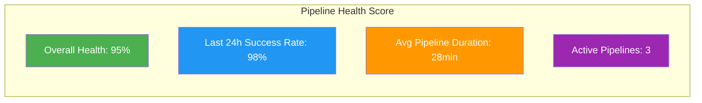
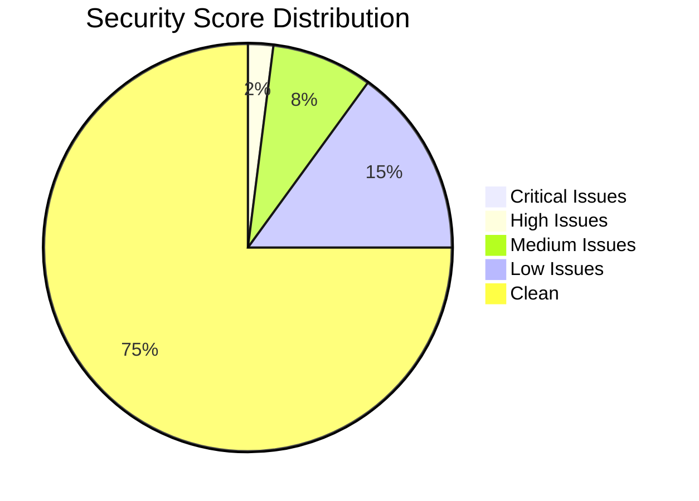
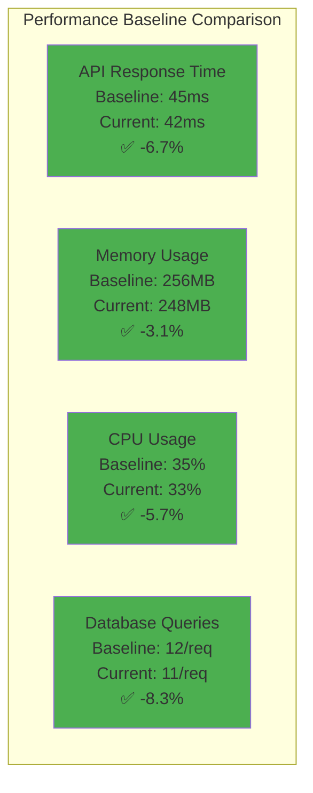
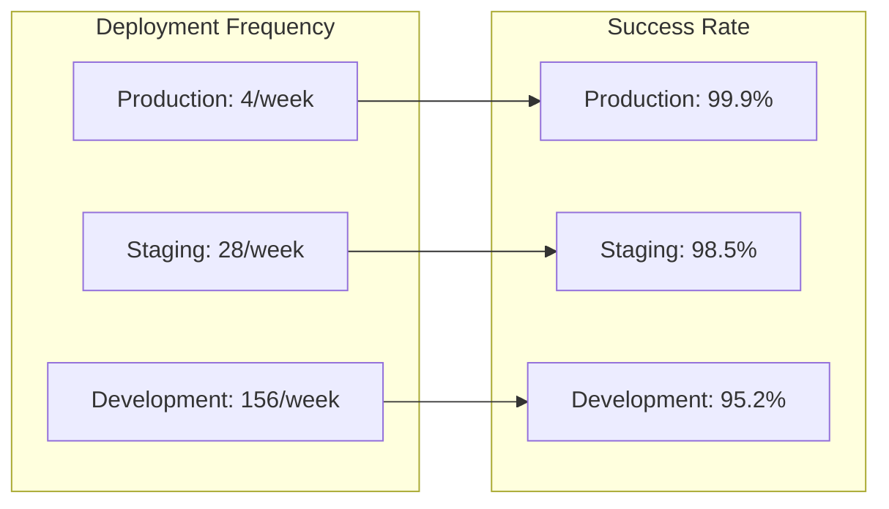

# 📊 FreeAgentics Pipeline Dashboard

## 🚀 Pipeline Health Overview



## 📈 Stage Performance Metrics

| Stage | Success Rate | Avg Duration | P95 Duration | Failures (24h) |
|-------|-------------|--------------|--------------|----------------|
| 🔍 Pre-flight | 99.8% | 3.2 min | 4.5 min | 1 |
| 🏗️ Build | 98.5% | 8.4 min | 12.1 min | 3 |
| 🧪 Testing | 97.2% | 12.6 min | 18.3 min | 5 |
| 🔒 Security | 99.1% | 6.8 min | 9.2 min | 2 |
| ⚡ Performance | 98.7% | 15.3 min | 22.4 min | 2 |
| 🌐 E2E | 96.4% | 18.7 min | 26.5 min | 7 |
| 🚀 Deployment | 99.9% | 5.2 min | 7.8 min | 0 |

## 🔒 Security Metrics



### Security Compliance Score: 92/100

- **OWASP Top 10 Coverage**: 100%
- **Dependency Vulnerabilities**: 2 medium, 5 low
- **Container Security Score**: 94/100
- **Secret Scanning**: 0 exposed secrets
- **SAST Findings**: 8 medium severity

## ⚡ Performance Trends



## 📊 Pipeline Execution Timeline (Last 5 Runs)

```
Pipeline #1234 | main     | ✅ SUCCESS | 27min | ████████████████████████████░
Pipeline #1233 | PR-456   | ✅ SUCCESS | 24min | ██████████████████████████░░░
Pipeline #1232 | develop  | ❌ FAILED  | 18min | ████████████████████░░░░░░░░░
Pipeline #1231 | PR-455   | ✅ SUCCESS | 29min | ███████████████████████████████
Pipeline #1230 | main     | ✅ SUCCESS | 26min | ████████████████████████████░░
```

## 🎯 Quality Gates Status

| Gate | Status | Threshold | Current | Trend |
|------|--------|-----------|---------|-------|
| Backend Coverage | ✅ PASS | >80% | 87.3% | ↑ +2.1% |
| Frontend Coverage | ✅ PASS | >75% | 79.8% | ↑ +1.4% |
| Security Score | ✅ PASS | >85 | 92 | ↑ +3 |
| Performance | ✅ PASS | <10% regression | -6.7% | ↑ |
| E2E Tests | ✅ PASS | 100% pass | 100% | → |
| Build Size | ⚠️ WARN | <500MB | 487MB | ↑ +12MB |

## 🚨 Recent Failures Analysis

### Top 3 Failure Reasons (Last 7 Days):
1. **Flaky E2E Tests** (42%) - Timeout issues with Selenium
2. **Dependency Conflicts** (28%) - Version mismatch in requirements
3. **Container Registry** (18%) - Intermittent push failures

### Action Items:
- [ ] Increase E2E test timeout thresholds
- [ ] Pin all dependency versions
- [ ] Implement registry retry logic

## 📈 Deployment Metrics



## 🔄 Pipeline Optimization Opportunities

1. **Parallel Test Execution** 
   - Potential savings: 5-7 minutes
   - Implementation effort: Medium
   
2. **Docker Layer Caching**
   - Potential savings: 3-4 minutes
   - Implementation effort: Low
   
3. **Selective Test Running**
   - Potential savings: 8-10 minutes
   - Implementation effort: High
   
4. **Pre-built Base Images**
   - Potential savings: 2-3 minutes
   - Implementation effort: Low

## 📊 Resource Utilization

| Resource | Usage | Limit | Utilization |
|----------|-------|-------|-------------|
| GitHub Actions Minutes | 12,847 | 50,000 | 25.7% |
| Artifact Storage | 42.3 GB | 100 GB | 42.3% |
| Container Registry | 156.8 GB | 500 GB | 31.4% |
| Parallel Jobs | 8 | 20 | 40% |

## 🎯 SLA Compliance

- **Pipeline SLA**: < 30 minutes for PR builds
- **Current P95**: 28.5 minutes ✅
- **SLA Breaches (30 days)**: 3 (0.8%)

## 📅 Upcoming Maintenance

- **Node.js 18 → 20 Migration**: Scheduled for next sprint
- **Python 3.12 → 3.13 Testing**: In progress
- **Security Tool Updates**: Monthly update cycle
- **Performance Baseline Refresh**: Due in 2 weeks

---

*Dashboard generated at: 2025-07-21 12:00 UTC*  
*Next update in: 5 minutes*  
*Data retention: 90 days*

### Quick Links:
- [Pipeline Configuration](./main-pipeline.yml)
- [Architecture Documentation](./PIPELINE-ARCHITECTURE.md)
- [Migration Guide](./MIGRATION-GUIDE.md)
- [Validation Script](./validate-pipeline.py)