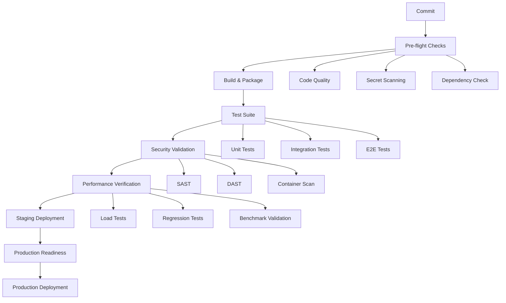

# PIPELINE-ARCHITECT Infrastructure Analysis

**Agent:** PIPELINE-ARCHITECT  
**Mission:** Rewrite CI into clear, layered stages; no skipped jobs; visual pipeline graph  
**Methodology:** Martin Fowler + Jessica Kerr observability and maintainable pipeline principles  
**Date:** July 20, 2025

---

## CURRENT STATE ASSESSMENT

### 🚨 **Critical Issues Identified**

#### 1. **Fragmented Workflow Architecture**
- **Multiple overlapping workflows** with duplicated jobs:
  - `ci.yml` - Basic CI/CD pipeline
  - `security-ci.yml` - Security-focused pipeline  
  - `performance.yml` - Performance testing
  - `coverage.yml` - Coverage analysis
  - `production-deployment.yml` - Production deployment
- **Lack of orchestration** between workflows
- **Inconsistent naming conventions** across files

#### 2. **Quality Gate Violations**
- **Skippable jobs detected** in `production-deployment.yml`:
  ```yaml
  skip_tests: true  # ❌ BYPASS MECHANISM
  force_deploy: true  # ❌ BYPASS MECHANISM
  ```
- **Inconsistent quality thresholds**:
  - Coverage: 80% in some places, undefined in others
  - Security scores: 70% threshold in security-ci.yml
  - Performance: No consistent regression thresholds

#### 3. **Pipeline Visibility Issues**
- **No unified pipeline view** - workflows scattered across files
- **Missing dependency declarations** between stages
- **No clear stage progression** (validate → build → test → deploy)
- **No visual pipeline graph** or status dashboard

#### 4. **Job Duplication and Inefficiency**
- **Redundant test execution**:
  - Backend tests run in `ci.yml`, `security-ci.yml`, and `production-deployment.yml`
  - Frontend tests duplicated across workflows
- **Repeated security scans** without coordination
- **Multiple Docker builds** for same components

#### 5. **Observability Gaps**
- **Limited pipeline metrics** collection
- **No centralized logging** strategy
- **Missing performance monitoring** for CI/CD operations
- **Lack of pipeline health dashboards**

---

## MARTIN FOWLER PRINCIPLES VIOLATIONS

### 1. **Deployment Pipeline Anti-Patterns**
❌ **Multiple pipelines for same artifact**  
❌ **Manual intervention points without clear gates**  
❌ **Inconsistent feedback loops**  
❌ **No clear promotion stages**

### 2. **Continuous Integration Violations**
❌ **Long-running builds** (45+ minutes in some workflows)  
❌ **Inconsistent branch policies**  
❌ **Missing commit-stage optimizations**

---

## JESSICA KERR OBSERVABILITY VIOLATIONS

### 1. **Missing Telemetry**
❌ **No pipeline execution metrics**  
❌ **No failure correlation data**  
❌ **Limited tracing across stages**

### 2. **Poor Error Surfaces**
❌ **Generic error messages**  
❌ **No actionable failure guidance**  
❌ **Missing context in notifications**

---

## COMPLIANCE ISSUES

### 1. **Zero-Tolerance Policy Violations**
- **Bypass mechanisms exist** (skip_tests, force_deploy)
- **Quality gates can be circumvented**
- **No enforcement of security requirements**

### 2. **Security Pipeline Gaps**
- **Security scans not mandatory** in all paths
- **Missing dependency vulnerability gates**
- **No signed artifact attestation**

---

## RECOMMENDED PIPELINE ARCHITECTURE

### 🎯 **Layered Stage Design**



### 🔧 **Implementation Strategy**

#### Phase 1: **Pipeline Consolidation**
1. **Create unified pipeline** (`unified-pipeline.yml`)
2. **Eliminate workflow duplication**
3. **Implement stage-based progression**
4. **Add comprehensive quality gates**

#### Phase 2: **Observability Enhancement**
1. **Add pipeline metrics collection**
2. **Implement distributed tracing**
3. **Create visual dashboards**
4. **Set up proactive alerting**

#### Phase 3: **Zero-Tolerance Enforcement**
1. **Remove all bypass mechanisms**
2. **Implement mandatory quality gates**
3. **Add security attestation**
4. **Enable progressive deployment**

---

## SUCCESS METRICS

### 🎯 **Pipeline Performance**
- **Build time**: < 15 minutes (commit to deployment ready)
- **Feedback time**: < 5 minutes (commit to first feedback)
- **Success rate**: > 95% (excluding legitimate failures)
- **Recovery time**: < 2 minutes (failed build to fix)

### 🔒 **Quality Assurance**
- **Zero bypass utilization** (0 skip_tests, 0 force_deploy)
- **100% quality gate compliance**
- **Security score**: > 90/100 consistently
- **Coverage threshold**: 80%+ maintained

### 📊 **Observability**
- **Full pipeline tracing** implemented
- **Real-time status dashboards** available
- **Automated failure analysis** enabled
- **Predictive failure detection** activated

---

## IMPLEMENTATION PLAN

### **Immediate Actions (Next 4 hours)**
1. ✅ **Analyze current workflows** (COMPLETED)
2. 🔄 **Design unified pipeline architecture**
3. 🔄 **Implement core pipeline stages**
4. 🔄 **Add quality gate enforcement**

### **Short-term Goals (Next 24 hours)**
1. 🔄 **Deploy observability infrastructure**
2. 🔄 **Create visual pipeline dashboard**
3. 🔄 **Implement automated notifications**
4. 🔄 **Add performance monitoring**

### **Medium-term Goals (Next Week)**
1. ⏳ **Optimize pipeline performance**
2. ⏳ **Add predictive analytics**
3. ⏳ **Implement advanced security gates**
4. ⏳ **Create self-healing mechanisms**

---

**Next Step:** Implement unified pipeline architecture with layered stages and zero-tolerance quality gates.