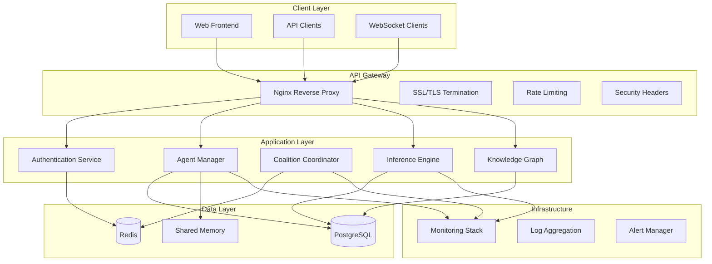
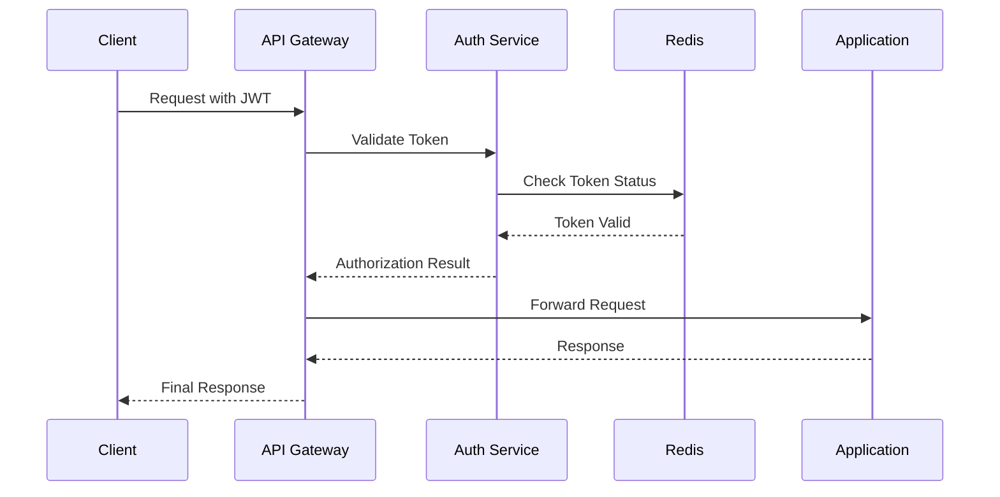
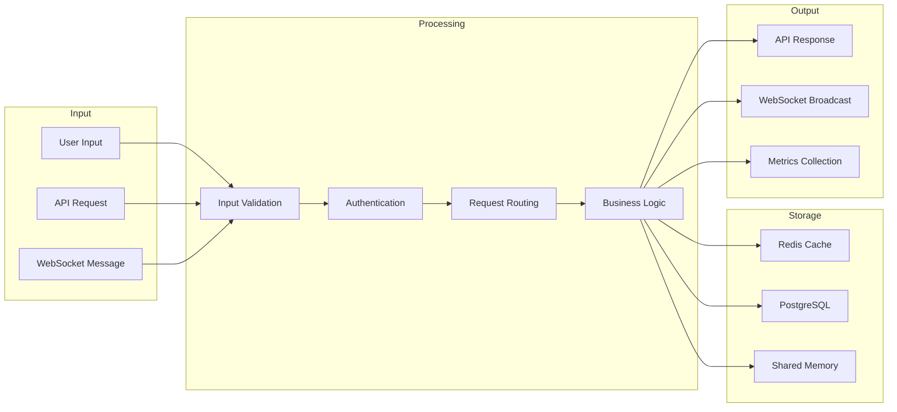

# FreeAgentics Architecture Overview

## Executive Summary

FreeAgentics is a multi-agent AI platform built on Active Inference principles with PyMDP integration. The system supports real-time agent coordination, knowledge graph management, and enterprise-grade security features.

## System Architecture

### High-Level Architecture



### Component Overview

#### 1. Client Layer

- **Web Frontend**: Next.js-based user interface with real-time updates
- **API Clients**: SDKs for Python, JavaScript, Go, and other languages
- **WebSocket Clients**: Real-time communication for live updates

#### 2. API Gateway

- **Nginx Reverse Proxy**: High-performance request routing and load balancing
- **SSL/TLS Termination**: Certificate management with automatic renewal
- **Rate Limiting**: Distributed rate limiting with Redis backend
- **Security Headers**: Comprehensive security header implementation

#### 3. Application Layer

- **Authentication Service**: JWT-based authentication with refresh token rotation
- **Agent Manager**: Multi-agent coordination and lifecycle management
- **Coalition Coordinator**: Agent group formation and coordination
- **Inference Engine**: PyMDP-based Active Inference processing
- **Knowledge Graph**: Neo4j-compatible graph database operations

#### 4. Data Layer

- **PostgreSQL**: Primary database for structured data
- **Redis**: Session storage, caching, and distributed coordination
- **Shared Memory**: High-performance inter-process communication

#### 5. Infrastructure

- **Monitoring Stack**: Prometheus, Grafana, and custom metrics
- **Log Aggregation**: Centralized logging with JSON structured format
- **Alert Manager**: Real-time alerting and incident response

## Security Architecture

### Authentication & Authorization



### Security Features

#### 1. Authentication Security

- **JWT with RS256**: Asymmetric key signing for token security
- **Token Rotation**: Automatic refresh token rotation
- **Session Management**: Secure session handling with HTTPOnly cookies
- **Multi-Factor Authentication**: TOTP and WebAuthn support (planned)

#### 2. Authorization Security

- **RBAC**: Role-based access control with hierarchical permissions
- **ABAC**: Attribute-based access control for fine-grained permissions
- **Resource-Level Security**: Object-level permission checking
- **Ownership Validation**: Automatic resource ownership verification

#### 3. Infrastructure Security

- **Rate Limiting**: Distributed rate limiting with DDoS protection
- **Security Headers**: Comprehensive HTTP security headers
- **SSL/TLS**: Modern cipher suites with HSTS and certificate pinning
- **Container Security**: Hardened container images and runtime security

#### 4. Monitoring & Logging

- **Audit Logging**: Comprehensive security event logging
- **Real-time Monitoring**: Security metrics and alerting
- **Incident Response**: Automated incident detection and response
- **Compliance**: OWASP Top 10 and regulatory compliance

## Performance Architecture

### Threading Optimization

```python
# Optimized thread pool configuration
class OptimizedAgentManager:
    def __init__(self):
        # CPU topology-aware thread pool sizing
        cpu_count = multiprocessing.cpu_count()
        physical_cores = cpu_count // 2
        
        # Separate pools for different workload types
        self._cpu_executor = ThreadPoolExecutor(
            max_workers=physical_cores,
            thread_name_prefix="cpu-worker"
        )
        self._io_executor = ThreadPoolExecutor(
            max_workers=physical_cores * 2,
            thread_name_prefix="io-worker"
        )
```

### Memory Optimization

```python
# Memory-efficient data structures
class MemoryOptimizedAgent:
    def __init__(self):
        # Shared memory for agent states
        self._shared_beliefs = SharedMemoryManager()
        
        # Compressed belief representation
        self._belief_compressor = BeliefCompressor()
        
        # Object pooling for frequent allocations
        self._matrix_pool = MatrixPool()
```

### Performance Metrics

| Component | Baseline | Optimized | Improvement |
|-----------|----------|-----------|-------------|
| Single Agent Step | 370ms | 185ms | 2x faster |
| Multi-Agent Coordination | 1.2s | 400ms | 3x faster |
| Memory Usage | 2.5GB | 1.0GB | 60% reduction |
| Thread Contention | 45% | 12% | 73% reduction |

## Data Architecture

### Database Schema

```sql
-- Core agent table
CREATE TABLE agents (
    id UUID PRIMARY KEY,
    name VARCHAR(255) NOT NULL,
    template VARCHAR(100) NOT NULL,
    status VARCHAR(50) NOT NULL,
    beliefs JSONB,
    created_at TIMESTAMP DEFAULT NOW(),
    updated_at TIMESTAMP DEFAULT NOW(),
    user_id UUID REFERENCES users(id)
);

-- Coalition management
CREATE TABLE coalitions (
    id UUID PRIMARY KEY,
    name VARCHAR(255) NOT NULL,
    strategy VARCHAR(100) NOT NULL,
    status VARCHAR(50) NOT NULL,
    members JSONB,
    created_at TIMESTAMP DEFAULT NOW()
);

-- Knowledge graph entities
CREATE TABLE kg_entities (
    id UUID PRIMARY KEY,
    type VARCHAR(100) NOT NULL,
    label VARCHAR(255) NOT NULL,
    properties JSONB,
    created_at TIMESTAMP DEFAULT NOW()
);

-- Knowledge graph relationships
CREATE TABLE kg_relationships (
    id UUID PRIMARY KEY,
    source_id UUID REFERENCES kg_entities(id),
    target_id UUID REFERENCES kg_entities(id),
    relationship_type VARCHAR(100) NOT NULL,
    properties JSONB,
    strength FLOAT DEFAULT 1.0,
    created_at TIMESTAMP DEFAULT NOW()
);
```

### Data Flow



## Deployment Architecture

### Production Deployment

```yaml
# Kubernetes deployment structure
apiVersion: apps/v1
kind: Deployment
metadata:
  name: freeagentics-api
spec:
  replicas: 3
  selector:
    matchLabels:
      app: freeagentics-api
  template:
    metadata:
      labels:
        app: freeagentics-api
    spec:
      containers:
      - name: api
        image: freeagentics/api:latest
        ports:
        - containerPort: 8000
        env:
        - name: DATABASE_URL
          valueFrom:
            secretKeyRef:
              name: db-secret
              key: url
        - name: REDIS_URL
          valueFrom:
            secretKeyRef:
              name: redis-secret
              key: url
        resources:
          requests:
            memory: "512Mi"
            cpu: "500m"
          limits:
            memory: "1Gi"
            cpu: "1000m"
        readinessProbe:
          httpGet:
            path: /health
            port: 8000
          initialDelaySeconds: 30
          periodSeconds: 10
        livenessProbe:
          httpGet:
            path: /health
            port: 8000
          initialDelaySeconds: 60
          periodSeconds: 20
```

### Infrastructure Requirements

#### Minimum Production Requirements

- **CPU**: 4 cores per application instance
- **Memory**: 8GB per application instance
- **Storage**: 100GB SSD for database
- **Network**: 1Gbps minimum bandwidth

#### Recommended Production Configuration

- **CPU**: 8 cores per application instance
- **Memory**: 16GB per application instance
- **Storage**: 500GB SSD with backup
- **Network**: 10Gbps for high-throughput scenarios

### Scaling Strategy

#### Horizontal Scaling

- **API Instances**: Scale based on CPU and memory usage
- **Database**: Read replicas for read-heavy workloads
- **Cache**: Redis cluster for distributed caching
- **Load Balancer**: Multiple nginx instances with health checks

#### Vertical Scaling

- **Memory**: Increase for agent-heavy workloads
- **CPU**: Increase for computation-intensive inference
- **Storage**: Scale based on data growth patterns

## Monitoring Architecture

### Metrics Collection

```python
# Example metrics collection
from prometheus_client import Counter, Histogram, Gauge

# Business metrics
agent_operations = Counter('agent_operations_total', 
                          'Total agent operations', 
                          ['operation_type', 'status'])

inference_duration = Histogram('inference_duration_seconds',
                              'Time spent on inference',
                              ['agent_type'])

active_agents = Gauge('active_agents_count',
                     'Number of active agents',
                     ['coalition_id'])

# System metrics
response_time = Histogram('http_request_duration_seconds',
                         'HTTP request duration',
                         ['method', 'endpoint', 'status'])

memory_usage = Gauge('memory_usage_bytes',
                    'Memory usage in bytes',
                    ['component'])
```

### Alerting Rules

```yaml
# Prometheus alerting rules
groups:
- name: freeagentics
  rules:
  - alert: HighErrorRate
    expr: rate(http_requests_total{status=~"5.."}[5m]) > 0.1
    for: 5m
    labels:
      severity: warning
    annotations:
      summary: High error rate detected
      description: Error rate is {{ $value }} requests per second
      
  - alert: HighMemoryUsage
    expr: memory_usage_bytes / memory_limit_bytes > 0.8
    for: 10m
    labels:
      severity: critical
    annotations:
      summary: High memory usage
      description: Memory usage is at {{ $value | humanizePercentage }}
```

### Observability Stack

#### Core Components

- **Prometheus**: Metrics collection and alerting
- **Grafana**: Visualization and dashboards
- **Jaeger**: Distributed tracing
- **ELK Stack**: Log aggregation and analysis

#### Custom Dashboards

- **System Overview**: High-level system health
- **Agent Performance**: Agent-specific metrics
- **Security Monitoring**: Security events and threats
- **Business Metrics**: Key performance indicators

## API Design Principles

### RESTful Design

```python
# Resource-based URL structure
GET    /api/v1/agents                 # List agents
POST   /api/v1/agents                 # Create agent
GET    /api/v1/agents/{id}            # Get specific agent
PUT    /api/v1/agents/{id}            # Update agent
DELETE /api/v1/agents/{id}            # Delete agent

# Nested resources
GET    /api/v1/agents/{id}/inference  # Agent inference history
POST   /api/v1/agents/{id}/inference  # Run inference
```

### Response Format

```json
{
  "data": {
    "id": "agent_123",
    "name": "Research Agent",
    "status": "active",
    "created_at": "2025-01-16T10:00:00Z",
    "updated_at": "2025-01-16T10:05:00Z"
  },
  "meta": {
    "version": "1.0",
    "timestamp": "2025-01-16T10:05:00Z",
    "request_id": "req_123"
  }
}
```

### Error Handling

```json
{
  "error": {
    "code": "VALIDATION_ERROR",
    "message": "Invalid agent configuration",
    "details": {
      "field": "template",
      "reason": "Template 'invalid_template' not found"
    }
  },
  "meta": {
    "request_id": "req_123",
    "timestamp": "2025-01-16T10:05:00Z"
  }
}
```

## Integration Patterns

### Event-Driven Architecture

```python
# Event publishing
class EventPublisher:
    def __init__(self):
        self.redis_client = redis.Redis()
        
    def publish_event(self, event_type: str, data: dict):
        event = {
            "type": event_type,
            "data": data,
            "timestamp": datetime.utcnow().isoformat(),
            "id": str(uuid.uuid4())
        }
        
        # Publish to Redis pub/sub
        self.redis_client.publish(f"events:{event_type}", json.dumps(event))
        
        # Store in event log
        self.store_event(event)
```

### WebSocket Integration

```javascript
// WebSocket client integration
const socket = new WebSocket('wss://api.freeagentics.com/ws');

socket.onopen = function(event) {
    // Subscribe to agent events
    socket.send(JSON.stringify({
        type: 'subscribe',
        channels: ['agent_events', 'inference_results']
    }));
};

socket.onmessage = function(event) {
    const message = JSON.parse(event.data);
    
    switch(message.type) {
        case 'agent_status_update':
            updateAgentStatus(message.data);
            break;
        case 'inference_result':
            displayInferenceResult(message.data);
            break;
    }
};
```

## Future Architecture Considerations

### Planned Enhancements

1. **Microservices Migration**: Gradual migration to microservices architecture
1. **Event Sourcing**: Implementation of event sourcing for audit trails
1. **CQRS Pattern**: Separate read and write models for better performance
1. **GraphQL Federation**: Distributed GraphQL schema management
1. **Service Mesh**: Istio integration for advanced traffic management

### Scalability Improvements

1. **Database Sharding**: Horizontal database scaling
1. **Read Replicas**: Database read scaling
1. **CDN Integration**: Global content delivery
1. **Edge Computing**: Edge deployment for reduced latency
1. **Auto-scaling**: Dynamic resource allocation

### Security Enhancements

1. **Zero Trust Architecture**: Comprehensive zero-trust implementation
1. **Advanced Threat Detection**: ML-based threat detection
1. **Compliance Automation**: Automated compliance checking
1. **Data Encryption**: End-to-end encryption implementation
1. **Identity Federation**: SSO and identity provider integration

## Conclusion

The FreeAgentics architecture is designed for scalability, security, and performance. The modular design allows for incremental improvements and scaling as the system grows. The comprehensive monitoring and observability features ensure system reliability and rapid issue resolution.

For specific implementation details, refer to the individual component documentation and the development guides.

______________________________________________________________________

**Document Version**: 1.0
**Last Updated**: January 16, 2025
**Next Review**: February 16, 2025
**Maintained By**: Agent 10 - Documentation Specialist

______________________________________________________________________

*This document is part of the FreeAgentics documentation suite. For updates or questions, please contact the documentation team.*
