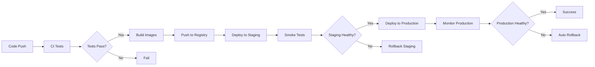

# CI/CD Pipeline Guide

## Overview

FreeAgentics uses a comprehensive CI/CD pipeline built on GitHub Actions that provides:

- Automated testing and quality checks
- Security scanning (SAST/DAST)
- Container building and registry management
- Blue-green deployments with automatic rollback
- Performance validation
- Production monitoring

## Pipeline Architecture

### 1. Continuous Integration

The CI pipeline triggers on:
- Every push to `main` and `develop` branches
- All pull requests
- Manual workflow dispatch
- Scheduled security scans (daily)

#### Test Stages

1. **Unit Tests**: Fast, isolated component tests
2. **Integration Tests**: API and service integration validation
3. **Performance Tests**: Benchmark regression detection
4. **Security Tests**: Vulnerability and compliance scanning

### 2. Security Scanning

#### SAST (Static Application Security Testing)
- **Bandit**: Python security linting
- **Semgrep**: Multi-language security patterns
- **CodeQL**: Deep code analysis
- **Gitleaks**: Secret detection

#### Dependency Scanning
- **Safety**: Python package vulnerabilities
- **pip-audit**: Python dependency audit
- **npm audit**: JavaScript vulnerabilities
- **Snyk**: Cross-platform vulnerability database

#### Container Scanning
- **Trivy**: Container vulnerability scanner
- **Grype**: Alternative vulnerability scanner
- **Container Structure Tests**: Runtime security validation

#### DAST (Dynamic Application Security Testing)
- **OWASP ZAP**: Full application security testing
- Runs after staging deployment
- Automated security regression detection

### 3. Container Registry

All container images are stored in GitHub Container Registry (ghcr.io):

```bash
# Backend image
ghcr.io/your-org/freeagentics-backend:v1.0.0

# Frontend image
ghcr.io/your-org/freeagentics-frontend:v1.0.0

# Nginx image
ghcr.io/your-org/freeagentics-nginx:v1.0.0
```

Images are tagged with:
- Git branch name
- Commit SHA
- Semantic version (for releases)

### 4. Deployment Strategy

#### Blue-Green Deployment

1. **Blue Environment**: Current production
2. **Green Environment**: New deployment
3. **Traffic Switch**: Atomic cutover
4. **Rollback**: Instant reversion if needed

#### Deployment Flow



### 5. Rollback Automation

Automatic rollback triggers on:
- Deployment failures
- Health check failures
- High error rates
- CloudWatch alarms

#### Rollback Process

1. Detect failure condition
2. Retrieve previous stable version
3. Deploy previous version
4. Verify health
5. Send notifications

## Environment Configuration

### Staging Environment

- **URL**: https://staging.freeagentics.com
- **Purpose**: Integration testing and QA
- **Deployment**: Automatic from `develop` branch
- **Data**: Sanitized production copy

### Production Environment

- **URL**: https://freeagentics.com
- **Purpose**: Live application
- **Deployment**: Manual approval required
- **Data**: Production database
- **Monitoring**: 24/7 alerting

## Secret Management

### Required GitHub Secrets

```yaml
# AWS Deployment
AWS_ACCESS_KEY_ID
AWS_SECRET_ACCESS_KEY

# Container Registry
GITHUB_TOKEN  # Automatically provided

# Security Scanning
SNYK_TOKEN
CODECOV_TOKEN

# Notifications
SLACK_WEBHOOK

# Application Secrets
DATABASE_URL
REDIS_URL
JWT_SECRET
SECRET_KEY
```

### Setting Secrets

```bash
# Using GitHub CLI
gh secret set AWS_ACCESS_KEY_ID --body "$AWS_ACCESS_KEY_ID"
gh secret set AWS_SECRET_ACCESS_KEY --body "$AWS_SECRET_ACCESS_KEY"
```

## Monitoring and Alerts

### CloudWatch Metrics

- Application performance
- Error rates
- Resource utilization
- Custom business metrics

### Alerting Rules

1. **High Error Rate**: >5% errors in 5 minutes
2. **Slow Response**: >2s average latency
3. **Resource Exhaustion**: >90% CPU/Memory
4. **Failed Health Checks**: >3 consecutive failures

### Notification Channels

- Slack webhook integration
- Email alerts for critical issues
- GitHub Issues for security findings

## Local Development

### Running CI Locally

```bash
# Install act (GitHub Actions locally)
brew install act  # macOS
# or
curl https://raw.githubusercontent.com/nektos/act/master/install.sh | sudo bash

# Run CI workflow
act -j test

# Run security scans
act -j security-scan
```

### Pre-commit Hooks

```bash
# Install pre-commit
pip install pre-commit

# Install hooks
pre-commit install

# Run manually
pre-commit run --all-files
```

## Deployment Commands

### Manual Deployment

```bash
# Deploy to staging
gh workflow run ci-cd-pipeline.yml -f deploy_environment=staging

# Deploy to production (requires approval)
gh workflow run ci-cd-pipeline.yml -f deploy_environment=production
```

### Emergency Rollback

```bash
# Rollback production
aws ecs update-service \
  --cluster freeagentics-production \
  --service freeagentics-api \
  --task-definition freeagentics-production:PREVIOUS_VERSION \
  --force-new-deployment
```

## Performance Benchmarks

The CI/CD pipeline enforces performance requirements:

- **API Response Time**: <500ms p95
- **Database Queries**: <100ms p95
- **Build Time**: <10 minutes
- **Deployment Time**: <5 minutes
- **Rollback Time**: <1 minute

## Security Requirements

### OWASP Top 10 Protection

- SQL Injection prevention
- XSS protection
- CSRF tokens
- Security headers
- Rate limiting
- Input validation

### Compliance

- GDPR data protection
- SOC 2 audit logging
- PCI DSS for payments
- HIPAA for health data

## Troubleshooting

### Common Issues

1. **Build Failures**
   ```bash
   # Check logs
   gh run view RUN_ID --log

   # Re-run failed jobs
   gh run rerun RUN_ID --failed
   ```

2. **Deployment Stuck**
   ```bash
   # Check ECS service
   aws ecs describe-services \
     --cluster freeagentics-production \
     --services freeagentics-api
   ```

3. **Security Scan Failures**
   ```bash
   # Run security scan locally
   bandit -r . -ll
   safety check
   npm audit
   ```

### Debug Mode

Enable debug logging:

```yaml
env:
  ACTIONS_STEP_DEBUG: true
  ACTIONS_RUNNER_DEBUG: true
```

## Best Practices

### Code Quality

1. Write comprehensive tests
2. Maintain >80% code coverage
3. Fix security issues immediately
4. Document breaking changes

### Deployment Safety

1. Always deploy to staging first
2. Run smoke tests after deployment
3. Monitor metrics during rollout
4. Have rollback plan ready

### Security

1. Never commit secrets
2. Use least-privilege IAM roles
3. Scan dependencies regularly
4. Update base images monthly

## CI/CD Metrics

Track these KPIs:

- **Deployment Frequency**: Daily
- **Lead Time**: <1 hour
- **MTTR**: <15 minutes
- **Change Failure Rate**: <5%
- **Build Success Rate**: >95%

## Future Improvements

1. **Canary Deployments**: Gradual rollout
2. **Feature Flags**: Runtime configuration
3. **A/B Testing**: Experimentation platform
4. **Multi-region**: Geographic distribution
5. **GitOps**: Declarative deployments

## Support

For CI/CD issues:

1. Check GitHub Actions logs
2. Review CloudWatch metrics
3. Contact DevOps team
4. Create incident ticket
