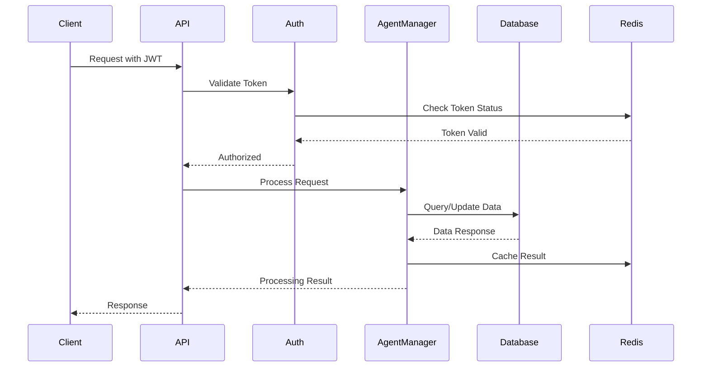

# FreeAgentics Onboarding Guide

## Welcome to FreeAgentics

Welcome to the FreeAgentics team! This guide will help you get up to speed with our multi-agent AI platform, development practices, and team culture.

## Table of Contents

1. [Project Overview](#project-overview)
2. [Architecture Understanding](#architecture-understanding)
3. [Development Setup](#development-setup)
4. [Development Workflow](#development-workflow)
5. [Security Practices](#security-practices)
6. [Testing Framework](#testing-framework)
7. [Documentation Standards](#documentation-standards)
8. [Team Practices](#team-practices)
9. [Resources and Tools](#resources-and-tools)
10. [First Week Tasks](#first-week-tasks)

## Project Overview

### What is FreeAgentics?

FreeAgentics is a cutting-edge multi-agent AI platform that enables the creation, coordination, and management of AI agents using Active Inference principles. Our platform supports:

- **Multi-Agent Systems**: Coordinate multiple AI agents working together
- **Active Inference**: PyMDP-based inference engine for agent decision-making
- **Real-time Communication**: WebSocket-based real-time agent communication
- **Enterprise Security**: Comprehensive security with JWT, RBAC, and monitoring
- **Scalable Architecture**: Designed for high-performance and scalability

### Key Technologies

- **Backend**: Python 3.9+, FastAPI, SQLAlchemy, PyMDP
- **Database**: PostgreSQL, Redis
- **Frontend**: Next.js, TypeScript, React
- **Infrastructure**: Docker, Kubernetes, Nginx
- **Monitoring**: Prometheus, Grafana, ELK Stack
- **Security**: JWT, RBAC, SSL/TLS, Rate Limiting

### Business Value

- **AI Democratization**: Makes AI agents accessible to non-technical users
- **Scalability**: Handles enterprise-scale agent coordination
- **Security**: Enterprise-grade security for sensitive applications
- **Performance**: Optimized for high-throughput agent processing

## Architecture Understanding

### System Architecture

```
┌─────────────────┐    ┌─────────────────┐    ┌─────────────────┐
│   Web Client    │    │   API Client    │    │ WebSocket Client│
└─────────────────┘    └─────────────────┘    └─────────────────┘
         │                       │                       │
         └───────────────────────┼───────────────────────┘
                                 │
                    ┌─────────────────┐
                    │  Nginx Gateway  │
                    │ (SSL/Rate Limit)│
                    └─────────────────┘
                                 │
                    ┌─────────────────┐
                    │   FastAPI App   │
                    │  (Agent Manager)│
                    └─────────────────┘
                                 │
         ┌───────────────────────┼───────────────────────┐
         │                       │                       │
┌─────────────────┐    ┌─────────────────┐    ┌─────────────────┐
│   PostgreSQL    │    │      Redis      │    │ Shared Memory   │
│  (Primary DB)   │    │ (Cache/Session) │    │ (Agent States)  │
└─────────────────┘    └─────────────────┘    └─────────────────┘
```

### Core Components

1. **Agent Manager** (`/agents/agent_manager.py`)
   - Manages agent lifecycle and coordination
   - Handles agent creation, destruction, and state management
   - Implements thread pool optimization for performance

2. **Coalition Coordinator** (`/agents/coalition_coordinator.py`)
   - Manages agent groups and collaboration
   - Implements coalition formation strategies
   - Handles inter-agent communication

3. **Authentication System** (`/auth/security_implementation.py`)
   - JWT-based authentication with refresh token rotation
   - Role-based access control (RBAC)
   - Security monitoring and audit logging

4. **Inference Engine** (`/inference/`)
   - PyMDP integration for Active Inference
   - Belief state management and updates
   - Action selection and planning

5. **Knowledge Graph** (`/knowledge_graph/`)
   - Graph-based knowledge representation
   - Entity and relationship management
   - Semantic search capabilities

### Data Flow



## Development Setup

### Prerequisites

1. **Python 3.9+**
   ```bash
   # Install Python 3.9 or higher
   python --version
   ```

2. **Node.js 18+**
   ```bash
   # Install Node.js 18 or higher
   node --version
   npm --version
   ```

3. **Optional: PostgreSQL and Redis** (for production-like setup)
   ```bash
   # Using Docker (optional)
   docker run -d --name postgres -p 5432:5432 -e POSTGRES_PASSWORD=postgres postgres:13
   docker run -d --name redis -p 6379:6379 redis:6
   ```

### Project Setup

1. **Clone Repository**
   ```bash
   git clone https://github.com/freeagentics/freeagentics.git
   cd freeagentics
   ```

2. **Environment Configuration**
   ```bash
   # Use development configuration (includes SQLite fallback)
   cp .env.development .env
   
   # Optional: Edit configuration for custom setup
   vim .env
   ```

3. **Install Dependencies (One Command)**
   ```bash
   # Installs both Python and Node.js dependencies
   make install
   ```

   This command will:
   - Create a Python virtual environment in `venv/`
   - Install Python dependencies including `inferactively-pymdp==0.0.7.1`
   - Install Node.js dependencies for the frontend

4. **Database Setup**
   ```bash
   # Option 1: Use SQLite (automatic with DEVELOPMENT_MODE=true)
   # No setup needed - database file created automatically
   
   # Option 2: Use PostgreSQL (if DATABASE_URL is set)
   # Run database migrations
   alembic upgrade head
   ```

5. **Start Development Servers**
   ```bash
   # Start both backend (8000) and frontend (3000)
   make dev
   
   # Or start separately:
   make dev-backend   # API at http://localhost:8000
   make dev-frontend  # UI at http://localhost:3000
   ```

6. **Verify Setup**
   ```bash
   # Run tests
   make test
   
   # Check API health
   curl http://localhost:8000/health
   
   # View API docs
   open http://localhost:8000/docs
   ```

### Development Environment Features

- **SQLite Fallback**: When `DEVELOPMENT_MODE=true` and no `DATABASE_URL` is set, SQLite is used automatically
- **In-Memory Redis Fallback**: If Redis is not available, an in-memory cache is used
- **Hot Reload**: Both backend and frontend auto-reload on code changes
- **Debug Logging**: Set `DEBUG=true` and `LOG_LEVEL=DEBUG` for detailed logs
- **SQL Query Logging**: Set `DEBUG_SQL=true` to see all database queries

### Development Tools

1. **IDE Setup**
   - Recommended: Visual Studio Code with Python extension
   - Alternative: PyCharm, Vim, or your preferred editor

2. **Code Quality Tools**
   ```bash
   # Code formatting
   black .
   
   # Linting
   flake8 .
   
   # Type checking
   mypy .
   
   # Security scanning
   bandit -r .
   ```

3. **Git Hooks**
   ```bash
   # Install pre-commit hooks
   pre-commit install
   
   # Run hooks manually
   pre-commit run --all-files
   ```

## Development Workflow

### Git Workflow

1. **Branch Strategy**
   ```bash
   # Create feature branch
   git checkout -b feature/your-feature-name
   
   # Work on feature
   git add .
   git commit -m "feat: add new feature"
   
   # Push to remote
   git push origin feature/your-feature-name
   ```

2. **Commit Message Format**
   ```
   type(scope): description
   
   [optional body]
   
   [optional footer]
   ```
   
   Types: `feat`, `fix`, `docs`, `style`, `refactor`, `test`, `chore`

3. **Pull Request Process**
   - Create PR with descriptive title and description
   - Ensure all tests pass and code quality checks pass
   - Request review from team members
   - Address review feedback
   - Merge after approval

### Test-Driven Development (TDD)

1. **Write Test First**
   ```python
   # tests/unit/test_agent_manager.py
   def test_create_agent_success():
       manager = AgentManager()
       
       agent = manager.create_agent(
           name="Test Agent",
           template="research_v2",
           user_id="user123"
       )
       
       assert agent.name == "Test Agent"
       assert agent.template == "research_v2"
       assert agent.status == "active"
   ```

2. **Write Minimum Code**
   ```python
   # agents/agent_manager.py
   class AgentManager:
       def create_agent(self, name: str, template: str, user_id: str) -> Agent:
           # Minimum implementation to pass test
           return Agent(
               name=name,
               template=template,
               user_id=user_id,
               status="active"
           )
   ```

3. **Refactor**
   ```python
   # Improve implementation while keeping tests green
   def create_agent(self, name: str, template: str, user_id: str) -> Agent:
       # Validate input
       if not name or not template:
           raise ValueError("Name and template are required")
       
       # Create agent with proper initialization
       agent = Agent(
           name=name,
           template=template,
           user_id=user_id,
           status="active",
           created_at=datetime.utcnow()
       )
       
       # Save to database
       self.db.add(agent)
       self.db.commit()
       
       return agent
   ```

### Code Review Guidelines

1. **What to Look For**
   - Code correctness and logic
   - Test coverage and quality
   - Security considerations
   - Performance implications
   - Code style and readability
   - Documentation updates

2. **Review Checklist**
   - [ ] All tests pass
   - [ ] Code follows style guidelines
   - [ ] Security best practices followed
   - [ ] Performance considerations addressed
   - [ ] Documentation updated
   - [ ] Error handling implemented

3. **Providing Feedback**
   - Be constructive and specific
   - Suggest improvements, don't just point out problems
   - Explain the reasoning behind suggestions
   - Acknowledge good practices

## Security Practices

### Security Mindset

1. **Security by Design**
   - Consider security implications in every design decision
   - Implement security controls from the beginning
   - Use secure defaults and fail securely

2. **Principle of Least Privilege**
   - Grant minimum necessary permissions
   - Regularly review and audit permissions
   - Implement role-based access control

3. **Defense in Depth**
   - Multiple layers of security controls
   - Don't rely on single security measure
   - Implement monitoring and alerting

### Common Security Practices

1. **Input Validation**
   ```python
   from pydantic import BaseModel, validator
   
   class AgentRequest(BaseModel):
       name: str
       template: str
       
       @validator('name')
       def validate_name(cls, v):
           if not v or len(v) < 3:
               raise ValueError('Name must be at least 3 characters')
           if not v.replace('_', '').replace('-', '').isalnum():
               raise ValueError('Name must be alphanumeric')
           return v
   ```

2. **Authentication**
   ```python
   from fastapi import Depends, HTTPException, status
   from fastapi.security import HTTPBearer
   
   security = HTTPBearer()
   
   def get_current_user(token: str = Depends(security)):
       try:
           payload = verify_jwt_token(token.credentials)
           return get_user_by_id(payload['user_id'])
       except Exception:
           raise HTTPException(
               status_code=status.HTTP_401_UNAUTHORIZED,
               detail="Invalid token"
           )
   ```

3. **Authorization**
   ```python
   def require_permission(permission: str):
       def decorator(func):
           def wrapper(current_user: User = Depends(get_current_user)):
               if not has_permission(current_user, permission):
                   raise HTTPException(
                       status_code=status.HTTP_403_FORBIDDEN,
                       detail="Insufficient permissions"
                   )
               return func(current_user)
           return wrapper
       return decorator
   
   @app.post("/api/v1/agents")
   @require_permission("create_agent")
   def create_agent(request: AgentRequest, current_user: User):
       # Implementation
       pass
   ```

### Security Testing

1. **Security Test Examples**
   ```python
   # Test authentication bypass
   def test_unauthenticated_access_denied():
       response = client.get("/api/v1/agents")
       assert response.status_code == 401
   
   # Test authorization
   def test_insufficient_permissions():
       token = create_user_token(role="viewer")
       headers = {"Authorization": f"Bearer {token}"}
       
       response = client.post("/api/v1/agents", 
                            json={"name": "test", "template": "research_v2"},
                            headers=headers)
       assert response.status_code == 403
   
   # Test input validation
   def test_malicious_input_rejected():
       token = create_admin_token()
       headers = {"Authorization": f"Bearer {token}"}
       
       response = client.post("/api/v1/agents",
                            json={"name": "<script>alert('xss')</script>"},
                            headers=headers)
       assert response.status_code == 422
   ```

2. **Security Scanning**
   ```bash
   # Run security tests
   pytest tests/security/ -v
   
   # Security scanning
   bandit -r .
   
   # Dependency vulnerability check
   pip-audit
   ```

## Testing Framework

### Test Structure

1. **Unit Tests** (70% of tests)
   - Test individual functions and classes
   - Fast execution (< 1 second per test)
   - High coverage of business logic

2. **Integration Tests** (20% of tests)
   - Test component interactions
   - Use real database and external services
   - Moderate execution time (< 10 seconds per test)

3. **End-to-End Tests** (10% of tests)
   - Test complete user workflows
   - Slowest execution (< 60 seconds per test)
   - Cover critical user paths

### Writing Good Tests

1. **Test Naming**
   ```python
   # Good: Descriptive test name
   def test_create_agent_with_valid_data_returns_active_agent():
       pass
   
   # Bad: Vague test name
   def test_create_agent():
       pass
   ```

2. **Test Structure (AAA Pattern)**
   ```python
   def test_agent_processes_observation_correctly():
       # Arrange
       agent = Agent(template="research_v2")
       observation = {"type": "text", "content": "What is AI?"}
       
       # Act
       result = agent.process_observation(observation)
       
       # Assert
       assert result["status"] == "processed"
       assert "confidence" in result
       assert 0.0 <= result["confidence"] <= 1.0
   ```

3. **Test Data Management**
   ```python
   # Use factories for test data
   def test_user_can_create_agent():
       user = UserFactory()
       agent_data = {
           "name": "Test Agent",
           "template": "research_v2"
       }
       
       agent = create_agent(user, agent_data)
       
       assert agent.user_id == user.id
       assert agent.name == "Test Agent"
   ```

### Running Tests

```bash
# Run all tests
pytest

# Run specific test file
pytest tests/unit/test_agent_manager.py

# Run with coverage
pytest --cov=. --cov-report=html

# Run tests in parallel
pytest -n auto

# Run only fast tests
pytest -m "not slow"
```

## Documentation Standards

### Code Documentation

1. **Function Documentation**
   ```python
   def create_agent(name: str, template: str, user_id: str) -> Agent:
       """
       Create a new agent with the specified configuration.
       
       Args:
           name: Human-readable name for the agent
           template: Agent template type (e.g., 'research_v2')
           user_id: ID of the user creating the agent
           
       Returns:
           Agent: The created agent instance
           
       Raises:
           ValueError: If name or template is invalid
           PermissionError: If user doesn't have create permissions
           
       Example:
           >>> agent = create_agent("My Agent", "research_v2", "user123")
           >>> agent.name
           'My Agent'
       """
   ```

2. **Class Documentation**
   ```python
   class AgentManager:
       """
       Manages the lifecycle and coordination of AI agents.
       
       The AgentManager handles agent creation, destruction, and state
       management. It provides thread-safe operations and implements
       performance optimizations for multi-agent scenarios.
       
       Attributes:
           agents: Dict mapping agent IDs to Agent instances
           thread_pool: ThreadPoolExecutor for parallel processing
           
       Example:
           >>> manager = AgentManager()
           >>> agent = manager.create_agent("Research Agent", "research_v2")
           >>> manager.get_agent_count()
           1
       """
   ```

### API Documentation

1. **Endpoint Documentation**
   ```python
   @app.post("/api/v1/agents", response_model=AgentResponse)
   def create_agent(
       request: AgentRequest,
       current_user: User = Depends(get_current_user)
   ):
       """
       Create a new AI agent.
       
       Creates a new agent with the specified configuration and assigns
       it to the current user.
       
       - **name**: Human-readable name for the agent
       - **template**: Agent template type (research_v2, analysis_v1, etc.)
       - **parameters**: Optional configuration parameters
       
       Returns the created agent with its unique ID and initial status.
       """
   ```

2. **Schema Documentation**
   ```python
   class AgentRequest(BaseModel):
       """
       Request model for creating a new agent.
       
       Attributes:
           name: Human-readable name (3-50 characters)
           template: Agent template identifier
           parameters: Optional configuration parameters
       """
       name: str = Field(..., min_length=3, max_length=50, description="Agent name")
       template: str = Field(..., description="Agent template type")
       parameters: Optional[Dict[str, Any]] = Field(None, description="Configuration parameters")
   ```

### README Files

1. **Component README Structure**
   ```markdown
   # Component Name
   
   Brief description of what this component does.
   
   ## Overview
   
   More detailed explanation of the component's purpose and functionality.
   
   ## Architecture
   
   Description of the component's architecture and key classes.
   
   ## Usage
   
   ```python
   # Example usage
   from agents.agent_manager import AgentManager
   
   manager = AgentManager()
   agent = manager.create_agent("My Agent", "research_v2")
   ```
   
   ## Configuration
   
   Environment variables and configuration options.
   
   ## Testing
   
   How to run tests for this component.
   
   ## Contributing
   
   Guidelines for contributing to this component.
   ```

## Team Practices

### Communication

1. **Daily Standups**
   - What did you work on yesterday?
   - What will you work on today?
   - Any blockers or issues?

2. **Code Reviews**
   - All code must be reviewed before merging
   - Provide constructive feedback
   - Focus on correctness, security, and maintainability

3. **Documentation**
   - Update documentation with code changes
   - Keep README files current
   - Document architectural decisions

### Collaboration Tools

1. **Communication**
   - Slack: Team communication
   - Email: Formal communications
   - Video calls: Complex discussions

2. **Development**
   - GitHub: Code repository and issue tracking
   - Docker: Development environment
   - Postman: API testing

3. **Monitoring**
   - Grafana: System monitoring
   - Sentry: Error tracking
   - Logs: Application logging

## Resources and Tools

### Learning Resources

1. **Python and FastAPI**
   - [FastAPI Documentation](https://fastapi.tiangolo.com/)
   - [Python Best Practices](https://docs.python-guide.org/)
   - [SQLAlchemy Documentation](https://docs.sqlalchemy.org/)

2. **Active Inference and PyMDP**
   - [PyMDP Documentation](https://github.com/infer-actively/pymdp)
   - [Active Inference Papers](https://www.fil.ion.ucl.ac.uk/~karl/)
   - [Multi-Agent Systems](https://multiagent.org/)

3. **Security**
   - [OWASP Top 10](https://owasp.org/www-project-top-ten/)
   - [JWT Best Practices](https://auth0.com/blog/a-look-at-the-latest-draft-for-jwt-bcp/)
   - [API Security](https://owasp.org/www-project-api-security/)

### Development Tools

1. **Code Quality**
   - Black: Code formatting
   - Flake8: Linting
   - MyPy: Type checking
   - Bandit: Security scanning

2. **Testing**
   - Pytest: Testing framework
   - Coverage.py: Coverage reporting
   - Factory Boy: Test data generation

3. **Database**
   - Alembic: Database migrations
   - PostgreSQL: Primary database
   - Redis: Caching and sessions

## First Week Tasks

### Day 1: Environment Setup

- [ ] Set up development environment
- [ ] Clone repository and install dependencies
- [ ] Run tests to verify setup
- [ ] Review project architecture documentation
- [ ] Meet with team members

### Day 2: Code Exploration

- [ ] Explore core components (Agent Manager, Auth, etc.)
- [ ] Run the application locally
- [ ] Test API endpoints using Postman
- [ ] Review recent pull requests
- [ ] Understand git workflow

### Day 3: First Contribution

- [ ] Pick a "good first issue" from GitHub
- [ ] Write tests for the feature/fix
- [ ] Implement the solution
- [ ] Create pull request
- [ ] Address review feedback

### Day 4: Testing Deep Dive

- [ ] Run full test suite
- [ ] Write additional tests for existing code
- [ ] Learn about our testing practices
- [ ] Understand CI/CD pipeline
- [ ] Review security testing procedures

### Day 5: Documentation and Knowledge Sharing

- [ ] Update documentation based on learnings
- [ ] Create or update README files
- [ ] Share learnings with team
- [ ] Plan next week's work
- [ ] Provide feedback on onboarding process

### First Week Deliverables

1. **Environment Setup**: Working development environment
2. **First Contribution**: Merged pull request
3. **Test Coverage**: New tests for existing code
4. **Documentation**: Updated documentation
5. **Feedback**: Onboarding improvement suggestions

## Getting Help

### Team Contacts

- **Tech Lead**: tech-lead@freeagentics.com
- **Security Lead**: security-lead@freeagentics.com
- **DevOps Lead**: devops-lead@freeagentics.com
- **QA Lead**: qa-lead@freeagentics.com

### Support Channels

1. **Slack Channels**
   - #general: General team discussion
   - #development: Development questions
   - #security: Security-related discussions
   - #infrastructure: Infrastructure and deployment

2. **Documentation**
   - [Architecture Overview](docs/ARCHITECTURE_OVERVIEW.md)
   - [API Documentation](docs/api/README.md)
   - [Security Documentation](docs/security/README.md)
   - [Testing Procedures](docs/TESTING_PROCEDURES.md)

3. **Issue Tracking**
   - GitHub Issues: Bug reports and feature requests
   - Security Issues: security@freeagentics.com
   - Infrastructure Issues: infrastructure@freeagentics.com

### Common Questions

1. **"How do I run tests?"**
   ```bash
   # Run all tests
   pytest
   
   # Run specific test file
   pytest tests/unit/test_agent_manager.py
   ```

2. **"How do I debug authentication issues?"**
   ```bash
   # Check JWT token
   python -c "import jwt; print(jwt.decode('TOKEN', verify=False))"
   
   # Check logs
   tail -f logs/security_audit.log
   ```

3. **"How do I add a new API endpoint?"**
   - Add endpoint to appropriate router in `/api/v1/`
   - Add request/response models
   - Write tests first (TDD)
   - Update API documentation

## Welcome Message

Congratulations on joining the FreeAgentics team! We're excited to have you contribute to our mission of democratizing AI through multi-agent systems.

This onboarding guide should help you get started, but don't hesitate to ask questions. We believe in continuous learning and improvement, and your fresh perspective will help us grow.

Remember:
- **Security first**: Always consider security implications
- **Test everything**: Write tests before code
- **Document your work**: Help future developers (including yourself)
- **Collaborate actively**: We're stronger together
- **Have fun**: We're building something amazing!

Welcome aboard! 🚀

---

**Document Version**: 1.0
**Last Updated**: January 16, 2025
**Next Review**: February 16, 2025
**Maintained By**: Team Lead

---

*This guide is a living document. Please suggest improvements based on your onboarding experience.*