# FreeAgentics Architecture Diagrams

This document provides visual representations of the FreeAgentics architecture using Mermaid diagrams.

## System Architecture Overview

The following diagram illustrates the high-level architecture of FreeAgentics, showing the main components and their relationships.

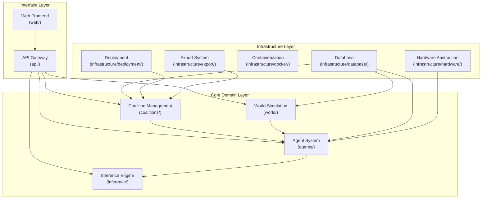

## Clean Architecture Dependency Flow

This diagram illustrates the dependency rules as defined in ADR-003, showing how dependencies flow inward toward the core domain.

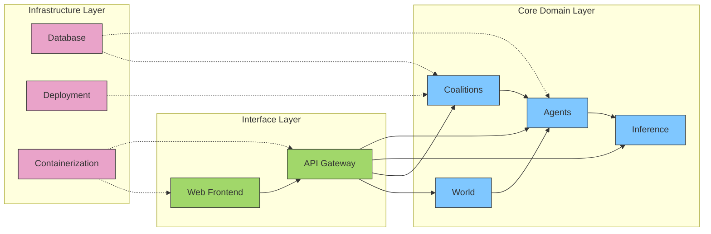

## Component Diagram

The following diagram shows the main components of the system and their interactions.

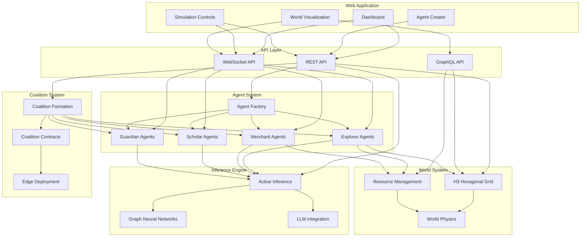

## Agent Interaction Flow

This diagram illustrates how agents interact with each other and the environment.

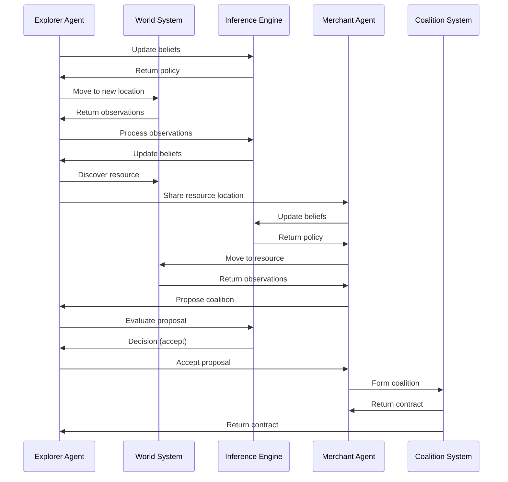

## Data Flow Diagram

This diagram shows how data flows through the system.

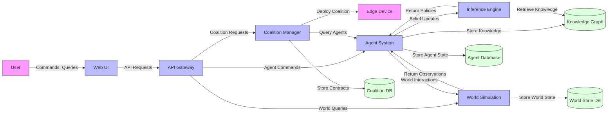

## Active Inference Process

This diagram illustrates the Active Inference process that drives agent behavior, now powered by the validated PyMDP library.

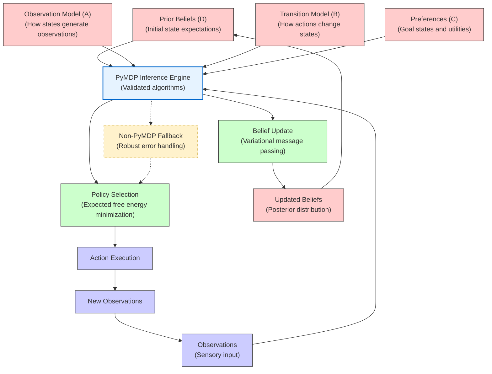

## PyMDP Integration Architecture

This diagram shows the detailed architecture of our PyMDP integration with robust fallback mechanisms.

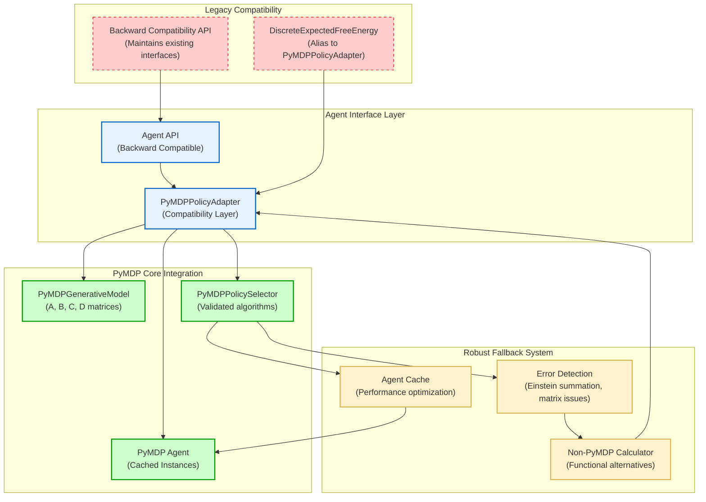

## Deployment Architecture

This diagram shows the deployment architecture of the system.

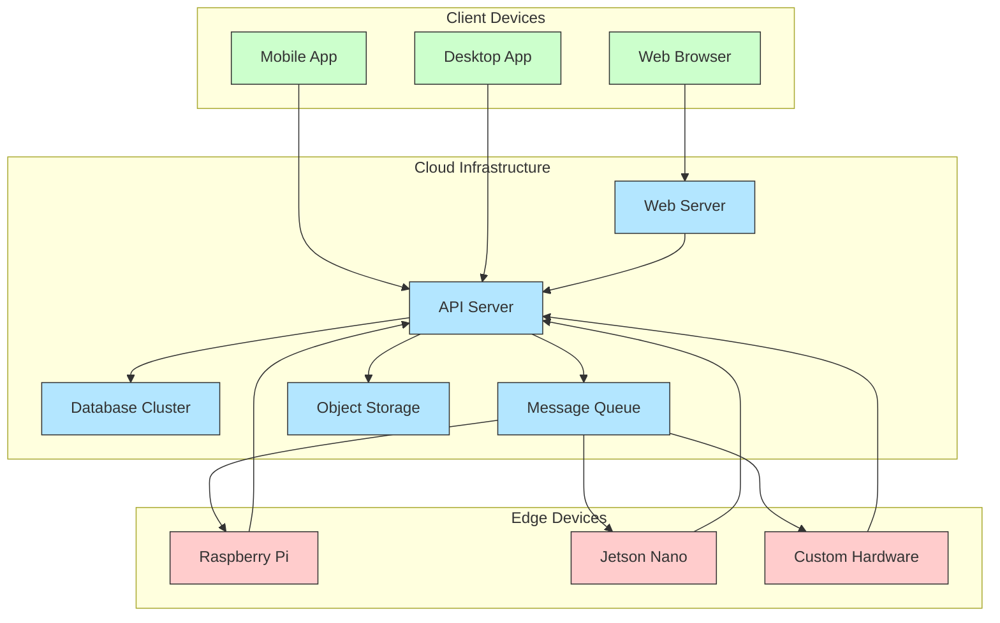

## Coalition Formation Process

This diagram illustrates the coalition formation process.

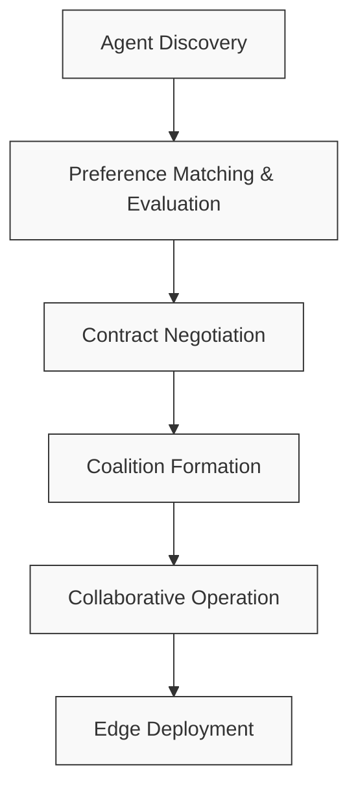

## Knowledge Graph Structure

This diagram shows the structure of the knowledge graph used by agents.

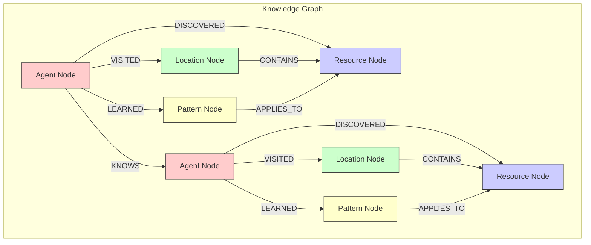

## Module Dependencies

This diagram shows the dependencies between the main modules of the system, adhering to ADR-003.

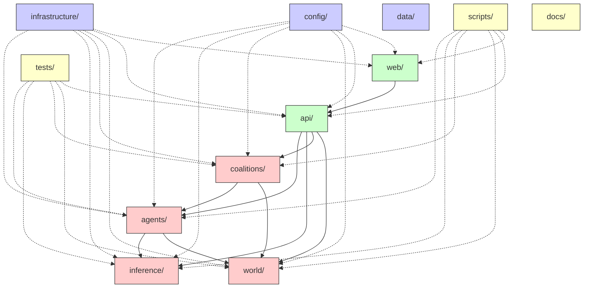

## Class Diagram: Agent System

This diagram shows the class structure of the agent system.

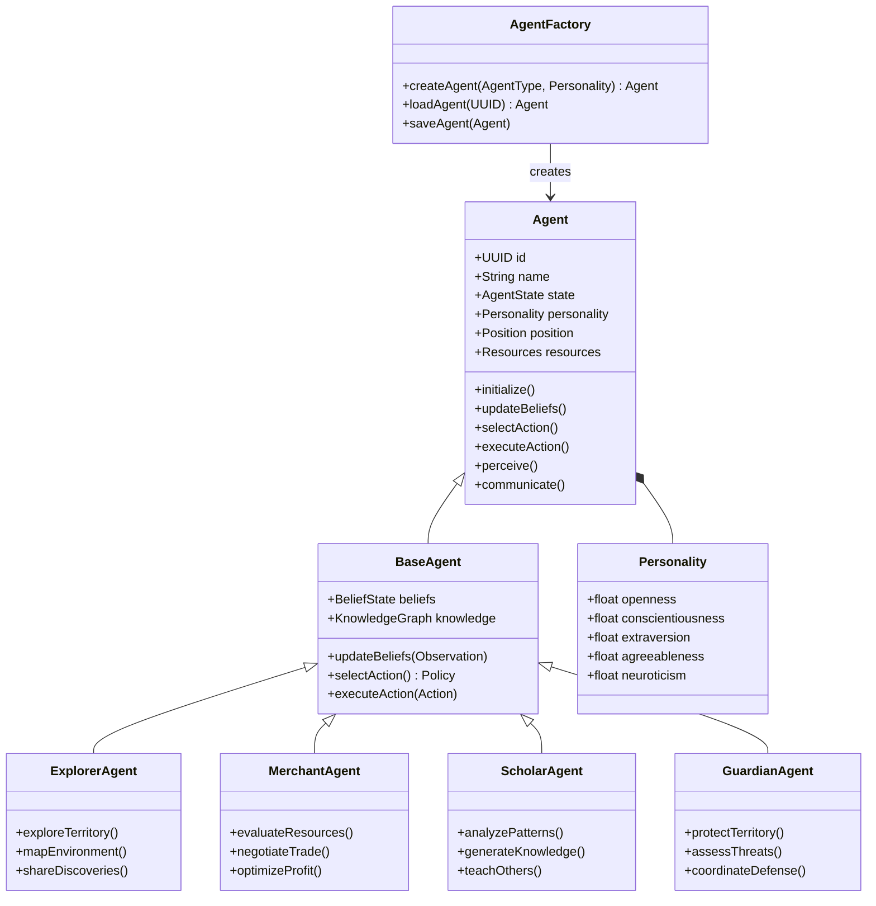

These diagrams provide a comprehensive visual representation of the FreeAgentics architecture, showing how the different components interact and how data flows through the system.
