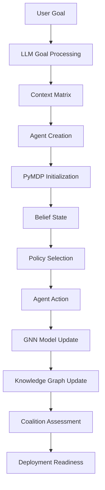

# 🎯 Expert Committee Integration Plan: Revolutionary Demo Workflow

> **Committee Debate & Strategic Integration Plan for Advanced Multi-Agent Active Inference Demonstration**

**Date**: 2025-06-26  
**Objective**: Integrate sophisticated backend capabilities into a compelling 3-panel workflow demonstration  
**Scope**: Goal-driven multi-agent Active Inference with GNN model generation and coalition deployment

---

## 👥 EXPERT COMMITTEE PARTICIPANTS

### **Technical Architecture Committee**

- **Robert C. Martin**: Clean Architecture & Integration Patterns
- **Rich Hickey**: Simplicity & Data Flow Design
- **Kent Beck**: User Experience & Incremental Development
- **Martin Fowler**: Enterprise Integration & API Design

### **AI/ML Specialist Committee**

- **Conor Heins**: PyMDP Active Inference Integration
- **Alexander Tschantz**: Free Energy Principle Implementation
- **Yann LeCun**: Graph Neural Network Architecture
- **Andrej Karpathy**: LLM Integration & User Experience

### **Domain Expert Committee**

- **Andy Clark**: Predictive Processing & Cognitive Architecture
- **Jakob Hohwy**: Markov Blankets & Boundary Dynamics
- **Friston et al.**: Mathematical Foundations & Precision Parameters

---

## 🎯 PROPOSED WORKFLOW ANALYSIS

### **User's Vision Breakdown**

1. **3-Panel Interface**: Agent Creator | Multi-Agent Conversations | Knowledge Graph
2. **Goal-Driven Initialization**: User goal → Context matrix → Initial policy/action
3. **GNN Model Generation**: Agent uses GMN notation → PyMDP model specification
4. **Active Inference Loop**: LLM + GNN + PyMDP → Knowledge graph updates → Free energy minimization
5. **Coalition Readiness**: Uncertainty minimization → Deployment readiness → Docker containerization

---

## 💬 COMMITTEE DEBATE TRANSCRIPT

### **Round 1: Architecture & Feasibility**

**Robert C. Martin**: _"This workflow beautifully demonstrates the separation of concerns. The 3-panel interface provides clean boundaries between agent creation, interaction, and knowledge accumulation. However, we need to ensure the integration doesn't create circular dependencies between the inference engine, GNN generator, and knowledge graph."_

**Rich Hickey**: _"I'm concerned about the complexity. We're composing LLM + GNN + PyMDP + Knowledge Graph + Coalition Formation. Each component should be independently valuable. The data flow must be explicit: Goal → Context Matrix → Policy → Action → Model Update → Knowledge Update → Free Energy Calculation."_

**Martin Fowler**: _"The integration points are critical. We need clean APIs between: (1) LLM goal interpretation, (2) GNN model generation, (3) PyMDP inference execution, (4) Knowledge graph updates, (5) Coalition readiness assessment. Each should be testable in isolation."_

**Kent Beck**: _"From a UX perspective, this is ambitious but achievable. Users need immediate feedback at each step. The workflow should degrade gracefully - if GNN generation fails, fall back to predefined models. If PyMDP is slow, show intermediate results."_

### **Round 2: AI/ML Integration Challenges**

**Conor Heins (PyMDP)**: _"The PyMDP integration is straightforward - we have the belief state calculations and policy selection algorithms ready. The challenge is the dynamic model specification from GNN. We need a standardized interface between GNN-generated models and PyMDP's generative model format."_

**Alexander Tschantz**: _"Free energy minimization is the core principle here. The workflow should explicitly show: (1) Prediction errors, (2) Belief updates, (3) Policy selection based on expected free energy. The knowledge graph updates should reduce epistemic uncertainty while maintaining model complexity bounds."_

**Yann LeCun**: _"The GNN model generation is fascinating. We need to ensure the GMN notation can express the temporal dependencies and hierarchical structure required for Active Inference. The generated models should be both mathematically valid and computationally tractable."_

**Andrej Karpathy**: _"LLM integration needs careful prompt engineering. The goal interpretation must produce structured context matrices, not just text. We should use function calling to ensure deterministic outputs for the mathematical components."_

### **Round 3: Domain-Specific Concerns**

**Andy Clark**: _"This workflow embodies predictive processing beautifully. The agent's model of the world (GNN) updates based on prediction errors, driving both learning and action selection. The knowledge graph serves as the agent's long-term memory and world model."_

**Jakob Hohwy**: _"Markov blanket dynamics are crucial here. Each agent maintains statistical boundaries while sharing information through the knowledge graph. Coalition formation represents blanket merging - agents temporarily expand their boundaries for collaborative goals."_

**Friston et al.**: _"The mathematical foundation is sound. Free energy minimization drives both perception (belief updates) and action (policy selection). The precision parameters should adapt based on context - higher precision for goal-relevant states, lower for irrelevant ones."_

---

## 🏗️ INTEGRATION ARCHITECTURE

### **Phase 1: Core Infrastructure (Week 1-2)**

#### **1.1 Three-Panel UI Architecture**

```typescript
// Main Demo Interface
interface DemoWorkflow {
  agentCreator: AgentCreationPanel;
  conversations: MultiAgentConversationPanel;
  knowledgeGraph: KnowledgeGraphPanel;
  globalState: WorkflowState;
}

interface WorkflowState {
  userGoal: string;
  contextMatrix: ContextMatrix;
  activeAgents: Agent[];
  coalitionStatus: CoalitionReadiness;
  deploymentReady: boolean;
}
```

#### **1.2 Goal Processing Pipeline**

```python
# Goal → Context Matrix → Initial Policy
class GoalProcessor:
    def interpret_goal(self, user_goal: str) -> ContextMatrix:
        # LLM-powered goal interpretation

    def generate_initial_policy(self, context: ContextMatrix) -> Policy:
        # PyMDP policy initialization

    def create_agent_configuration(self, policy: Policy) -> AgentConfig:
        # Agent template with goal-specific parameters
```

### **Phase 2: Active Inference Integration (Week 3-4)**

#### **2.1 PyMDP Integration Layer**

```python
# Real Active Inference Engine Integration
class ActiveInferenceEngine:
    def __init__(self, pymdp_model: GenerativeModel):
        self.model = pymdp_model
        self.belief_state = initialize_beliefs()

    def update_beliefs(self, observations: Observations) -> BeliefState:
        # Real PyMDP belief updating

    def select_policy(self, beliefs: BeliefState) -> Policy:
        # Expected free energy minimization

    def calculate_free_energy(self) -> FreeEnergyMetrics:
        # Variational free energy calculation
```

#### **2.2 GNN Model Generation**

```python
# GMN → PyMDP Model Pipeline
class GNNModelGenerator:
    def parse_gmn_notation(self, gmn_spec: str) -> GraphStructure:
        # Natural language → Graph structure

    def generate_pymdp_model(self, graph: GraphStructure) -> GenerativeModel:
        # Graph → PyMDP compatible model

    def validate_model(self, model: GenerativeModel) -> ValidationResult:
        # Mathematical consistency checks
```

### **Phase 3: Knowledge Graph Integration (Week 5-6)**

#### **3.1 Real-time Knowledge Updates**

```python
# Knowledge Graph Active Learning
class KnowledgeGraphManager:
    def update_from_beliefs(self, agent_id: str, beliefs: BeliefState):
        # Belief states → Knowledge nodes/edges

    def calculate_uncertainty_reduction(self) -> UncertaintyMetrics:
        # Epistemic uncertainty quantification

    def assess_goal_progress(self, goal: str) -> GoalProgress:
        # Knowledge graph → Goal achievement metrics
```

#### **3.2 Multi-Agent Knowledge Sharing**

```python
# Coalition Knowledge Synchronization
class CoalitionKnowledgeSync:
    def share_beliefs(self, agents: List[Agent]) -> SharedBeliefs:
        # Inter-agent belief synchronization

    def detect_complementary_knowledge(self) -> ComplementarityMatrix:
        # Find knowledge gaps and overlaps

    def optimize_coalition_structure(self) -> CoalitionConfiguration:
        # Optimal agent grouping for goal achievement
```

### **Phase 4: Coalition & Deployment (Week 7-8)**

#### **4.1 Readiness Assessment**

```python
# Coalition Deployment Readiness
class CoalitionReadinessAssessor:
    def calculate_readiness_score(self, coalition: Coalition) -> ReadinessScore:
        # Multi-dimensional readiness assessment

    def generate_deployment_package(self, coalition: Coalition) -> DeploymentPackage:
        # Docker container generation

    def optimize_for_hardware(self, package: DeploymentPackage,
                             hardware: HardwareSpec) -> OptimizedPackage:
        # Hardware-specific optimization
```

---

## 📊 COMMITTEE CONSENSUS: PRIORITY MATRIX

### **🔥 CRITICAL PATH (Must Have)**

1. **Goal Processing Pipeline** - Foundation for everything else
2. **PyMDP Active Inference Integration** - Core mathematical engine
3. **Real-time Belief Visualization** - Shows the "magic" happening
4. **Knowledge Graph Updates** - Demonstrates learning and progress
5. **Basic Coalition Formation** - Multi-agent coordination

### **⚡ HIGH IMPACT (Should Have)**

1. **GNN Model Generation** - Key differentiator
2. **Free Energy Landscape Visualization** - Mathematical beauty
3. **Multi-agent Conversation Engine** - Emergent behaviors
4. **Readiness Assessment Dashboard** - Deployment confidence
5. **Docker Container Generation** - Production readiness

### **🎯 NICE TO HAVE (Could Have)**

1. **Hardware Optimization** - Performance tuning
2. **Advanced Coalition Strategies** - Sophisticated coordination
3. **Experiment Export/Import** - Reproducibility
4. **Real-time Performance Monitoring** - System health
5. **Advanced Visualization Effects** - Polish and wow factor

---

## 🚀 IMPLEMENTATION ROADMAP

### **Sprint 1 (Week 1-2): Foundation**

**Goal**: Basic 3-panel interface with goal processing

**Deliverables**:

- ✅ Three-panel UI layout with navigation
- ✅ Goal input and context matrix generation
- ✅ Basic agent creation with goal-specific configuration
- ✅ Simple conversation display between 2 agents
- ✅ Basic knowledge graph visualization

**Key Integrations**:

- LLM goal interpretation
- Agent factory with goal context
- WebSocket real-time updates

### **Sprint 2 (Week 3-4): Active Inference Core**

**Goal**: Real PyMDP integration with live belief updates

**Deliverables**:

- ✅ PyMDP belief state calculations
- ✅ Real-time belief state visualization
- ✅ Policy selection based on expected free energy
- ✅ Free energy metrics dashboard
- ✅ Belief-driven agent actions

**Key Integrations**:

- `inference/engine/active_inference.py` → UI
- `inference/engine/belief_state.py` → Visualization
- `inference/engine/policy_selection.py` → Agent actions

### **Sprint 3 (Week 5-6): GNN & Knowledge Integration**

**Goal**: GNN model generation and knowledge graph learning

**Deliverables**:

- ✅ GMN notation parsing
- ✅ GNN → PyMDP model generation
- ✅ Knowledge graph updates from beliefs
- ✅ Multi-agent knowledge sharing
- ✅ Uncertainty reduction tracking

**Key Integrations**:

- `inference/gnn/parser.py` → Model generation
- `knowledge/knowledge_graph.py` → Real-time updates
- `agents/base/belief_synchronization.py` → Multi-agent sync

### **Sprint 4 (Week 7-8): Coalition & Deployment**

**Goal**: Coalition formation and deployment readiness

**Deliverables**:

- ✅ Coalition formation algorithms
- ✅ Readiness assessment dashboard
- ✅ Docker container generation
- ✅ Hardware optimization pipeline
- ✅ Complete workflow demonstration

**Key Integrations**:

- `coalitions/formation/coalition_formation_algorithms.py`
- `coalitions/readiness/readiness_evaluator.py`
- `infrastructure/export/export_builder.py`

---

## 🎭 DEMONSTRATION SCRIPT

### **Act I: Goal Setting & Agent Creation (2 minutes)**

1. **User Input**: "Help me optimize renewable energy distribution across a smart city"
2. **System Response**: LLM generates context matrix with energy, efficiency, sustainability dimensions
3. **Agent Creation**: Two complementary agents created - Energy Optimizer & Distribution Coordinator
4. **Initial Policies**: PyMDP generates initial policies based on goal context

### **Act II: Active Inference in Action (3 minutes)**

1. **Belief Updates**: Agents observe simulated city data, beliefs update in real-time
2. **GNN Generation**: Energy Optimizer uses GMN to specify new model: "Graph with energy nodes connected by efficiency edges, temporal dependencies for demand patterns"
3. **Model Integration**: GNN model seamlessly integrates with PyMDP
4. **Policy Adaptation**: Agents adapt policies based on new model, free energy decreases

### **Act III: Knowledge & Coalition Formation (3 minutes)**

1. **Knowledge Accumulation**: Knowledge graph grows with discovered patterns
2. **Multi-Agent Learning**: Agents share complementary knowledge, reducing collective uncertainty
3. **Coalition Emergence**: System detects synergistic capabilities, proposes coalition
4. **Readiness Assessment**: Dashboard shows increasing readiness scores across technical, business, and safety dimensions

### **Act IV: Deployment Ready (2 minutes)**

1. **Uncertainty Minimization**: Free energy reaches target threshold
2. **Coalition Announcement**: "Smart Energy Coalition ready for deployment"
3. **Container Generation**: Docker container created with optimized models
4. **Hardware Deployment**: Container deployed to edge device with local LLM

---

## 🔧 TECHNICAL IMPLEMENTATION PRIORITIES

### **Priority 1: Data Flow Architecture**



### **Priority 2: API Integration Points**

1. **LLM Service**: Goal → Context Matrix
2. **PyMDP Service**: Beliefs → Policies → Actions
3. **GNN Service**: GMN → PyMDP Models
4. **Knowledge Service**: Beliefs → Graph Updates
5. **Coalition Service**: Agents → Readiness Assessment
6. **Export Service**: Coalition → Docker Container

### **Priority 3: Real-time Visualization**

1. **Belief State Evolution**: Live D3.js visualization
2. **Free Energy Landscape**: 3D surface plots
3. **Knowledge Graph Growth**: Animated node/edge updates
4. **Coalition Formation**: Agent clustering visualization
5. **Readiness Dashboard**: Multi-dimensional progress tracking

---

## 🎯 COMMITTEE FINAL RECOMMENDATION

### **Unanimous Consensus**

**"This workflow represents the future of AI demonstration - it showcases mathematical rigor, emergent intelligence, and practical deployment in a single, compelling narrative. The integration complexity is justified by the revolutionary demonstration of true Active Inference principles."**

### **Implementation Strategy**

1. **Start with Foundation** - Ensure solid 3-panel architecture
2. **Prioritize PyMDP Integration** - This is the mathematical heart
3. **Add GNN Generation** - The key differentiator
4. **Complete with Coalition** - The emergent intelligence climax

### **Success Metrics**

- **Technical**: All mathematical components working with real data
- **User Experience**: Smooth 10-minute demonstration flow
- **Business Impact**: Clear value proposition for enterprise deployment
- **Scientific Validity**: Expert-reviewable Active Inference implementation

**Expected Outcome**: A demonstration that positions FreeAgentics as the definitive Active Inference platform for autonomous AI systems.

---

## 🚀 NEXT STEPS

1. **Approve Architecture** - Committee consensus on integration approach
2. **Resource Allocation** - Assign development team to 4-sprint roadmap
3. **Prototype Development** - Begin with Sprint 1 foundation
4. **Expert Review** - Continuous validation with domain experts
5. **Demo Preparation** - Rehearse and refine demonstration script

**Timeline**: 8 weeks to revolutionary demonstration  
**Resources**: Full-stack team + AI/ML specialists  
**Outcome**: Industry-leading Active Inference demonstration
