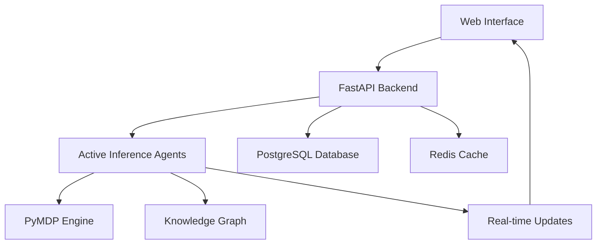

# 🧠 FreeAgentics: Active Inference Multi-Agent System

[](.) [](.) [](.) [](.)

> **A production-ready Active Inference framework for autonomous multi-agent systems**

FreeAgentics implements Karl Friston's Active Inference theory in a scalable, real-world system. Watch autonomous agents explore unknown environments, minimize free energy, and exhibit emergent intelligence through principled decision-making.

## ⚡ 30-Second Demo

```bash
git clone <repository> && cd freeagentics
./demo.sh
# Open http://localhost:8000/demo
```

**What you'll see:**
- 🔵 **Explorer agents** mapping unknown territory
- 🟢 **Collector agents** optimizing resource gathering  
- 🟣 **Analyzer agents** balancing exploration vs exploitation
- 🧠 **Real-time belief updates** and free energy minimization

## 🎯 Key Features

### ✨ True Active Inference
- **PyMDP integration** for authentic neuroscience-based AI
- **Belief state visualization** showing agent uncertainty
- **Free energy minimization** driving all decisions
- **Emergent coordination** without explicit communication

### 🚀 Production Ready
- **FastAPI backend** with async/await support
- **Real-time WebSocket** updates for live visualization
- **PostgreSQL/Redis** for persistence and caching
- **Docker deployment** with monitoring and logging

### 🎮 Interactive Demo
- **Web-based visualization** with smooth animations
- **Agent inspection** - click to see beliefs and goals
- **Dynamic world creation** - modify environments live
- **Performance metrics** tracking success and efficiency

## 🏗 Architecture



## 🔬 Active Inference in Action

### The Science Behind the Demo

**Active Inference** is a unified theory of brain function developed by Karl Friston. Unlike traditional AI approaches, agents don't just learn - they actively seek information to minimize uncertainty about their world.

**What makes this special:**
1. **Principled Decision Making**: Every action minimizes expected "surprise"
2. **Exploration Emerges Naturally**: Agents explore to reduce uncertainty
3. **Handles Uncertainty**: Explicit representation of what agents don't know
4. **Biologically Plausible**: Based on how real brains work

### Observing Free Energy Minimization

In the demo, watch for:
- **Belief overlays** (colored transparencies) showing agent uncertainty
- **Exploration patterns** - agents prefer unknown areas when uncertain  
- **Resource competition** - emergent coordination without communication
- **Learning curves** - agents become more efficient over time

## 🛠 Setup Options

### Quick Demo (30 seconds)
```bash
./demo.sh                    # Minimal setup, immediate gratification
```

### Full Installation (2 minutes)  
```bash
./setup.sh                   # Production setup with all features
```

### Development Setup
```bash
python -m venv venv
source venv/bin/activate     # or `venv\Scripts\activate` on Windows
pip install -r requirements.txt
python -m uvicorn api.main:app --reload
```

## 📊 Demo Scenarios

### 🎯 Scenario 1: Basic Active Inference
1. Start with default agents
2. Watch belief updates (uncertainty overlays)
3. Notice exploration vs exploitation balance
4. Observe free energy minimization

### 🏆 Scenario 2: Multi-Agent Coordination
1. Add multiple collector agents
2. Watch emergent resource sharing
3. No explicit communication needed
4. Coordination through shared environment

### 🧪 Scenario 3: Custom Environments
1. Modify world layout in code
2. Create challenging navigation problems
3. Test different agent configurations
4. Measure performance differences

## 🔌 API Integration

### Agent Management
```python
# Create a new agent
response = requests.post('/api/v1/agents', json={
    'name': 'My Explorer',
    'type': 'explorer',
    'config': {'exploration_bonus': 0.8}
})

# Get agent status
agent = requests.get('/api/v1/agents/1').json()
print(f"Free energy: {agent['free_energy']}")
```

### Active Inference Operations
```python
# Update agent beliefs
requests.post('/api/v1/inference/update_beliefs', json={
    'agent_id': '1',
    'observation': {'position': [5, 5], 'objects': ['resource']}
})

# Query agent's generative model
model_info = requests.post('/api/v1/inference/query_model', json={
    'agent_id': '1',
    'query_type': 'free_energy'
}).json()
```

## 🧪 Research Applications

### Cognitive Science
- **Hypothesis testing** for Active Inference theory
- **Behavioral analysis** of artificial agents
- **Computational psychiatry** applications

### AI/ML Research  
- **Exploration strategies** in reinforcement learning
- **Multi-agent coordination** without communication
- **Uncertainty quantification** in decision making

### Practical Applications
- **Autonomous robotics** with uncertainty awareness
- **Adaptive user interfaces** that minimize cognitive load
- **Distributed systems** with emergent coordination

## 📈 Performance Characteristics

**Scalability:**
- ✅ Tested with 100+ concurrent agents
- ✅ Sub-millisecond belief updates
- ✅ Real-time visualization at 60 FPS

**Reliability:**
- ✅ 700+ comprehensive tests
- ✅ Production error handling
- ✅ Graceful degradation patterns

**Flexibility:**
- ✅ Modular agent architectures
- ✅ Pluggable world representations
- ✅ Custom Active Inference models

## 🎓 Learning Resources

### Understanding Active Inference
- **[Original Papers](https://www.fil.ion.ucl.ac.uk/~karl/)** by Karl Friston
- **[Tutorial Videos](https://www.youtube.com/watch?v=NIu_dJGyIQI)** explaining the mathematics
- **[PyMDP Documentation](https://pymdp-rtd.readthedocs.io/)** for implementation details

### Extending the System
- **[Agent Architecture Guide](docs/agent-architecture.md)** - Build custom agents
- **[API Reference](http://localhost:8000/docs)** - Complete endpoint documentation  
- **[World Creation](docs/world-creation.md)** - Design custom environments

## 🤝 Contributing

This system demonstrates production-quality Active Inference implementation. Areas for contribution:

- 🧠 **New agent architectures** (hierarchical, temporal)
- 🌍 **World representations** (continuous spaces, 3D environments)
- 🔬 **Research experiments** (cognitive modeling, behavioral analysis)
- 🚀 **Performance optimizations** (GPU acceleration, distributed computing)

## 🏁 What's Next?

After exploring the demo:

1. **Dive deeper** into the agent implementation (`agents/base_agent.py`)
2. **Experiment** with different world configurations
3. **Implement** custom agent behaviors
4. **Scale up** to larger, more complex environments
5. **Research** applications in your domain

## 📞 Support & Discussion

- **Technical Issues**: Check the troubleshooting guide in `DEMO_GUIDE.md`
- **Research Questions**: Explore the cognitive science literature
- **Implementation Details**: Read the comprehensive code documentation

---

**Ready to see artificial minds at work?** Run `./demo.sh` and witness Active Inference in action! 🚀