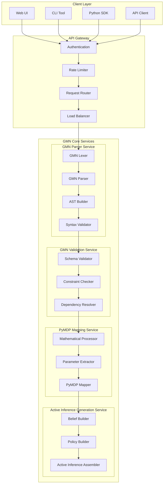
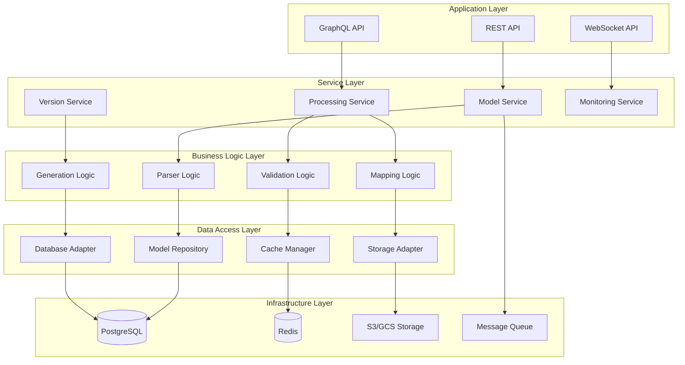
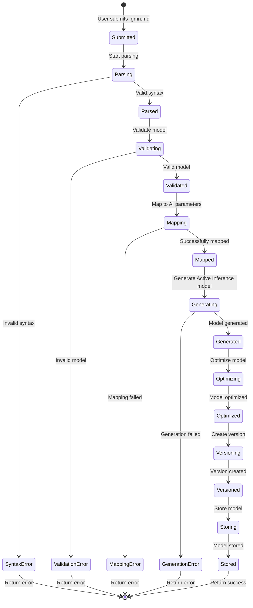
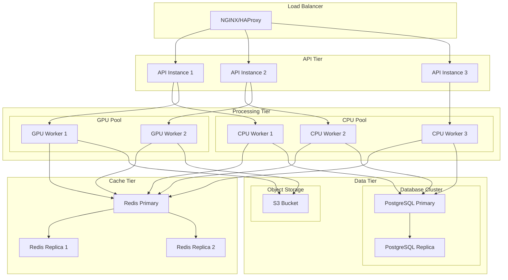
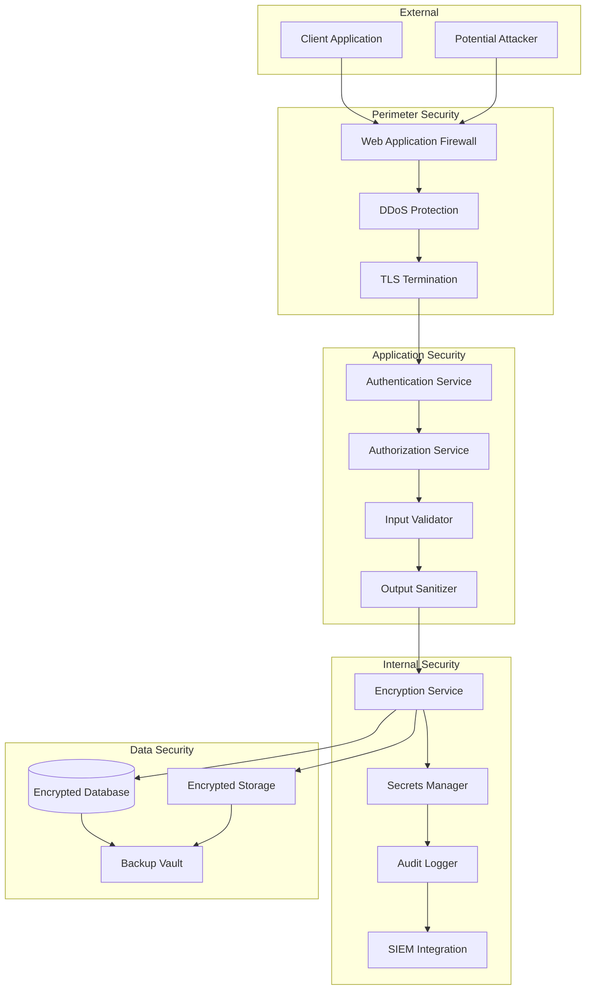
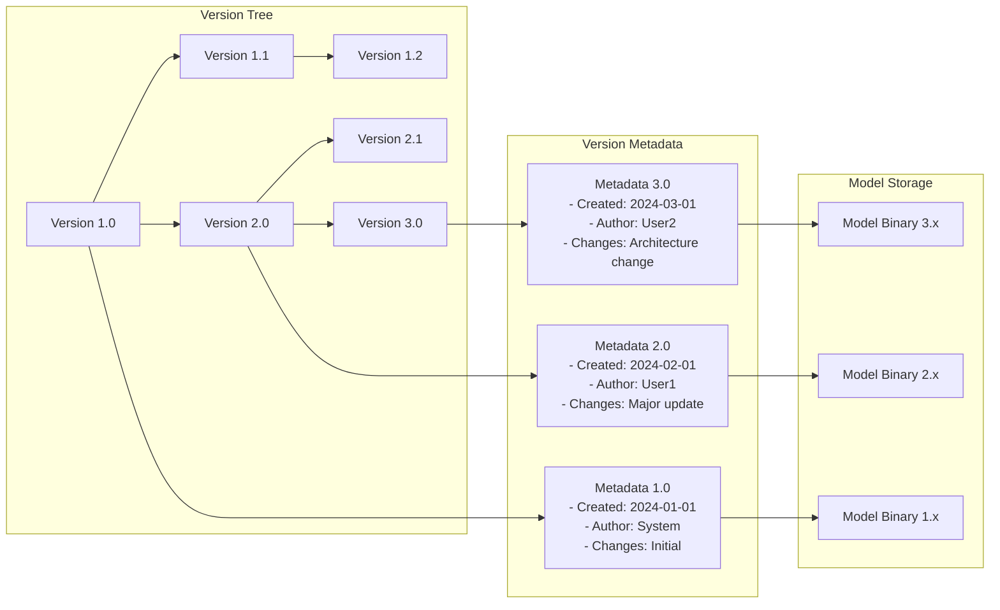
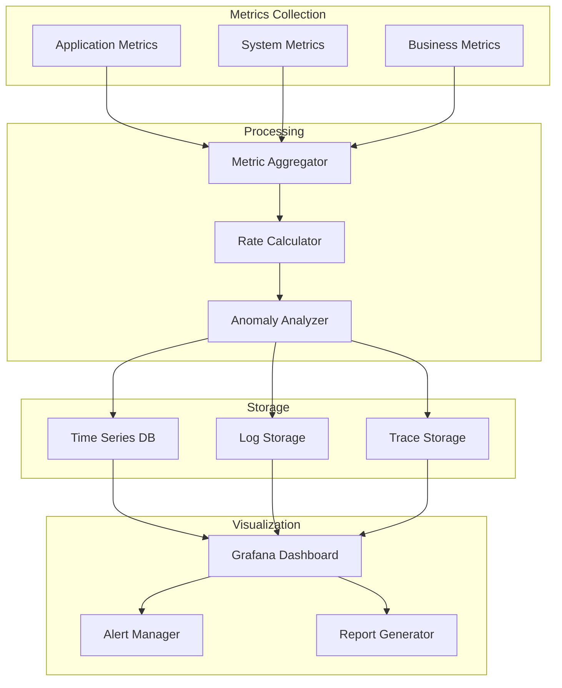
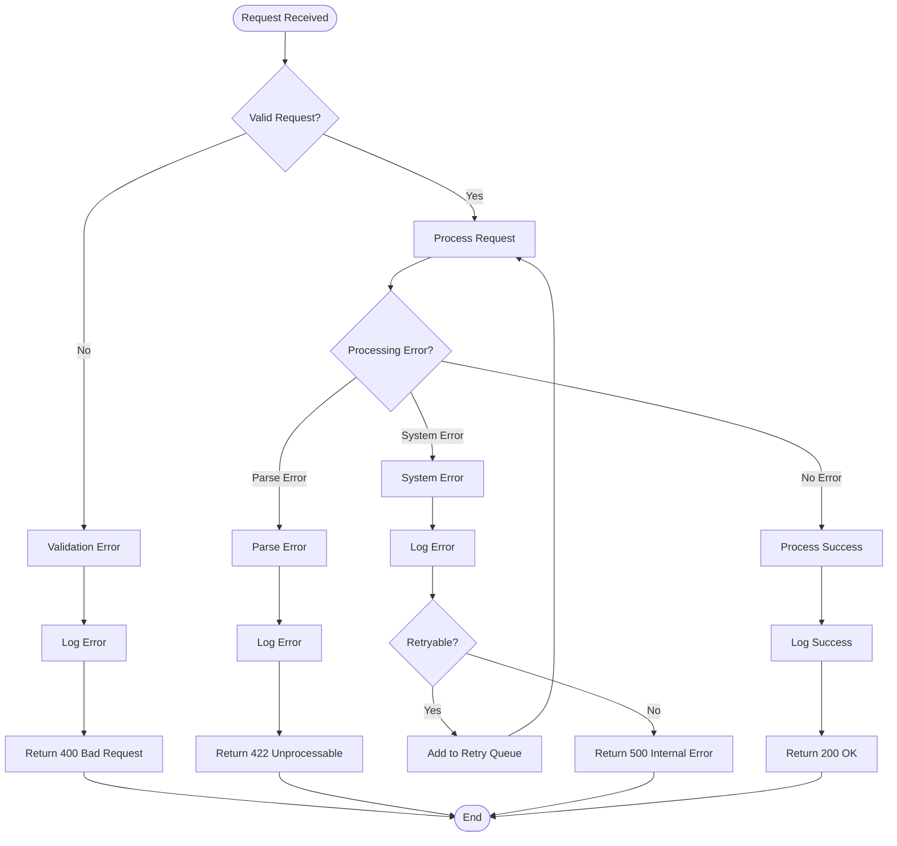

# GMN Processing Core - Architecture Diagrams

> **Important**: This documentation covers **Generative Model Notation (GMN)** for PyMDP mathematical model processing. For Graph Neural Network architecture diagrams, see the neural network documentation.

This document contains detailed architecture diagrams for the GMN Processing Core components used to parse, validate, and execute mathematical Active Inference models.

## GMN Component Interaction Diagram



## GMN Data Processing Pipeline

```mermaid
graph LR
    subgraph "Input Stage"
        Input[.gmn.md File]
        Raw[Raw Mathematical Text]
        Tokens[Token Stream]
    end

    subgraph "Parsing Stage"
        AST[Abstract Syntax Tree]
        Validated[Validated AST]
        Normalized[Normalized Model]
    end

    subgraph "Mathematical Mapping Stage"
        MathFeatures[Mathematical Features]
        Parameters[PyMDP Parameters]
        ModelSpec[Mathematical Specification]
    end

    subgraph "Active Inference Generation Stage"
        Architecture[Active Inference Architecture]
        Components[PyMDP Components]
        Model[Complete Active Inference Model]
    end

    subgraph "Output Stage"
        Serialized[Serialized Model]
        Versioned[Versioned Model]
        Deployed[Deployment Package]
    end

    Input --> Raw
    Raw --> Tokens
    Tokens --> AST
    AST --> Validated
    Validated --> Normalized
    Normalized --> MathFeatures
    MathFeatures --> Parameters
    Parameters --> ModelSpec
    ModelSpec --> Architecture
    Architecture --> Components
    Components --> Model
    Model --> Serialized
    Serialized --> Versioned
    Versioned --> Deployed
```



## Layer Architecture



## GMN Model Processing Flow



## Deployment Topology



## Security Architecture



## Model Versioning System



## Performance Monitoring Dashboard



## Error Handling Flow



## Cache Strategy

```mermaid
graph TB
    subgraph "Cache Layers"
        L1[L1: Application Cache<br/>TTL: 5 min]
        L2[L2: Redis Cache<br/>TTL: 1 hour]
        L3[L3: CDN Cache<br/>TTL: 24 hours]
    end

    subgraph "Cache Keys"
        ModelKey[model:{id}:{version}]
        ResultKey[result:{model}:{graph_hash}]
        MetaKey[meta:{model}:{type}]
    end

    subgraph "Cache Operations"
        Get[Cache Get]
        Set[Cache Set]
        Invalidate[Cache Invalidate]
        Warm[Cache Warm]
    end

    Request[Incoming Request] --> Get
    Get --> L1
    L1 -->|Miss| L2
    L2 -->|Miss| L3
    L3 -->|Miss| Database[(Database)]

    Database --> Set
    Set --> L3
    Set --> L2
    Set --> L1

    Update[Model Update] --> Invalidate
    Invalidate --> L1
    Invalidate --> L2
    Invalidate --> L3

    Schedule[Scheduled Job] --> Warm
    Warm --> Database
    Warm --> Set
```

---

These diagrams provide visual representations of the GNN Processing Core architecture, helping developers and stakeholders understand the system's structure and behavior.
