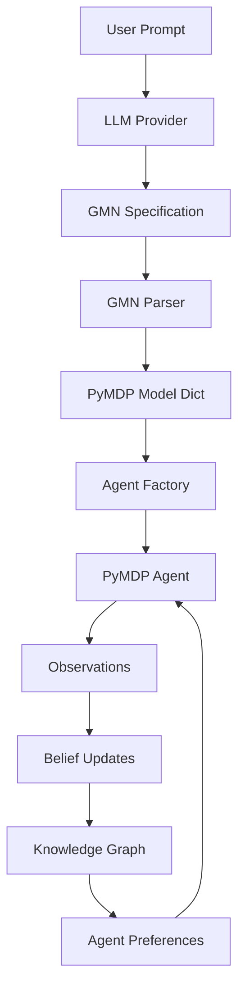

# FreeAgentics Data Flow Diagram

## Overview
This document illustrates the intended data flow from user prompt to knowledge graph update, highlighting where implementations are missing.

## Complete Data Flow (Intended)



## Current Implementation Status

### 1. User Prompt → LLM Provider ❌
**Status:** NOT IMPLEMENTED

**Expected Data Format:**
```python
{
    "prompt": "Create an agent that explores a 4x4 grid",
    "context": "Active inference agent for navigation"
}
```

**Missing Components:**
- No provider implementations in `llm/providers/`
- No prompt templates for GMN generation
- No provider selection logic

### 2. LLM Provider → GMN Specification ❌
**Status:** NOT IMPLEMENTED

**Expected Output Format:**
```
[nodes]
location: state {num_states: 16}
observation: observation {num_observations: 5}
move: action {num_actions: 5}
[edges]
location -> observation: generates
```

**Missing Components:**
- No LLM prompt engineering
- No GMN format validation in LLM output
- No retry/refinement logic

### 3. GMN Specification → PyMDP Model ✅
**Status:** IMPLEMENTED

**Data Transformation:**
```python
# Input: GMN text/dict
gmn_spec = """[nodes]...[edges]..."""

# Output: PyMDP model dict
{
    "num_states": [16],
    "num_obs": [5],
    "num_actions": [5],
    "A": np.array(...),  # Observation model
    "B": np.array(...),  # Transition model
    "C": np.array(...),  # Preferences
    "D": np.array(...),  # Initial beliefs
}
```

### 4. PyMDP Model → Agent ❌
**Status:** NOT IMPLEMENTED

**Expected Transformation:**
```python
# Input: Model dict
model = {"num_states": [16], "A": ..., "B": ...}

# Missing: Agent Factory
agent = AgentFactory.create_from_model(model)

# Output: Configured PyMDP Agent instance
```

**Missing Components:**
- No `AgentFactory` class
- No model validation before agent creation
- No error handling for invalid models

### 5. Agent → Belief Updates ⚠️
**Status:** PARTIALLY IMPLEMENTED

**Data Flow:**
```python
# Input: Observation
observation = [2]  # Observed state index

# Process: Agent inference
agent.infer_states(observation)
beliefs = agent.get_beliefs()  # This method doesn't exist!

# Output: Belief distribution
beliefs = [0.1, 0.2, 0.5, 0.2]  # Probability over states
```

**Issues:**
- PyMDP agents don't have `get_beliefs()` method
- Belief extraction requires accessing internal `qs` attribute
- No standardized belief format

### 6. Beliefs → Knowledge Graph ❌
**Status:** NOT IMPLEMENTED

**Expected Transformation:**
```python
# Input: Agent beliefs
beliefs = {
    "position": [0.1, 0.2, 0.5, 0.2],
    "timestamp": "2024-01-01T00:00:00"
}

# Missing: Belief-KG Bridge
nodes = BeliefKGBridge.convert_beliefs_to_nodes(beliefs)

# Output: KG nodes
[
    KnowledgeNode(type=BELIEF, label="position_2",
                  properties={"probability": 0.5})
]
```

**Missing Components:**
- No `BeliefKGBridge` class
- No belief-to-node conversion logic
- No temporal tracking of belief evolution

### 7. Knowledge Graph → Agent Preferences ❌
**Status:** NOT IMPLEMENTED

**Expected Feedback Loop:**
```python
# Input: KG insights
insights = kg.analyze_patterns()

# Missing: Preference Updater
new_C = PreferenceUpdater.kg_to_preferences(insights)

# Output: Updated preference vector
agent.C = new_C  # Update agent goals
```

## Critical Data Format Mismatches

### 1. GMN Output vs PyMDP Input
- GMN produces dictionaries with lists
- PyMDP expects direct numpy arrays
- No validation of matrix dimensions

### 2. Belief Representation
- PyMDP: Internal `qs` attribute (list of arrays)
- Knowledge Graph: Expects node properties
- No standard intermediate format

### 3. Observation Formats
- Frontend: JSON objects
- PyMDP: Integer indices or lists
- Knowledge Graph: Structured observation nodes

## Integration Points Needed

### 1. LLM Provider Interface
```python
class ProviderBridge:
    def prompt_to_gmn(self, prompt: str) -> str:
        """Convert user prompt to GMN spec via LLM"""
        pass
```

### 2. Agent Factory
```python
class AgentFactory:
    def create_from_gmn_model(self, model: dict) -> Agent:
        """Create PyMDP agent from GMN output"""
        pass
```

### 3. Belief-KG Bridge
```python
class BeliefKGBridge:
    def beliefs_to_nodes(self, beliefs: list) -> List[KnowledgeNode]:
        """Convert agent beliefs to KG nodes"""
        pass

    def observations_to_nodes(self, obs: Any) -> List[KnowledgeNode]:
        """Convert observations to KG nodes"""
        pass
```

## Monitoring Requirements

Each data transformation point needs:
1. Input validation
2. Output validation
3. Error tracking
4. Performance metrics
5. Data lineage tracking

## Next Steps

1. **Implement Provider Bridge** (8-12 hours)
   - Create OpenAI/Anthropic providers
   - Add GMN prompt templates
   - Implement retry logic

2. **Build Agent Factory** (12-16 hours)
   - Parse GMN model output
   - Validate matrix dimensions
   - Create configured agents

3. **Create Belief-KG Bridge** (16-20 hours)
   - Define belief node schema
   - Implement conversion logic
   - Add temporal tracking

4. **Integration Testing** (8-12 hours)
   - End-to-end flow tests
   - Error case handling
   - Performance benchmarks

Total Estimated Effort: 44-60 hours
