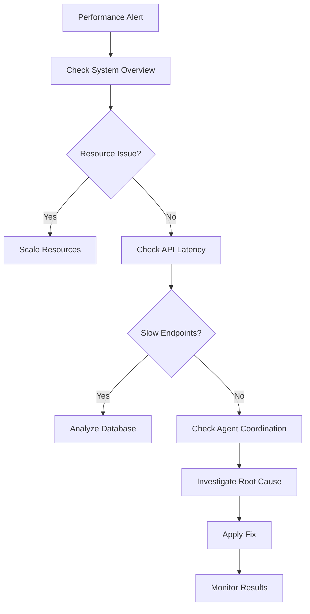
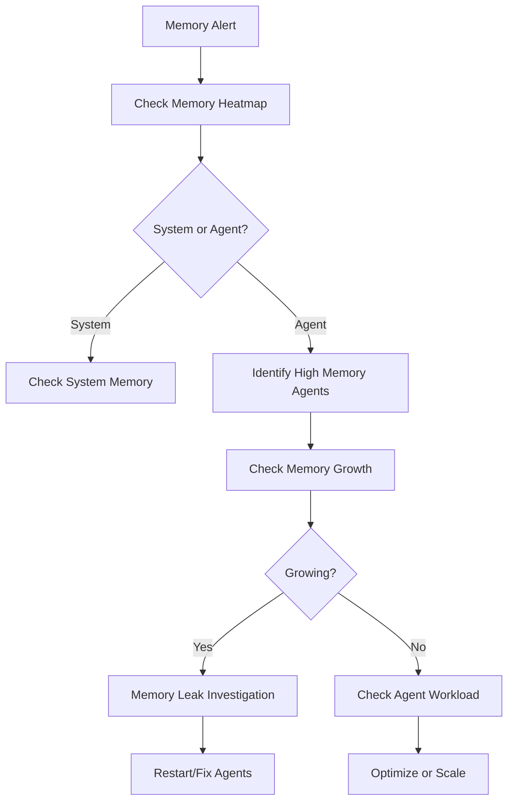
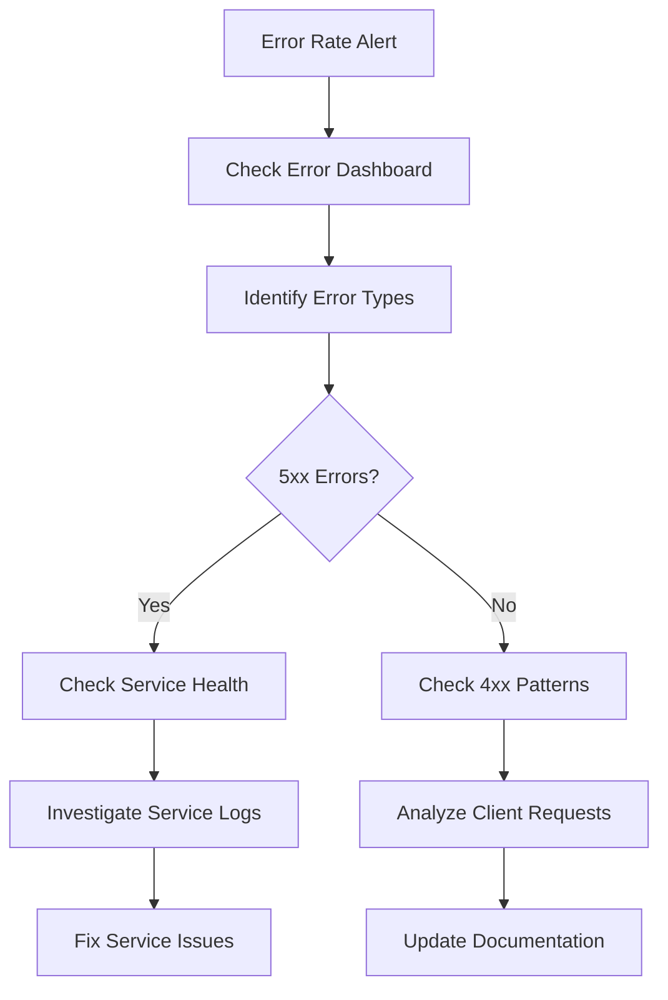

# Troubleshooting FreeAgentics with Metrics Guide

## Overview

This guide provides systematic approaches to troubleshooting FreeAgentics issues using metrics, dashboards, and observability data. It covers common problems, investigation workflows, and resolution steps.

## Table of Contents

1. [Troubleshooting Methodology](#troubleshooting-methodology)
2. [Common Issues and Patterns](#common-issues-and-patterns)
3. [Investigation Workflows](#investigation-workflows)
4. [Metric Correlation Patterns](#metric-correlation-patterns)
5. [Performance Degradation Analysis](#performance-degradation-analysis)
6. [Capacity and Scaling Issues](#capacity-and-scaling-issues)
7. [Belief System Anomalies](#belief-system-anomalies)
8. [Quick Reference Queries](#quick-reference-queries)

## Troubleshooting Methodology

### The OODA Loop for Incident Response

1. **Observe**: Gather initial metrics and symptoms
2. **Orient**: Understand the current state vs. expected
3. **Decide**: Determine investigation path and actions
4. **Act**: Execute fixes and monitor results

### Systematic Investigation Process

```
1. Symptom Recognition
   ↓
2. Scope Assessment
   ↓
3. Timeline Analysis
   ↓
4. Metric Correlation
   ↓
5. Root Cause Analysis
   ↓
6. Solution Implementation
   ↓
7. Verification
```

### Investigation Toolkit

- **Grafana Dashboards**: Real-time visualization
- **Prometheus Queries**: Detailed metric analysis
- **Log Analysis**: Contextual information
- **Alerting History**: Pattern recognition
- **Performance Baselines**: Deviation analysis

## Common Issues and Patterns

### 1. High Memory Usage

#### Symptoms
- Agents consuming > 30MB memory
- System memory usage > 1.8GB
- OOM kills in container logs

#### Investigation Steps

1. **Check Memory Overview**
   ```promql
   # System memory usage
   freeagentics_system_memory_usage_bytes / (1024*1024*1024)

   # Agent memory distribution
   histogram_quantile(0.95,
     rate(freeagentics_agent_memory_usage_bytes[5m])
   ) / (1024*1024)
   ```

2. **Identify Memory Hogs**
   ```promql
   # Top 10 memory consumers
   topk(10, freeagentics_agent_memory_usage_bytes / (1024*1024))
   ```

3. **Analyze Memory Growth**
   ```promql
   # Memory growth rate over 1 hour
   rate(freeagentics_agent_memory_usage_bytes[1h]) * 3600 / (1024*1024)
   ```

4. **Check for Memory Leaks**
   ```promql
   # Memory trend over 24 hours
   increase(freeagentics_agent_memory_usage_bytes[24h]) / (1024*1024)
   ```

#### Common Root Causes
- **Memory Leaks**: Unreleased resources, circular references
- **Data Accumulation**: Large datasets not being cleaned
- **Configuration Issues**: Incorrect buffer sizes
- **Agent Proliferation**: Too many agents spawned

#### Resolution Actions
```bash
# Restart high-memory agents
kubectl delete pod -l app=freeagentics,memory-usage=high

# Scale down agent count
kubectl scale deployment freeagentics-agents --replicas=10

# Increase memory limits
kubectl patch deployment freeagentics-agents -p '{"spec":{"template":{"spec":{"containers":[{"name":"agent","resources":{"limits":{"memory":"40Mi"}}}]}}}}'
```

### 2. High API Latency

#### Symptoms
- P95 response time > 500ms
- Request queue buildup
- User complaints about slow responses

#### Investigation Steps

1. **Check Overall API Performance**
   ```promql
   # P95 latency by endpoint
   histogram_quantile(0.95,
     sum by (handler, le) (
       rate(http_request_duration_seconds_bucket[5m])
     )
   ) * 1000
   ```

2. **Identify Slow Endpoints**
   ```promql
   # Top 5 slowest endpoints
   topk(5,
     histogram_quantile(0.95,
       sum by (handler, le) (
         rate(http_request_duration_seconds_bucket[5m])
       )
     )
   )
   ```

3. **Check Request Volume**
   ```promql
   # Request rate by endpoint
   sum by (handler) (rate(http_requests_total[5m]))
   ```

4. **Analyze Database Performance**
   ```promql
   # Database query duration
   histogram_quantile(0.95,
     rate(pg_stat_statements_mean_time_seconds_bucket[5m])
   )
   ```

#### Common Root Causes
- **Database Bottlenecks**: Slow queries, lock contention
- **External API Delays**: Third-party service issues
- **Resource Contention**: CPU/memory pressure
- **Cold Start Issues**: Service initialization delays

#### Resolution Actions
```bash
# Scale API instances
kubectl scale deployment freeagentics-api --replicas=5

# Check database connections
kubectl exec -it postgres-0 -- psql -c "SELECT * FROM pg_stat_activity;"

# Analyze slow queries
kubectl logs -f api-deployment | grep "slow_query"
```

### 3. Agent Coordination Failures

#### Symptoms
- Active agents > 50 (hard limit)
- Coordination timeout rate > 5%
- Agent communication failures

#### Investigation Steps

1. **Check Agent Status**
   ```promql
   # Active agents by type
   sum by (agent_type) (freeagentics_agent_active{state="running"})

   # Agent coordination queue
   freeagentics_agent_coordination_queue_size
   ```

2. **Analyze Coordination Performance**
   ```promql
   # Coordination duration percentiles
   histogram_quantile(0.95,
     rate(freeagentics_agent_coordination_duration_seconds_bucket[5m])
   )
   ```

3. **Check Timeout Patterns**
   ```promql
   # Timeout rate by agent type
   rate(freeagentics_agent_coordination_errors_total{error_type="timeout"}[5m])
   / rate(freeagentics_agent_coordination_requests_total[5m])
   ```

4. **Monitor Concurrent Sessions**
   ```promql
   # Concurrent coordination sessions
   freeagentics_agent_coordination_concurrent_sessions
   ```

#### Common Root Causes
- **Agent Proliferation**: Too many agents created
- **Network Latency**: Slow inter-agent communication
- **Resource Exhaustion**: Coordination service overload
- **Deadlocks**: Circular coordination dependencies

#### Resolution Actions
```bash
# Kill stuck agents
kubectl delete pod -l app=freeagentics,status=stuck

# Implement agent throttling
kubectl patch configmap agent-config -p '{"data":{"max_agents":"30"}}'

# Restart coordination service
kubectl rollout restart deployment freeagentics-coordinator
```

### 4. Belief System Anomalies

#### Symptoms
- Free energy > 10 or < 0.1
- Belief accuracy < 75%
- Convergence failures

#### Investigation Steps

1. **Check Free Energy Distribution**
   ```promql
   # Free energy histogram
   histogram_quantile(0.95,
     rate(freeagentics_belief_free_energy_bucket[5m])
   )
   ```

2. **Analyze Belief Accuracy**
   ```promql
   # Belief accuracy by agent
   avg by (agent_id) (freeagentics_belief_accuracy_ratio)
   ```

3. **Monitor Convergence Time**
   ```promql
   # Convergence time percentiles
   histogram_quantile(0.90,
     rate(freeagentics_belief_convergence_time_seconds_bucket[5m])
   )
   ```

4. **Check Prediction Errors**
   ```promql
   # Prediction error rate
   rate(freeagentics_belief_prediction_errors_total[5m])
   ```

#### Common Root Causes
- **Data Quality Issues**: Corrupted or inconsistent inputs
- **Model Drift**: Outdated belief models
- **Configuration Errors**: Incorrect parameters
- **Resource Constraints**: Insufficient processing power

#### Resolution Actions
```bash
# Reset belief state
kubectl exec -it belief-service -- /app/reset-beliefs.sh

# Update belief models
kubectl create job belief-model-update --from=cronjob/model-updater

# Check data quality
kubectl logs -f data-validator | grep "validation_error"
```

## Investigation Workflows

### Workflow 1: Performance Degradation



### Workflow 2: Memory Issue Investigation



### Workflow 3: Error Rate Investigation



## Metric Correlation Patterns

### Memory vs. Performance Correlation

```promql
# Memory usage vs. response time
(
  freeagentics_agent_memory_usage_bytes / (1024*1024)
) and on(agent_id) (
  histogram_quantile(0.95,
    rate(freeagentics_agent_response_time_seconds_bucket[5m])
  )
)
```

**Pattern**: Higher memory usage often correlates with slower response times

### Agent Count vs. Coordination Performance

```promql
# Active agents vs. coordination duration
freeagentics_system_active_agents_total and
histogram_quantile(0.95,
  rate(freeagentics_agent_coordination_duration_seconds_bucket[5m])
)
```

**Pattern**: More agents lead to longer coordination times

### Error Rate vs. Resource Usage

```promql
# Error rate vs. CPU usage
rate(http_requests_total{status=~"5.."}[5m]) / rate(http_requests_total[5m])
and
(100 - (avg(rate(node_cpu_seconds_total{mode="idle"}[5m])) * 100))
```

**Pattern**: High CPU usage often increases error rates

## Performance Degradation Analysis

### Step-by-Step Analysis

1. **Initial Assessment**
   ```promql
   # System health overview
   up{job="freeagentics-backend"}
   rate(http_requests_total[5m])
   histogram_quantile(0.95, rate(http_request_duration_seconds_bucket[5m]))
   rate(http_requests_total{status=~"5.."}[5m])
   ```

2. **Timeline Analysis**
   ```promql
   # Performance over time
   rate(http_request_duration_seconds_sum[5m]) / rate(http_request_duration_seconds_count[5m])
   ```

3. **Component Breakdown**
   ```promql
   # Performance by component
   sum by (component) (rate(component_duration_seconds_sum[5m]))
   ```

4. **Resource Analysis**
   ```promql
   # Resource utilization
   rate(node_cpu_seconds_total[5m])
   node_memory_MemAvailable_bytes / node_memory_MemTotal_bytes
   rate(node_disk_io_time_seconds_total[5m])
   ```

### Common Performance Patterns

#### Pattern 1: Gradual Degradation
- **Symptoms**: Slowly increasing latency over hours/days
- **Cause**: Memory leaks, cache pollution, data growth
- **Investigation**: Check memory trends, cache hit rates

#### Pattern 2: Sudden Spike
- **Symptoms**: Immediate performance drop
- **Cause**: Deployment, configuration change, external failure
- **Investigation**: Check recent changes, external dependencies

#### Pattern 3: Periodic Degradation
- **Symptoms**: Performance drops at regular intervals
- **Cause**: Batch jobs, garbage collection, scheduled tasks
- **Investigation**: Check cron jobs, GC metrics

## Capacity and Scaling Issues

### Scaling Decision Tree

```
Is performance degrading?
├── Yes
│   ├── Resource constrained?
│   │   ├── CPU high? → Scale compute
│   │   ├── Memory high? → Scale memory
│   │   └── Disk I/O high? → Scale storage
│   └── Not resource constrained?
│       ├── Check application bottlenecks
│       ├── Optimize queries/code
│       └── Review architecture
└── No
    └── Monitor and maintain baselines
```

### Capacity Metrics

```promql
# CPU capacity
avg(rate(node_cpu_seconds_total{mode!="idle"}[5m])) * 100

# Memory capacity
(node_memory_MemTotal_bytes - node_memory_MemAvailable_bytes) / node_memory_MemTotal_bytes * 100

# Agent capacity
freeagentics_system_active_agents_total / 50 * 100  # 50 is the limit

# Request capacity
rate(http_requests_total[5m]) / 500 * 100  # 500 is the limit
```

### Scaling Triggers

| Metric | Scale Up | Scale Down |
|--------|----------|------------|
| CPU | > 70% for 10m | < 30% for 30m |
| Memory | > 80% for 5m | < 40% for 60m |
| Agents | > 80% of limit | < 30% of limit |
| Queue | > 100 items | < 10 items |

## Belief System Anomalies

### Belief System Health Check

```promql
# Free energy within normal range
freeagentics_belief_free_energy_current > 0.1 and freeagentics_belief_free_energy_current < 10

# Belief accuracy acceptable
freeagentics_belief_accuracy_ratio > 0.75

# Convergence time reasonable
histogram_quantile(0.90, rate(freeagentics_belief_convergence_time_seconds_bucket[5m])) < 5
```

### Anomaly Detection

```promql
# Detect free energy anomalies
abs(freeagentics_belief_free_energy_current - avg_over_time(freeagentics_belief_free_energy_current[1h])) > 3 * stddev_over_time(freeagentics_belief_free_energy_current[1h])

# Detect accuracy drops
freeagentics_belief_accuracy_ratio < 0.8 and
rate(freeagentics_belief_accuracy_ratio[5m]) < -0.1
```

### Belief System Troubleshooting

1. **Check Data Quality**
   ```promql
   # Data validation errors
   rate(freeagentics_data_validation_errors_total[5m])
   ```

2. **Monitor Model Performance**
   ```promql
   # Model prediction errors
   rate(freeagentics_model_prediction_errors_total[5m])
   ```

3. **Verify Configuration**
   ```promql
   # Configuration mismatches
   freeagentics_config_validation_errors_total
   ```

## Quick Reference Queries

### System Health
```promql
# Overall system status
up{job="freeagentics-backend"}

# Request rate
rate(http_requests_total[5m])

# Error rate
rate(http_requests_total{status=~"5.."}[5m]) / rate(http_requests_total[5m])

# Response time
histogram_quantile(0.95, rate(http_request_duration_seconds_bucket[5m]))
```

### Agent Metrics
```promql
# Active agents
freeagentics_system_active_agents_total

# Agent memory usage
topk(10, freeagentics_agent_memory_usage_bytes / (1024*1024))

# Coordination success rate
rate(freeagentics_agent_coordination_requests_total{status="success"}[5m]) / rate(freeagentics_agent_coordination_requests_total[5m])

# Coordination duration
histogram_quantile(0.95, rate(freeagentics_agent_coordination_duration_seconds_bucket[5m]))
```

### Resource Usage
```promql
# CPU usage
100 - (avg(rate(node_cpu_seconds_total{mode="idle"}[5m])) * 100)

# Memory usage
(node_memory_MemTotal_bytes - node_memory_MemAvailable_bytes) / node_memory_MemTotal_bytes * 100

# Disk usage
(node_filesystem_size_bytes - node_filesystem_free_bytes) / node_filesystem_size_bytes * 100
```

### Business Metrics
```promql
# User interactions
rate(freeagentics_business_user_interactions_total[1h])

# Response quality
freeagentics_business_response_quality_score

# Knowledge graph size
freeagentics_system_knowledge_graph_nodes_total
```

## Escalation Procedures

### When to Escalate

1. **Critical System Issues**
   - System completely down
   - Data corruption risk
   - Security incidents

2. **Performance Issues**
   - SLO violations for > 30 minutes
   - Cascading failures
   - Unable to identify root cause

3. **Capacity Issues**
   - Approaching hard limits
   - Scaling not resolving issues
   - Architecture constraints

### Escalation Contacts

- **L1 Support**: Initial triage and basic fixes
- **L2 Engineering**: Deep investigation and complex fixes
- **L3 Architecture**: System design and scaling decisions
- **Security Team**: Security-related incidents
- **Management**: Business impact and resource decisions

### Incident Documentation

```markdown
# Incident Report Template

## Summary
- **Incident ID**: INC-2025-001
- **Start Time**: 2025-01-15 10:30 UTC
- **Duration**: 45 minutes
- **Severity**: High
- **Impact**: 15% error rate increase

## Timeline
- 10:30 - Alert fired: High API latency
- 10:35 - Investigation started
- 10:45 - Root cause identified: database lock
- 10:50 - Fix applied: killed blocking query
- 11:15 - System fully recovered

## Root Cause
Database deadlock caused by concurrent schema migration

## Resolution
- Killed blocking query
- Implemented migration locking
- Added deadlock detection

## Follow-up Actions
- [ ] Improve migration process
- [ ] Add deadlock monitoring
- [ ] Update runbooks
```

---

**Last Updated**: 2025-01-15
**Version**: 1.0
**Contact**: sre@freeagentics.com
