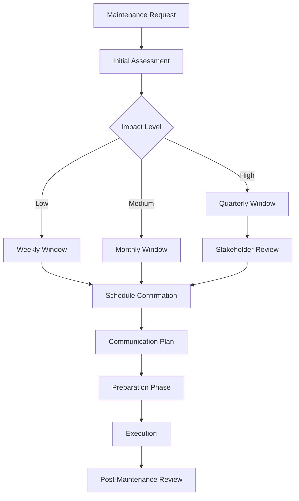

# Maintenance Windows Planning Guide

## Overview

This document outlines the planning, scheduling, and execution of maintenance windows for the FreeAgentics system. Proper planning ensures minimal impact on users while maintaining system health and security.

## Table of Contents

1. [Maintenance Window Types](#maintenance-window-types)
2. [Scheduling Guidelines](#scheduling-guidelines)
3. [Planning Process](#planning-process)
4. [Execution Procedures](#execution-procedures)
5. [Communication Strategy](#communication-strategy)
6. [Risk Management](#risk-management)
7. [Post-Maintenance Review](#post-maintenance-review)

## Maintenance Window Types

### 1. Regular Maintenance Windows

#### Weekly Maintenance (Low Impact)
- **Schedule**: Every Sunday 03:00-04:00 UTC
- **Duration**: 1 hour
- **Impact**: Minimal service degradation
- **Activities**:
  - Database VACUUM operations
  - Log rotation and cleanup
  - Minor security updates
  - Performance monitoring review

#### Monthly Maintenance (Medium Impact)
- **Schedule**: First Sunday of month 02:00-05:00 UTC
- **Duration**: 3 hours
- **Impact**: Possible brief service interruptions
- **Activities**:
  - Database full maintenance
  - Major security updates
  - Configuration updates
  - System optimization

#### Quarterly Maintenance (High Impact)
- **Schedule**: Announced 2 weeks in advance
- **Duration**: 4-6 hours
- **Impact**: Planned service downtime
- **Activities**:
  - Major version upgrades
  - Infrastructure changes
  - Security patches requiring restart
  - Performance optimization

### 2. Emergency Maintenance

#### Immediate Response (0-30 minutes)
- **Trigger**: Critical security vulnerability
- **Duration**: Variable
- **Impact**: Immediate service interruption
- **Activities**:
  - Security patch application
  - System isolation
  - Configuration changes

#### Urgent Maintenance (Same day)
- **Trigger**: System instability, performance degradation
- **Duration**: 1-4 hours
- **Impact**: Service degradation or downtime
- **Activities**:
  - System repairs
  - Database recovery
  - Service restoration

## Scheduling Guidelines

### Optimal Maintenance Times

#### Primary Window (Global Low Usage)
- **Time**: Sunday 03:00-07:00 UTC
- **Rationale**: Minimal global user activity
- **Suitable for**: All maintenance types

#### Secondary Window (Regional Low Usage)
- **Time**: Tuesday 10:00-12:00 UTC
- **Rationale**: Low usage in primary markets
- **Suitable for**: Minor updates only

#### Emergency Window (Any Time)
- **Time**: As needed
- **Rationale**: Critical issues require immediate attention
- **Suitable for**: Security patches, system recovery

### Blackout Periods

#### Business Critical Times
- **Black Friday**: Week of November 25
- **Year-end**: December 15 - January 2
- **Major Product Launches**: As announced
- **Peak Business Hours**: Monday-Friday 09:00-17:00 local time

#### Seasonal Considerations
- **Holiday Seasons**: Extended blackout periods
- **Financial Year End**: March 31, June 30, September 30, December 31
- **Conference Seasons**: When industry events occur

### Maintenance Calendar

| Month | Week 1 | Week 2 | Week 3 | Week 4 | Special Notes |
|-------|--------|--------|--------|--------|---------------|
| Jan | Monthly | Weekly | Weekly | Weekly | Post-holiday recovery |
| Feb | Monthly | Weekly | Weekly | Weekly | Quarterly prep |
| Mar | Monthly | Weekly | Weekly | Quarterly | Q1 maintenance |
| Apr | Monthly | Weekly | Weekly | Weekly | Post-quarterly |
| May | Monthly | Weekly | Weekly | Weekly | Normal operations |
| Jun | Monthly | Weekly | Weekly | Quarterly | Q2 maintenance |
| Jul | Monthly | Weekly | Weekly | Weekly | Summer operations |
| Aug | Monthly | Weekly | Weekly | Weekly | Vacation season |
| Sep | Monthly | Weekly | Weekly | Quarterly | Q3 maintenance |
| Oct | Monthly | Weekly | Weekly | Weekly | Pre-holiday prep |
| Nov | Monthly | Weekly | BLACKOUT | BLACKOUT | Black Friday |
| Dec | Monthly | Weekly | BLACKOUT | BLACKOUT | Holiday season |

## Planning Process

### 1. Maintenance Request Initiation

#### Request Template
```
Maintenance Request Form
======================

Requestor: [Name, Team]
Date Requested: [Date]
Proposed Window: [Date/Time]
Duration: [Estimated hours]
Impact Level: [Low/Medium/High]

Description:
[What needs to be done]

Justification:
[Why this maintenance is needed]

Dependencies:
[Other systems or teams affected]

Rollback Plan:
[How to revert if issues occur]

Testing Plan:
[Pre and post-maintenance verification]

Risk Assessment:
[Potential issues and mitigation]
```

### 2. Maintenance Planning Workflow



### 3. Approval Process

#### Low Impact Maintenance
- **Approver**: Team Lead
- **Notice**: 24 hours
- **Documentation**: Maintenance log entry

#### Medium Impact Maintenance
- **Approver**: Technical Manager
- **Notice**: 1 week
- **Documentation**: Maintenance plan document

#### High Impact Maintenance
- **Approver**: CTO + Product Owner
- **Notice**: 2 weeks
- **Documentation**: Formal maintenance proposal

### 4. Pre-Maintenance Checklist

#### 1 Week Before
- [ ] Maintenance plan finalized
- [ ] Stakeholder notifications sent
- [ ] Backup verification completed
- [ ] Rollback procedures documented
- [ ] Testing environment prepared

#### 24 Hours Before
- [ ] Final system backup
- [ ] Rollback plan reviewed
- [ ] Team roles assigned
- [ ] Communication templates prepared
- [ ] Monitoring alerts configured

#### 1 Hour Before
- [ ] System health check
- [ ] Team assembles
- [ ] Communication channels active
- [ ] Maintenance mode prepared
- [ ] Final go/no-go decision

## Execution Procedures

### Pre-Maintenance Phase

#### System Preparation
```bash
# Create maintenance backup
./scripts/backup/full-backup.sh

# Verify backup integrity
./scripts/backup/database-restore.sh verify

# Check system health
./scripts/maintenance/system-health-check.sh --full

# Prepare maintenance environment
./scripts/maintenance/prepare-maintenance.sh
```

#### Notification Setup
```bash
# Send start notification
./scripts/maintenance/notify-users.sh --start \
  --window "2024-01-21 03:00 UTC" \
  --duration "2 hours" \
  --impact "minimal"

# Enable maintenance mode
./scripts/maintenance/enable-maintenance-mode.sh
```

### Maintenance Execution

#### Standard Maintenance Flow
1. **Enable Maintenance Mode**
   ```bash
   ./scripts/maintenance/enable-maintenance-mode.sh
   ```

2. **Execute Maintenance Tasks**
   ```bash
   # Run planned maintenance
   ./scripts/maintenance/run-maintenance.sh --plan monthly
   
   # Monitor progress
   tail -f /var/log/freeagentics/maintenance.log
   ```

3. **Verify Changes**
   ```bash
   # System health check
   ./scripts/maintenance/verify-health.sh
   
   # Performance baseline
   ./scripts/maintenance/performance-check.sh
   ```

4. **Disable Maintenance Mode**
   ```bash
   ./scripts/maintenance/disable-maintenance-mode.sh
   ```

### Post-Maintenance Phase

#### Verification Steps
```bash
# Comprehensive health check
./scripts/maintenance/post-maintenance-check.sh

# Performance validation
./scripts/maintenance/performance-validation.sh

# User acceptance test
./scripts/maintenance/uat-check.sh
```

#### Monitoring Setup
```bash
# Extended monitoring
./scripts/maintenance/post-maintenance-monitor.sh --duration 4h

# Alert threshold adjustment
./scripts/maintenance/adjust-alert-thresholds.sh --post-maintenance
```

## Communication Strategy

### Notification Timeline

#### Quarterly Maintenance (High Impact)
- **2 weeks before**: Initial announcement
- **1 week before**: Reminder with details
- **24 hours before**: Final reminder
- **1 hour before**: Maintenance starting soon
- **Start**: Maintenance began
- **Progress**: Every 30 minutes during maintenance
- **Completion**: Maintenance completed

#### Monthly Maintenance (Medium Impact)
- **1 week before**: Announcement
- **24 hours before**: Reminder
- **Start**: Maintenance began
- **Completion**: Maintenance completed

#### Weekly Maintenance (Low Impact)
- **24 hours before**: Notification
- **Completion**: Summary if any issues

### Communication Channels

#### Internal Communications
- **Slack**: `#maintenance-updates`
- **Email**: `all-engineering@freeagentics.io`
- **Dashboard**: Internal status page

#### External Communications
- **Status Page**: `https://status.freeagentics.io`
- **Email**: Customer notification list
- **API**: Service status endpoint

### Communication Templates

#### Initial Announcement
```
Subject: Scheduled Maintenance - FreeAgentics Platform

Dear Users,

We have scheduled maintenance for the FreeAgentics platform:

Date: [Date]
Time: [Start] - [End] UTC
Duration: [Duration]
Impact: [Impact Description]

During this window:
- [Service Impact 1]
- [Service Impact 2]
- [Service Impact 3]

We will provide updates throughout the maintenance window.

Thank you for your patience.

The FreeAgentics Team
```

#### Progress Update
```
Subject: Maintenance Update - FreeAgentics Platform

Maintenance Progress Update:

Completed Tasks:
✓ Database optimization (30 min)
✓ Security updates (15 min)

Current Task:
⏳ Application updates (ETA: 45 min)

Remaining Tasks:
- Service verification (15 min)
- Performance validation (15 min)

New ETA: [Time]

Next update in 30 minutes.
```

#### Completion Notice
```
Subject: Maintenance Complete - FreeAgentics Platform

The scheduled maintenance has been completed successfully.

Maintenance Summary:
- Duration: [Actual duration]
- Tasks completed: [List]
- Issues encountered: [None/Description]
- Performance impact: [None/Minimal/Description]

All services are now fully operational.

Thank you for your patience during this maintenance window.

The FreeAgentics Team
```

## Risk Management

### Risk Assessment Matrix

| Risk | Likelihood | Impact | Mitigation |
|------|------------|---------|------------|
| Extended downtime | Medium | High | Thorough testing, rollback plan |
| Data corruption | Low | Critical | Multiple backups, verification |
| Performance degradation | Medium | Medium | Performance monitoring, optimization |
| Security vulnerability | Low | High | Security review, patch testing |
| User impact | High | Medium | Communication, scheduling |

### Risk Mitigation Strategies

#### Pre-Maintenance
- **Backup Strategy**: Multiple backup points
- **Testing**: Comprehensive testing in staging
- **Rollback Plan**: Detailed rollback procedures
- **Team Preparation**: Team training and rehearsal

#### During Maintenance
- **Monitoring**: Real-time system monitoring
- **Communication**: Regular status updates
- **Escalation**: Clear escalation procedures
- **Documentation**: Detailed change logging

#### Post-Maintenance
- **Verification**: Comprehensive testing
- **Monitoring**: Extended monitoring period
- **Support**: Dedicated support team
- **Feedback**: User feedback collection

### Emergency Procedures

#### Maintenance Extension
```bash
# Extend maintenance window
./scripts/maintenance/extend-window.sh --duration 1h

# Notify stakeholders
./scripts/maintenance/notify-extension.sh --reason "complexity"
```

#### Rollback Activation
```bash
# Immediate rollback
./scripts/maintenance/emergency-rollback.sh

# Verify rollback
./scripts/maintenance/verify-rollback.sh

# Notify completion
./scripts/maintenance/notify-rollback.sh
```

## Post-Maintenance Review

### Review Process

#### Immediate Review (Within 24 hours)
- Maintenance execution summary
- Issues encountered and resolutions
- Performance impact assessment
- User feedback collection

#### Formal Review (Within 1 week)
- Detailed analysis of maintenance
- Process improvement recommendations
- Team feedback and lessons learned
- Documentation updates

### Review Template

```
Maintenance Review Report
========================

Maintenance Details:
- Date: [Date]
- Duration: [Planned vs Actual]
- Type: [Weekly/Monthly/Quarterly]
- Impact: [Low/Medium/High]

Execution Summary:
- Tasks completed: [List]
- Issues encountered: [List]
- Deviations from plan: [List]

Performance Impact:
- Downtime: [Duration]
- Performance degradation: [None/Minimal/Significant]
- User impact: [Description]

Lessons Learned:
- What went well: [List]
- What could be improved: [List]
- Process improvements: [List]

Action Items:
- [ ] [Action 1] - [Owner] - [Due Date]
- [ ] [Action 2] - [Owner] - [Due Date]
- [ ] [Action 3] - [Owner] - [Due Date]

Next Review: [Date]
```

### Metrics Tracking

#### Maintenance Metrics
- **MTTR**: Mean Time To Recovery
- **Downtime**: Planned vs Actual
- **Success Rate**: Successful maintenance percentage
- **Rollback Rate**: Percentage requiring rollback

#### User Impact Metrics
- **User Complaints**: Number of support tickets
- **Service Availability**: Uptime percentage
- **Performance Impact**: Response time changes
- **User Satisfaction**: Survey results

### Continuous Improvement

#### Monthly Review
- Maintenance metrics analysis
- Process efficiency assessment
- Tool effectiveness evaluation
- Team performance review

#### Quarterly Review
- Maintenance strategy assessment
- Risk management effectiveness
- Communication strategy review
- Training needs identification

## Appendix

### A. Maintenance Scripts Reference

| Script | Purpose | Location |
|--------|---------|----------|
| `prepare-maintenance.sh` | Pre-maintenance setup | `/scripts/maintenance/` |
| `enable-maintenance-mode.sh` | Enable maintenance mode | `/scripts/maintenance/` |
| `run-maintenance.sh` | Execute maintenance tasks | `/scripts/maintenance/` |
| `verify-health.sh` | Health verification | `/scripts/maintenance/` |
| `disable-maintenance-mode.sh` | Disable maintenance mode | `/scripts/maintenance/` |
| `post-maintenance-check.sh` | Post-maintenance verification | `/scripts/maintenance/` |

### B. Contact Information

| Role | Contact | Escalation |
|------|---------|------------|
| Maintenance Lead | maintenance@freeagentics.io | CTO |
| DBA Team | dba@freeagentics.io | Database Manager |
| Security Team | security@freeagentics.io | CISO |
| Customer Support | support@freeagentics.io | Support Manager |

### C. External Resources

- **Status Page**: https://status.freeagentics.io
- **Documentation**: https://docs.freeagentics.io
- **Support**: https://support.freeagentics.io
- **Monitoring**: https://monitoring.freeagentics.io

---

**Last Updated**: January 2024  
**Next Review**: April 2024  
**Version**: 1.0