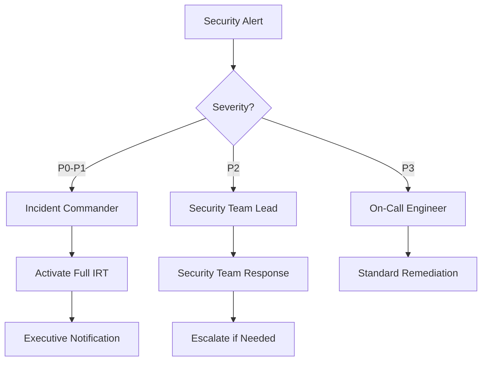

# Incident Response Procedures

## Overview

This document outlines the procedures for detecting, responding to, and recovering from security incidents in the FreeAgentics system.

## Incident Classification

### Severity Levels

| Level | Name | Description | Response Time | Examples |
|-------|------|-------------|---------------|----------|
| P0 | Critical | System-wide outage or data breach | < 15 minutes | Data breach, ransomware, system compromise |
| P1 | High | Significant security impact | < 1 hour | Active attack, authentication bypass |
| P2 | Medium | Limited security impact | < 4 hours | Suspicious activity, failed penetration |
| P3 | Low | Minor security concern | < 24 hours | Policy violation, misconfiguration |

### Incident Types

1. **Data Breach**
   - Unauthorized data access
   - Data exfiltration
   - Database compromise

2. **System Compromise**
   - Malware infection
   - Unauthorized system access
   - Root/admin compromise

3. **Denial of Service**
   - DDoS attacks
   - Resource exhaustion
   - Service disruption

4. **Authentication Attacks**
   - Brute force attempts
   - Credential stuffing
   - Session hijacking

5. **Application Attacks**
   - SQL injection
   - XSS attempts
   - API abuse

## Response Team Structure

### Core Incident Response Team

| Role | Responsibility | Contact |
|------|----------------|---------|
| Incident Commander | Overall incident coordination | security-lead@freeagentics.com |
| Security Engineer | Technical investigation and remediation | security-team@freeagentics.com |
| DevOps Engineer | Infrastructure and deployment | devops-team@freeagentics.com |
| Communications Lead | Internal/external communications | comms@freeagentics.com |
| Legal Counsel | Legal and compliance guidance | legal@freeagentics.com |

### Escalation Matrix



## Detection and Analysis

### Automated Detection

1. **Security Monitoring Dashboard**
   ```python
   # Key metrics to monitor
   - Failed login attempts > 50/hour
   - Rate limit violations > 100/hour
   - 500 errors > 10% of traffic
   - Suspicious IP patterns
   - Unusual data access patterns
   ```

2. **Alert Configuration**
   ```yaml
   alerts:
     - name: PotentialBruteForce
       condition: failed_logins > 50 AND unique_ips < 5
       severity: P1
       action: block_ip_and_alert
       
     - name: DataExfiltration
       condition: data_transfer > 1GB AND time < 5min
       severity: P0
       action: immediate_response
   ```

### Manual Analysis Tools

```bash
# Check recent security events
tail -f /var/log/security_audit.log | grep -E "CRITICAL|ERROR"

# Analyze access patterns
awk '{print $1}' /var/log/nginx/access.log | sort | uniq -c | sort -rn | head -20

# Check for suspicious processes
ps aux | grep -E "suspicious_pattern"

# Network connections analysis
netstat -tuln | grep ESTABLISHED
```

## Response Procedures

### Phase 1: Initial Response (0-15 minutes)

1. **Acknowledge Alert**
   ```python
   # Alert acknowledgment template
   {
       "incident_id": "INC-2025-001",
       "acknowledged_by": "security_engineer",
       "acknowledged_at": "2025-01-16T10:00:00Z",
       "initial_assessment": "Potential brute force attack detected",
       "severity": "P1"
   }
   ```

2. **Initial Containment**
   ```bash
   # Block suspicious IP immediately
   iptables -A INPUT -s $SUSPICIOUS_IP -j DROP
   
   # Add to Redis blacklist
   redis-cli SADD blocked_ips $SUSPICIOUS_IP
   
   # Update WAF rules
   curl -X POST https://waf.api/rules \
     -H "Authorization: Bearer $WAF_TOKEN" \
     -d '{"action": "block", "ip": "'$SUSPICIOUS_IP'"}'
   ```

3. **Preserve Evidence**
   ```bash
   # Create incident directory
   mkdir -p /incident/$(date +%Y%m%d_%H%M%S)
   
   # Capture system state
   ps aux > processes.txt
   netstat -tuln > connections.txt
   
   # Backup logs
   cp /var/log/security_audit.log ./
   cp /var/log/nginx/access.log ./
   ```

### Phase 2: Investigation (15-60 minutes)

1. **Detailed Analysis**
   ```python
   # Automated investigation script
   def investigate_incident(incident_id):
       # Collect relevant logs
       logs = collect_logs(
           start_time=incident.start_time - timedelta(hours=1),
           end_time=datetime.now()
       )
       
       # Analyze patterns
       patterns = analyze_attack_patterns(logs)
       
       # Check affected resources
       affected = identify_affected_resources(logs)
       
       # Generate report
       return {
           "incident_id": incident_id,
           "attack_vectors": patterns,
           "affected_resources": affected,
           "timeline": generate_timeline(logs)
       }
   ```

2. **Impact Assessment**
   - Data accessed/modified
   - Systems compromised
   - User accounts affected
   - Service availability impact

### Phase 3: Containment and Eradication

1. **Short-term Containment**
   ```bash
   # Isolate affected systems
   docker stop affected_container
   
   # Revoke compromised credentials
   UPDATE users SET password_reset_required = true 
   WHERE last_login_ip IN (SELECT ip FROM suspicious_ips);
   
   # Invalidate sessions
   redis-cli --scan --pattern "session:*" | xargs redis-cli DEL
   ```

2. **Long-term Containment**
   ```yaml
   # Update security policies
   security_rules:
     - rule: enhanced_authentication
       require_mfa: true
       session_timeout: 30m
       
     - rule: ip_restrictions
       whitelist_only: true
       allowed_ips: ["10.0.0.0/8"]
   ```

3. **Eradication**
   - Remove malware/backdoors
   - Patch vulnerabilities
   - Update security configurations
   - Reset compromised credentials

### Phase 4: Recovery

1. **System Restoration**
   ```bash
   # Restore from clean backup
   kubectl apply -f deployment/clean-state.yaml
   
   # Verify system integrity
   ./scripts/verify-integrity.sh
   
   # Re-enable services gradually
   kubectl scale deployment api --replicas=1
   kubectl scale deployment api --replicas=3
   ```

2. **Monitoring Enhancement**
   ```python
   # Enhanced monitoring post-incident
   monitoring_config = {
       "increased_logging": True,
       "log_retention_days": 90,
       "alert_sensitivity": "high",
       "additional_metrics": [
           "auth_attempts_per_ip",
           "data_access_patterns",
           "api_usage_anomalies"
       ]
   }
   ```

### Phase 5: Post-Incident Activities

1. **Incident Report Template**
   ```markdown
   # Incident Report: INC-2025-001
   
   ## Executive Summary
   - Incident Type: Brute Force Attack
   - Severity: P1
   - Duration: 2 hours
   - Impact: 1000 failed login attempts, no breach
   
   ## Timeline
   - 10:00 - Initial detection
   - 10:05 - IP blocked
   - 10:15 - Investigation started
   - 11:00 - Attack mitigated
   - 12:00 - Normal operations restored
   
   ## Root Cause
   Insufficient rate limiting on login endpoint
   
   ## Remediation
   1. Implemented stricter rate limits
   2. Added CAPTCHA for repeated failures
   3. Enhanced monitoring rules
   
   ## Lessons Learned
   - Need better automated response
   - Rate limits were too permissive
   - Detection worked as designed
   ```

2. **Improvement Actions**
   - Update incident response procedures
   - Enhance detection rules
   - Conduct team training
   - Update security controls

## Automated Response Scripts

### DDoS Mitigation

```python
#!/usr/bin/env python3
# ddos_mitigation.py

import redis
import subprocess
from datetime import datetime, timedelta

class DDoSMitigator:
    def __init__(self):
        self.redis_client = redis.Redis()
        self.threshold = 1000  # requests per minute
        
    def check_traffic_patterns(self):
        # Get request counts by IP
        pipe = self.redis_client.pipeline()
        for key in self.redis_client.scan_iter("rate_limit:*"):
            pipe.get(key)
        
        results = pipe.execute()
        
        # Identify attack sources
        attack_sources = []
        for ip, count in results:
            if int(count) > self.threshold:
                attack_sources.append(ip)
        
        return attack_sources
    
    def mitigate_attack(self, attack_sources):
        for ip in attack_sources:
            # Block at firewall level
            subprocess.run([
                "iptables", "-A", "INPUT", 
                "-s", ip, "-j", "DROP"
            ])
            
            # Add to permanent blacklist
            self.redis_client.sadd("permanent_blacklist", ip)
            
            # Log incident
            self.log_incident(ip, "DDoS attack source")
    
    def enable_cdn_protection(self):
        # Enable CDN DDoS protection
        cdn_api.update_security_level("under_attack")
```

### Credential Stuffing Defense

```python
#!/usr/bin/env python3
# credential_stuffing_defense.py

from collections import defaultdict
import asyncio

class CredentialStuffingDefender:
    def __init__(self):
        self.failed_attempts = defaultdict(list)
        self.blocked_ips = set()
        
    async def analyze_login_patterns(self, username, ip, success):
        if not success:
            self.failed_attempts[ip].append({
                "username": username,
                "timestamp": datetime.now()
            })
            
            # Check for credential stuffing patterns
            if self.is_credential_stuffing(ip):
                await self.block_attacker(ip)
    
    def is_credential_stuffing(self, ip):
        attempts = self.failed_attempts[ip]
        
        # Multiple usernames from same IP
        usernames = set(a["username"] for a in attempts)
        if len(usernames) > 5:
            return True
        
        # Rapid attempts
        recent = [a for a in attempts 
                 if a["timestamp"] > datetime.now() - timedelta(minutes=5)]
        if len(recent) > 10:
            return True
        
        return False
    
    async def block_attacker(self, ip):
        # Immediate IP block
        await redis_client.setex(f"blocked:{ip}", 3600, "credential_stuffing")
        
        # Alert security team
        await send_security_alert({
            "type": "credential_stuffing",
            "ip": ip,
            "attempts": len(self.failed_attempts[ip])
        })
```

## Communication Templates

### Internal Communication

```markdown
Subject: [SECURITY INCIDENT P1] Active Attack Detected

Team,

We have detected an active security incident:
- Type: [Incident Type]
- Severity: P1
- Started: [Time]
- Status: Investigating

Incident Commander: [Name]
Bridge: [Conference Details]

Please join the incident bridge immediately.
```

### Customer Communication

```markdown
Subject: Security Notification

Dear Customer,

We are currently investigating a security event that may affect our services. 

Impact:
- Some users may experience slow response times
- Login functionality temporarily restricted

We are actively working to resolve this issue and will provide updates every 30 minutes.

Thank you for your patience.
```

### Regulatory Notification

```markdown
Subject: Security Incident Notification - [Company Name]

To: [Regulatory Body]

This is to notify you of a security incident:
- Date/Time: [Incident Start]
- Type: [Classification]
- Data Affected: [Yes/No - Details]
- Users Impacted: [Number]
- Current Status: [Contained/Ongoing]

Full report will be provided within 72 hours as required.

Contact: legal@freeagentics.com
```

## Recovery Verification

### System Health Checks

```bash
#!/bin/bash
# post_incident_verification.sh

echo "=== Post-Incident System Verification ==="

# API Health
echo "Checking API health..."
curl -s https://api.freeagentics.com/health | jq .

# Database Connectivity
echo "Checking database..."
psql -c "SELECT COUNT(*) FROM users;" 

# Redis Status
echo "Checking Redis..."
redis-cli ping

# Security Headers
echo "Checking security headers..."
curl -I https://api.freeagentics.com | grep -E "Strict-Transport|X-Frame"

# Rate Limiting
echo "Testing rate limits..."
for i in {1..10}; do
    curl -s -o /dev/null -w "%{http_code}\n" https://api.freeagentics.com/test
done

# Monitoring
echo "Checking monitoring..."
curl -s http://localhost:9090/api/v1/query?query=up | jq .
```

## Lessons Learned Process

### Post-Mortem Meeting

1. **Schedule**: Within 48 hours of incident resolution
2. **Attendees**: All involved parties + stakeholders
3. **Agenda**:
   - Timeline review
   - What went well
   - What went wrong
   - Action items
   - Process improvements

### Documentation Updates

- Update runbooks
- Revise detection rules
- Enhance response procedures
- Update contact lists
- Improve automation

## Training and Drills

### Monthly Security Drills

1. **Tabletop Exercises**
   - Scenario-based discussions
   - Decision-making practice
   - Communication flow testing

2. **Red Team Exercises**
   - Simulated attacks
   - Response time measurement
   - Tool effectiveness testing

3. **Recovery Drills**
   - Backup restoration
   - Service failover
   - Data recovery procedures

## Key Contacts

| Role | Name | Phone | Email |
|------|------|-------|-------|
| Security Lead | John Doe | +1-555-0100 | john@freeagentics.com |
| CTO | Jane Smith | +1-555-0101 | jane@freeagentics.com |
| Legal | Bob Johnson | +1-555-0102 | legal@freeagentics.com |
| PR | Alice Brown | +1-555-0103 | pr@freeagentics.com |

### External Contacts

- FBI Cyber Division: +1-555-0200
- Local Law Enforcement: +1-555-0201
- Cyber Insurance: +1-555-0202
- Security Vendor Support: +1-555-0203