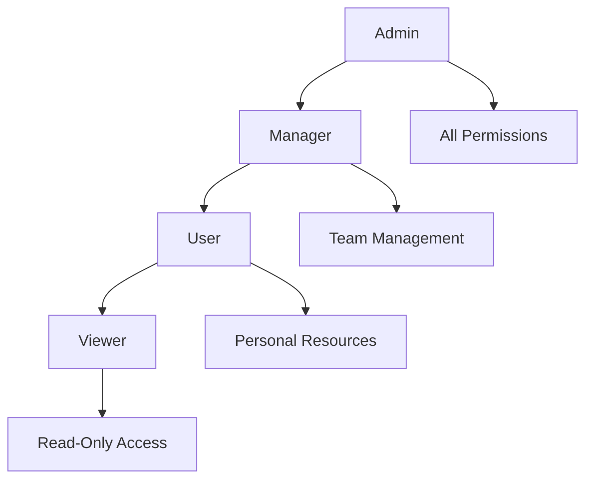
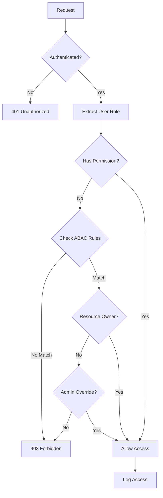

# RBAC Permission Matrix

## Overview

This document provides a comprehensive mapping of roles, permissions, and access controls in the FreeAgentics system.

## Role Hierarchy



## Detailed Permission Matrix

### Core Permissions

| Permission | Description | Admin | Manager | User | Viewer |
|------------|-------------|-------|---------|------|--------|
| **Agent Management** |
| CREATE_AGENT | Create new agents | ✓ | ✓ | ✓ | ✗ |
| VIEW_AGENTS | View agent details | ✓ | ✓ | Own only | Public only |
| MODIFY_AGENT | Edit agent configuration | ✓ | ✓ | Own only | ✗ |
| DELETE_AGENT | Remove agents | ✓ | ✓ | Own only | ✗ |
| EXECUTE_AGENT | Run agent tasks | ✓ | ✓ | Own only | ✗ |
| **Coalition Management** |
| CREATE_COALITION | Form agent coalitions | ✓ | ✓ | ✗ | ✗ |
| MODIFY_COALITION | Edit coalition settings | ✓ | ✓ | ✗ | ✗ |
| DELETE_COALITION | Remove coalitions | ✓ | ✓ | ✗ | ✗ |
| VIEW_COALITION | View coalition details | ✓ | ✓ | Members only | ✗ |
| **System Management** |
| VIEW_METRICS | Access system metrics | ✓ | ✓ | ✗ | ✗ |
| ADMIN_SYSTEM | System administration | ✓ | ✗ | ✗ | ✗ |
| MANAGE_USERS | User management | ✓ | ✗ | ✗ | ✗ |
| VIEW_LOGS | Access system logs | ✓ | Limited | ✗ | ✗ |
| **Security Management** |
| VIEW_AUDIT_LOGS | Access security logs | ✓ | ✗ | ✗ | ✗ |
| MANAGE_PERMISSIONS | Modify permissions | ✓ | ✗ | ✗ | ✗ |
| MANAGE_ROLES | Create/edit roles | ✓ | ✗ | ✗ | ✗ |
| VIEW_SECURITY_METRICS | Security dashboards | ✓ | ✗ | ✗ | ✗ |

### Resource-Specific Permissions

#### Agent Resources

| Action | Admin | Manager | User | Viewer | Conditions |
|--------|-------|---------|------|--------|------------|
| Create | ✓ | ✓ | ✓ | ✗ | Rate limited |
| Read Own | ✓ | ✓ | ✓ | ✗ | Always allowed |
| Read Others | ✓ | ✓ | ✗ | ✗ | Department-based |
| Update Own | ✓ | ✓ | ✓ | ✗ | Owner check |
| Update Others | ✓ | ✓ | ✗ | ✗ | Admin override |
| Delete Own | ✓ | ✓ | ✓ | ✗ | Soft delete |
| Delete Others | ✓ | ✗ | ✗ | ✗ | Admin only |
| Share | ✓ | ✓ | ✓ | ✗ | Owner only |

#### User Management

| Action | Admin | Manager | User | Viewer | Conditions |
|--------|-------|---------|------|--------|------------|
| Create User | ✓ | ✗ | ✗ | ✗ | Admin only |
| View Profile | ✓ | ✓ | Own only | ✗ | Privacy settings |
| Edit Profile | ✓ | ✗ | Own only | ✗ | Limited fields |
| Change Password | ✓ | ✗ | Own only | ✗ | Current password required |
| Reset Password | ✓ | ✗ | ✗ | ✗ | Admin only |
| Disable Account | ✓ | ✗ | ✗ | ✗ | Admin only |
| Delete Account | ✓ | ✗ | ✗ | ✗ | Soft delete |
| View Activity | ✓ | ✗ | Own only | ✗ | Audit logs |

## Attribute-Based Access Control (ABAC)

### User Attributes

| Attribute | Description | Example Values | Usage |
|-----------|-------------|----------------|-------|
| department | User's department | engineering, sales, hr | Department-based access |
| clearance_level | Security clearance | public, internal, confidential, secret | Data classification |
| location | Geographic location | us-east, eu-west, asia-pacific | Regional restrictions |
| employment_type | Type of employment | full_time, contractor, partner | Access limitations |
| created_at | Account creation date | ISO timestamp | Time-based restrictions |

### Resource Attributes

| Attribute | Description | Example Values | Usage |
|-----------|-------------|----------------|-------|
| sensitivity | Data sensitivity level | low, medium, high, critical | Access restrictions |
| classification | Information classification | public, internal, confidential | Clearance matching |
| owner_id | Resource owner | User UUID | Ownership validation |
| department | Resource department | engineering, sales | Department matching |
| created_at | Creation timestamp | ISO timestamp | Age-based rules |
| expires_at | Expiration timestamp | ISO timestamp | Temporal access |

### Environmental Attributes

| Attribute | Description | Example Values | Usage |
|-----------|-------------|----------------|-------|
| time_of_day | Current time | 00:00-23:59 | Business hours access |
| day_of_week | Current day | monday-sunday | Weekday restrictions |
| ip_address | Client IP | 192.168.1.1 | Network-based access |
| geo_location | Geographic location | Country/region codes | Geo-blocking |
| device_type | Client device | desktop, mobile, api | Device restrictions |
| network_zone | Network segment | internal, dmz, external | Zone-based access |

## ABAC Policy Examples

### Time-Based Access

```python
{
    "rule_id": "business_hours_only",
    "description": "Restrict access to business hours",
    "conditions": {
        "time_of_day": {"between": ["09:00", "18:00"]},
        "day_of_week": {"in": ["monday", "tuesday", "wednesday", "thursday", "friday"]}
    },
    "effect": "allow"
}
```

### Department-Based Access

```python
{
    "rule_id": "same_department_access",
    "description": "Users can only access resources in their department",
    "conditions": {
        "user.department": {"equals": "resource.department"}
    },
    "effect": "allow"
}
```

### Clearance-Based Access

```python
{
    "rule_id": "clearance_level_check",
    "description": "User clearance must meet or exceed resource classification",
    "conditions": {
        "user.clearance_level": {"gte": "resource.classification"}
    },
    "effect": "allow"
}
```

### Geographic Restrictions

```python
{
    "rule_id": "regional_access",
    "description": "Restrict access based on geographic location",
    "conditions": {
        "user.location": {"equals": "resource.region"},
        "env.geo_location": {"in": ["US", "CA", "UK"]}
    },
    "effect": "allow"
}
```

## Permission Inheritance

### Role Inheritance Chain

```
Admin
├── All Manager permissions
├── All User permissions
├── All Viewer permissions
└── Admin-specific permissions

Manager
├── All User permissions
├── All Viewer permissions
└── Manager-specific permissions

User
├── All Viewer permissions
└── User-specific permissions

Viewer
└── Viewer-specific permissions
```

### Dynamic Permission Assignment

```python
# Example: Grant temporary elevated permissions
{
    "user_id": "user123",
    "temporary_permissions": ["VIEW_METRICS"],
    "valid_from": "2025-01-16T00:00:00Z",
    "valid_until": "2025-01-17T00:00:00Z",
    "reason": "Quarterly review period"
}
```

## API Endpoint Permissions

### Authentication Endpoints

| Endpoint | Method | Required Permission | Additional Checks |
|----------|--------|-------------------|-------------------|
| /auth/login | POST | None | Rate limiting |
| /auth/logout | POST | Authenticated | Valid session |
| /auth/refresh | POST | Authenticated | Valid refresh token |
| /auth/change-password | POST | Authenticated | Current password |
| /auth/reset-password | POST | None | Email verification |

### Agent Management Endpoints

| Endpoint | Method | Required Permission | Additional Checks |
|----------|--------|-------------------|-------------------|
| /agents | GET | VIEW_AGENTS | Filtered by ownership |
| /agents | POST | CREATE_AGENT | Rate limiting |
| /agents/{id} | GET | VIEW_AGENTS | Ownership/public check |
| /agents/{id} | PUT | MODIFY_AGENT | Ownership check |
| /agents/{id} | DELETE | DELETE_AGENT | Ownership check |
| /agents/{id}/execute | POST | EXECUTE_AGENT | Ownership check |

### System Management Endpoints

| Endpoint | Method | Required Permission | Additional Checks |
|----------|--------|-------------------|-------------------|
| /users | GET | MANAGE_USERS | Admin only |
| /users/{id} | GET | MANAGE_USERS or Self | Privacy settings |
| /users/{id} | PUT | MANAGE_USERS or Self | Field restrictions |
| /metrics | GET | VIEW_METRICS | Department filtering |
| /logs | GET | VIEW_LOGS | Log level filtering |
| /security/audit | GET | VIEW_AUDIT_LOGS | Admin only |

## Permission Checking Flow



## Best Practices

1. **Principle of Least Privilege**

   - Grant minimum permissions required
   - Regular permission audits
   - Remove unused permissions

1. **Separation of Duties**

   - Critical operations require multiple roles
   - No single user has complete control
   - Audit trail for all actions

1. **Regular Reviews**

   - Quarterly permission reviews
   - Annual role assessment
   - Automated compliance checks

1. **Emergency Access**

   - Break-glass procedures
   - Temporary elevation process
   - Full audit logging

## Compliance Mapping

### GDPR Compliance

| Requirement | Implementation |
|-------------|----------------|
| Right to Access | User can view own data |
| Right to Rectification | User can edit profile |
| Right to Erasure | Soft delete with admin approval |
| Data Portability | Export user data API |
| Consent Management | Permission-based access |

### SOC 2 Compliance

| Control | Implementation |
|---------|----------------|
| Access Control | RBAC + ABAC |
| Audit Logging | Comprehensive security logs |
| Data Encryption | In transit and at rest |
| Incident Response | Automated alerting |
| Change Management | Permission-based changes |
