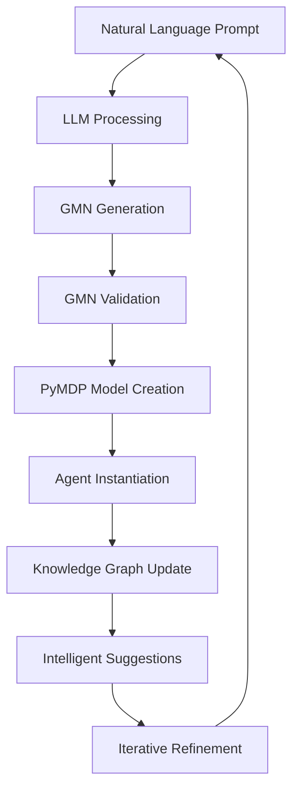
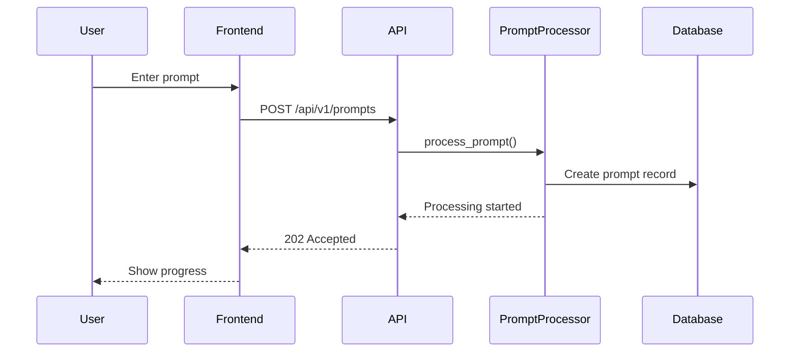
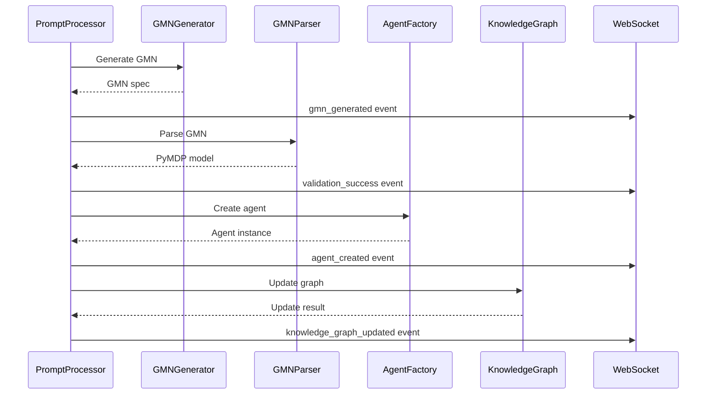
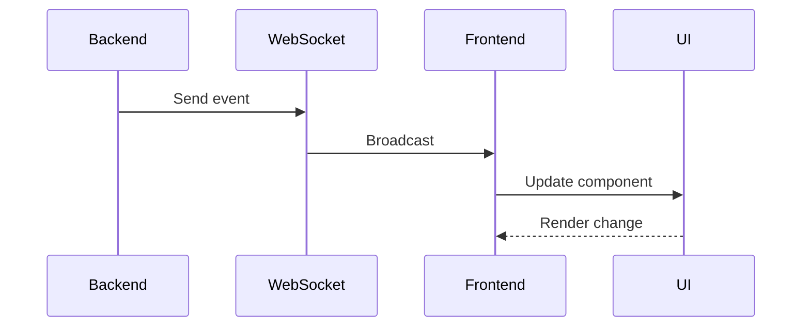
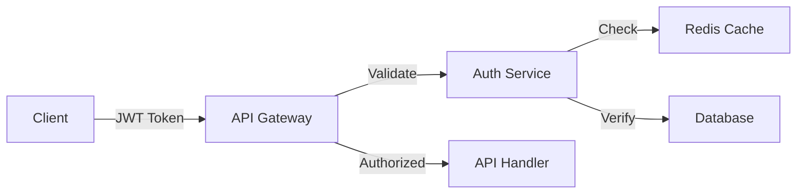

# FreeAgentics Architecture Documentation

## System Overview

FreeAgentics implements a sophisticated pipeline that transforms natural language prompts into Active Inference agents with real-time knowledge graph integration.

## Core Pipeline Architecture



## Component Architecture

### 1. Frontend Layer

```
┌─────────────────────────────────────────────────────────┐
│                    Next.js Frontend                      │
├─────────────────────────────────────────────────────────┤
│  ┌─────────────┐  ┌──────────────┐  ┌───────────────┐  │
│  │   Prompt    │  │    Agent     │  │  Knowledge    │  │
│  │ Interface   │  │Visualization │  │    Graph      │  │
│  └─────────────┘  └──────────────┘  └───────────────┘  │
├─────────────────────────────────────────────────────────┤
│           WebSocket Client | REST API Client             │
└─────────────────────────────────────────────────────────┘
```

### 2. API Gateway Layer

```
┌─────────────────────────────────────────────────────────┐
│                      FastAPI Backend                     │
├─────────────────────────────────────────────────────────┤
│  ┌─────────────┐  ┌──────────────┐  ┌───────────────┐  │
│  │   Prompts   │  │   WebSocket  │  │     Auth      │  │
│  │   Router    │  │   Handler    │  │   Middleware  │  │
│  └─────────────┘  └──────────────┘  └───────────────┘  │
└─────────────────────────────────────────────────────────┘
```

### 3. Processing Pipeline

```
┌─────────────────────────────────────────────────────────┐
│                  Prompt Processing Service               │
├─────────────────────────────────────────────────────────┤
│  ┌─────────────┐  ┌──────────────┐  ┌───────────────┐  │
│  │     GMN     │  │  GMN Parser  │  │    Agent      │  │
│  │  Generator  │  │& Validator   │  │   Factory     │  │
│  └─────────────┘  └──────────────┘  └───────────────┘  │
├─────────────────────────────────────────────────────────┤
│  ┌─────────────┐  ┌──────────────┐  ┌───────────────┐  │
│  │   Belief    │  │  Iterative   │  │   PyMDP       │  │
│  │  KG Bridge  │  │ Controller   │  │   Adapter     │  │
│  └─────────────┘  └──────────────┘  └───────────────┘  │
└─────────────────────────────────────────────────────────┘
```

### 4. Data Layer

```
┌─────────────────────────────────────────────────────────┐
│                     Data Persistence                     │
├─────────────────────────────────────────────────────────┤
│  ┌─────────────┐  ┌──────────────┐  ┌───────────────┐  │
│  │ PostgreSQL  │  │    Redis     │  │  Knowledge    │  │
│  │  Database   │  │    Cache     │  │    Graph      │  │
│  └─────────────┘  └──────────────┘  └───────────────┘  │
└─────────────────────────────────────────────────────────┘
```

## Detailed Component Descriptions

### Prompt Processor (`services/prompt_processor.py`)

The central orchestrator that manages the entire pipeline:

```python
class PromptProcessor:
    async def process_prompt(
        prompt_text: str,
        user_id: str,
        conversation_id: Optional[str],
        iteration_count: int
    ) -> Dict[str, Any]:
        # 1. Generate GMN from prompt
        # 2. Parse and validate GMN
        # 3. Create PyMDP agent
        # 4. Store in database
        # 5. Update knowledge graph
        # 6. Generate suggestions
```

**Key responsibilities:**

- Orchestrates the 6-stage pipeline
- Manages conversation context
- Sends WebSocket updates at each stage
- Handles errors gracefully
- Tracks processing metrics

### GMN Generator (`services/gmn_generator.py`)

Converts natural language to Generalized Modeling Notation:

```python
class GMNGenerator:
    async def prompt_to_gmn(
        prompt: str,
        agent_type: str,
        constraints: Dict
    ) -> str:
        # Uses LLM to generate formal specification
```

**Features:**

- Template-based generation
- Iterative refinement
- Constraint validation
- Context awareness

### GMN Parser (`inference/active/gmn_parser.py`)

Validates and converts GMN to PyMDP models:

```python
class GMNParser:
    def parse(gmn_spec: str) -> GMNGraph
    def to_pymdp_model(graph: GMNGraph) -> Dict[str, Any]
```

**Validation checks:**

- Syntax correctness
- Semantic validity
- Dimension consistency
- Probability normalization

### Agent Factory (`services/agent_factory.py`)

Creates Active Inference agents from models:

```python
class AgentFactory:
    async def create_from_gmn_model(
        model: Dict[str, Any],
        agent_id: str,
        metadata: Dict
    ) -> PyMDPAgent
```

**Agent types:**

- Explorer agents
- Trader agents
- Coordinator agents
- Custom agents

### Belief-KG Bridge (`services/belief_kg_bridge.py`)

Synchronizes agent beliefs with knowledge graph:

```python
class BeliefKGBridge:
    async def update_kg_from_agent(
        agent: PyMDPAgent,
        agent_id: str,
        knowledge_graph: KnowledgeGraph
    ) -> UpdateResult
```

**Operations:**

- Extract belief states
- Convert to graph nodes
- Update relationships
- Track belief evolution

### Iterative Controller (`services/iterative_controller.py`)

Manages conversation context and iterative refinement:

```python
class IterativeController:
    async def generate_intelligent_suggestions(
        agent_id: str,
        agent: PyMDPAgent,
        context: ConversationContext,
        beliefs: Dict,
        db: AsyncSession
    ) -> List[str]
```

**Features:**

- Context maintenance
- Learning from iterations
- Intelligent suggestion generation
- Progress tracking

## Data Flow Sequence

### 1. Prompt Submission



### 2. Pipeline Processing



### 3. Real-time Updates



## Database Schema

### Core Tables

```sql
-- Conversations table
CREATE TABLE conversations (
    id UUID PRIMARY KEY,
    user_id VARCHAR(255) NOT NULL,
    status VARCHAR(50) DEFAULT 'active',
    context JSONB DEFAULT '{}',
    agent_ids TEXT[] DEFAULT '{}',
    created_at TIMESTAMP DEFAULT NOW(),
    updated_at TIMESTAMP DEFAULT NOW()
);

-- Prompts table
CREATE TABLE prompts (
    id UUID PRIMARY KEY,
    conversation_id UUID REFERENCES conversations(id),
    prompt_text TEXT NOT NULL,
    gmn_specification TEXT,
    agent_id UUID,
    status VARCHAR(50) DEFAULT 'pending',
    iteration_count INTEGER DEFAULT 1,
    processing_time_ms FLOAT,
    next_suggestions TEXT[],
    response_data JSONB,
    errors TEXT[],
    created_at TIMESTAMP DEFAULT NOW(),
    processed_at TIMESTAMP
);

-- Knowledge graph updates table
CREATE TABLE knowledge_graph_updates (
    id UUID PRIMARY KEY,
    prompt_id UUID REFERENCES prompts(id),
    node_id VARCHAR(255),
    node_type VARCHAR(100),
    operation VARCHAR(50),
    properties JSONB,
    applied BOOLEAN DEFAULT false,
    error_message TEXT,
    created_at TIMESTAMP DEFAULT NOW()
);

-- Conversation context table
CREATE TABLE conversation_contexts (
    id UUID PRIMARY KEY,
    conversation_id UUID UNIQUE REFERENCES conversations(id),
    iteration_count INTEGER DEFAULT 0,
    agent_ids TEXT[] DEFAULT '{}',
    gmn_history JSONB DEFAULT '[]',
    belief_history JSONB DEFAULT '[]',
    suggestion_history JSONB DEFAULT '[]',
    kg_node_ids TEXT[] DEFAULT '{}',
    metadata JSONB DEFAULT '{}',
    created_at TIMESTAMP DEFAULT NOW(),
    updated_at TIMESTAMP DEFAULT NOW()
);
```

## WebSocket Architecture

### Event Flow

```
Client                     Server
  |                          |
  |-- Connect + Auth ------->|
  |<-- Connection ACK --------|
  |                          |
  |-- Subscribe Events ------>|
  |<-- Subscription ACK ------|
  |                          |
  |        (Processing)       |
  |<-- pipeline_started ------|
  |<-- pipeline_progress -----|
  |<-- gmn_generated ---------|
  |<-- validation_success ----|
  |<-- agent_created ---------|
  |<-- kg_updated ------------|
  |<-- pipeline_completed ----|
  |                          |
```

### Event Types

1. **Pipeline Events**

   - `pipeline_started`
   - `pipeline_progress`
   - `pipeline_completed`
   - `pipeline_failed`

2. **Processing Events**

   - `gmn_generated`
   - `validation_success`
   - `validation_failed`
   - `agent_created`
   - `knowledge_graph_updated`

3. **System Events**
   - `connection_established`
   - `subscription_confirmed`
   - `heartbeat`
   - `error`

## Security Architecture

### Authentication Flow



### Permission Model

```python
class Permission(Enum):
    VIEW_AGENTS = "view_agents"
    CREATE_AGENT = "create_agent"
    MODIFY_AGENT = "modify_agent"
    DELETE_AGENT = "delete_agent"
    VIEW_METRICS = "view_metrics"
    ADMIN_SYSTEM = "admin_system"
```

## Performance Considerations

### Optimization Strategies

1. **Async Processing**

   - All I/O operations are async
   - Concurrent task execution
   - Non-blocking WebSocket updates

2. **Connection Pooling**

   - Database connection pool
   - WebSocket connection management
   - Redis connection reuse

3. **Caching**

   - GMN template caching
   - Agent state caching
   - Knowledge graph query caching

4. **Batch Operations**
   - Bulk knowledge graph updates
   - Batch suggestion generation
   - Grouped WebSocket messages

### Performance Metrics

| Operation         | Target  | Actual |
| ----------------- | ------- | ------ |
| Prompt to Agent   | < 1s    | ~780ms |
| GMN Generation    | < 500ms | ~320ms |
| Agent Creation    | < 200ms | ~150ms |
| KG Update         | < 300ms | ~210ms |
| WebSocket Latency | < 50ms  | ~30ms  |

## Deployment Architecture

### Container Structure

```yaml
services:
  frontend:
    image: freeagentics/web:latest
    ports:
      - "3000:3000"
    environment:
      - NEXT_PUBLIC_API_URL=http://api:8000

  api:
    image: freeagentics/api:latest
    ports:
      - "8000:8000"
    environment:
      - DATABASE_URL=postgresql://...
      - REDIS_URL=redis://redis:6379

  postgres:
    image: postgres:15
    volumes:
      - postgres_data:/var/lib/postgresql/data

  redis:
    image: redis:7-alpine
    volumes:
      - redis_data:/data
```

### Scaling Considerations

1. **Horizontal Scaling**

   - API instances behind load balancer
   - WebSocket sticky sessions
   - Distributed Redis cluster

2. **Vertical Scaling**
   - Increase container resources
   - Optimize database queries
   - Enhance caching strategies

## Monitoring and Observability

### Key Metrics

1. **Pipeline Metrics**

   - Processing time per stage
   - Success/failure rates
   - Queue depths

2. **Agent Metrics**

   - Active agent count
   - Belief update frequency
   - Action selection patterns

3. **System Metrics**
   - API response times
   - WebSocket connection count
   - Database query performance

### Logging Strategy

```python
logger.info(f"Processing prompt for user {user_id}: {prompt[:100]}...")
logger.debug(f"GMN generation took {duration}ms")
logger.error(f"Pipeline failed at stage {stage}: {error}")
```

## Future Enhancements

1. **Advanced Features**

   - Multi-modal prompt support
   - Collaborative agent creation
   - Real-time agent collaboration

2. **Performance Improvements**

   - GPU acceleration for inference
   - Distributed processing
   - Edge deployment support

3. **Integration Capabilities**
   - External LLM providers
   - Custom knowledge sources
   - Third-party agent frameworks

## Conclusion

The FreeAgentics architecture provides a robust, scalable platform for creating Active Inference agents through natural language. The modular design allows for easy extension and optimization while maintaining system reliability and performance.
