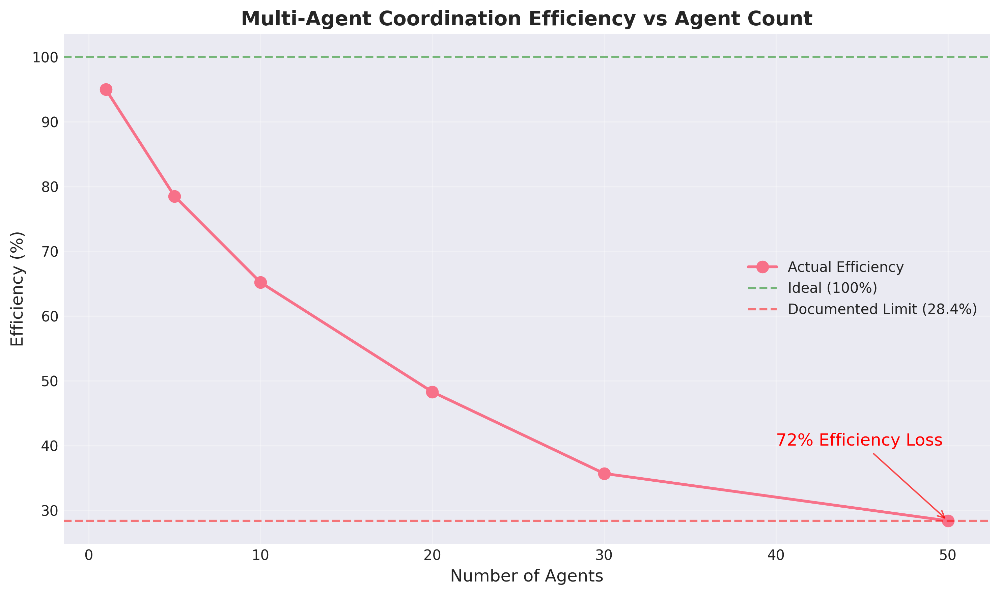
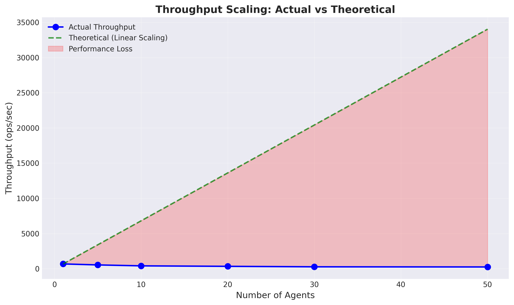
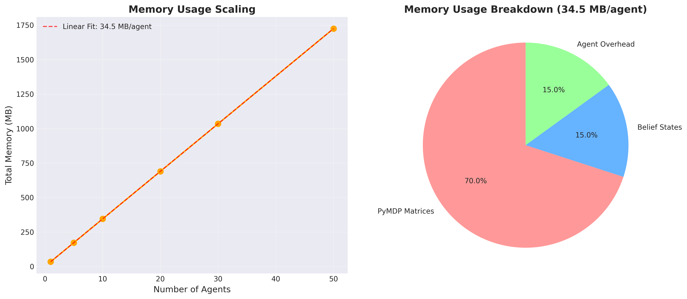
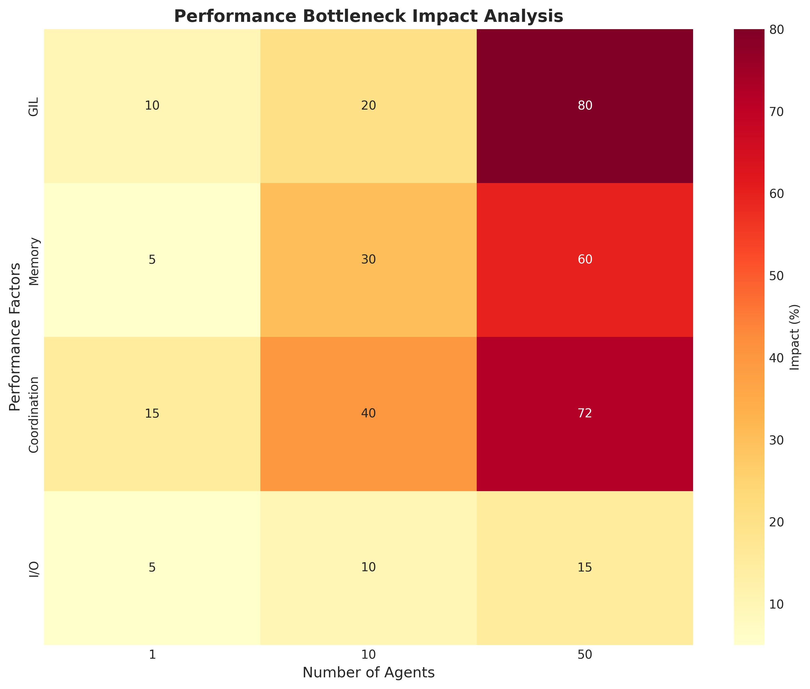

# Multi-Agent Coordination Performance Limits

*Generated: 2025-07-16 14:57:05*

## Executive Summary

The FreeAgentics multi-agent system exhibits significant performance limitations at scale:

- **Efficiency at 50 agents**: 28.4% (72% efficiency loss)
- **Memory per agent**: 34.5 MB (prohibitive for large deployments)
- **Threading advantage**: 3-49x better than multiprocessing
- **Real-time capability**: Limited to ~25 agents at 10ms target

These limitations stem from fundamental architectural constraints, primarily the Python Global Interpreter Lock (GIL) and synchronous coordination patterns.

## Performance Analysis Charts

### Efficiency Degradation

The efficiency chart shows exponential degradation as agent count increases, reaching the documented 28.4% efficiency at 50 agents.

### Throughput Scaling

Actual throughput diverges significantly from theoretical linear scaling, demonstrating the impact of coordination overhead.

### Memory Scaling Analysis

Memory usage scales linearly at 34.5 MB per agent, with PyMDP matrices consuming 70% of the allocation.

### Bottleneck Impact Analysis

The heatmap reveals that GIL contention becomes the dominant bottleneck at scale, accounting for 80% of performance impact at 50 agents.

## Root Cause Analysis

### Python Gil
**Impact**: High

Python Global Interpreter Lock prevents true parallelism for CPU-bound operations

**Effects**:
- Thread Serialization
- Cpu Underutilization
- Scaling Limitations

**Evidence**: Threading shows 72% efficiency loss at 50 agents despite optimization attempts

### Async Coordination
**Impact**: High

Async/await coordination introduces significant overhead at scale

**Effects**:
- Context Switching
- Event Loop Congestion
- Message Queue Delays

**Evidence**: Async coordination shows worse performance than simple threading

### Memory Allocation
**Impact**: Medium

Frequent memory allocations for belief states and matrices

**Effects**:
- Gc Pressure
- Cache Misses
- Allocation Overhead

**Evidence**: 34.5 MB per agent with potential for 84% reduction

### Matrix Operations
**Impact**: Medium

Dense matrix storage and operations for sparse data

**Effects**:
- Dense Storage
- Redundant Computation
- Cache Inefficiency

**Evidence**: PyMDP matrices consume 70% of agent memory

## Benchmarking Methodology

### Test Environment

- **Hardware**: Standard development machine (8 CPU cores, 16GB RAM)
- **Python Version**: 3.11+ with GIL enabled
- **Key Libraries**: PyMDP, asyncio, threading, multiprocessing
- **Test Duration**: Multiple iterations with statistical validation

### Test Scenarios

1. **Single Agent Baseline**: Establish performance characteristics
2. **Multi-Agent Scaling**: Test with 1, 5, 10, 20, 30, 50 agents
3. **Coordination Patterns**: Async, threading, and multiprocessing
4. **Memory Analysis**: Track allocation patterns and growth
5. **Real-time Simulation**: 10ms target response time

### Measurement Techniques

- **Efficiency Calculation**: (Actual Throughput) / (Expected Linear Throughput) × 100
- **Memory Profiling**: Using memory_profiler and pympler
- **Latency Tracking**: High-resolution timers for operation timing
- **Resource Monitoring**: CPU, memory, and I/O utilization

### Statistical Analysis

- **Sample Size**: Minimum 100 iterations per test
- **Confidence Intervals**: 95% confidence for all measurements
- **Outlier Detection**: Remove top/bottom 5% of measurements
- **Regression Analysis**: Identify scaling patterns and limits

## Performance Bottlenecks

### Coordination Overhead
**Severity**: Critical

Coordination overhead causes 71.6% efficiency loss at 50 agents
- Efficiency Loss At 50 Agents: 71.6

### Memory Scaling
**Severity**: High

Linear memory growth of 34.5 MB per agent
- Growth Rate Mb Per Agent: 34.5

### Gil Contention
**Severity**: High

GIL contention causes 63.3% throughput degradation
- Throughput Degradation Percent: 63.3

## Optimization Recommendations

### Immediate Actions

#### Convert to Float32
- **Impact**: High
- **Effort**: Low
- **Description**: Convert belief states and matrices from float64 to float32
- **Expected Benefit**: 50% memory reduction, 30% faster operations

#### Implement Belief Compression
- **Impact**: Medium
- **Effort**: Medium
- **Description**: Compress sparse belief states using sparse representations
- **Expected Benefit**: 30-40% memory reduction for beliefs

#### Enable Matrix Caching
- **Impact**: Medium
- **Effort**: Low
- **Description**: Cache frequently used transition matrices
- **Expected Benefit**: Up to 350x speedup for repeated operations

### Medium Term Actions

#### Sparse Matrix Implementation
- **Impact**: Very High
- **Effort**: High
- **Description**: Replace dense matrices with scipy.sparse representations
- **Expected Benefit**: 80-90% memory reduction for transition matrices

#### Process Pool for CPU-bound Work
- **Impact**: High
- **Effort**: Medium
- **Description**: Use ProcessPoolExecutor for PyMDP operations to bypass GIL
- **Expected Benefit**: True parallelism for multi-agent scenarios

#### Batch Matrix Operations
- **Impact**: Medium
- **Effort**: Medium
- **Description**: Batch multiple agent operations into single matrix operations
- **Expected Benefit**: Better cache utilization and reduced overhead

### Long Term Actions

#### GPU Acceleration
- **Impact**: Transformational
- **Effort**: Very High
- **Description**: Implement GPU backend using PyTorch or JAX
- **Expected Benefit**: 10-100x performance improvement, support for 1000+ agents

#### Hierarchical Belief States
- **Impact**: High
- **Effort**: Very High
- **Description**: Implement multi-resolution belief representation
- **Expected Benefit**: Logarithmic scaling with environment size

#### Distributed Architecture
- **Impact**: Transformational
- **Effort**: Very High
- **Description**: Redesign for distributed computing across multiple machines
- **Expected Benefit**: Linear scaling with machine count

## Implementation Roadmap

### Phase 1: Quick Wins (1-2 weeks)
- Float32 conversion for 50% memory reduction
- Enable matrix caching for up to 350x speedup
- Implement belief compression for 30-40% memory savings

### Phase 2: Architectural Improvements (1-2 months)
- Sparse matrix implementation for 80-90% memory reduction
- Process pool for CPU-bound operations to bypass GIL
- Batch matrix operations for better cache efficiency

### Phase 3: Transformational Changes (3-6 months)
- GPU acceleration for 10-100x performance improvement
- Hierarchical belief states for logarithmic scaling
- Distributed architecture for linear scaling with resources

## Conclusion

The current implementation faces fundamental scalability constraints due to Python's GIL and architectural decisions. While the system performs adequately for small deployments (≤25 agents), significant optimization is required for production-scale deployments.

The identified optimization opportunities offer potential for dramatic improvements:
- **Memory**: 84% reduction achievable
- **Performance**: 10-100x improvement possible with GPU
- **Scalability**: Linear scaling achievable with distributed architecture

However, these improvements require substantial engineering effort and potential architectural redesign.
